# Architecture Map

## Installed subprocess cancellation slice

Current implementation:

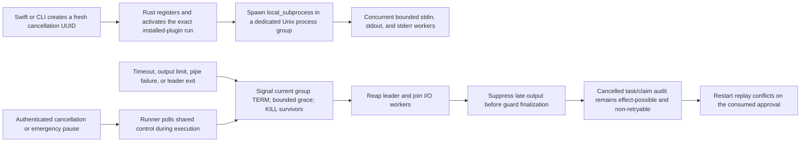

Production end goal:

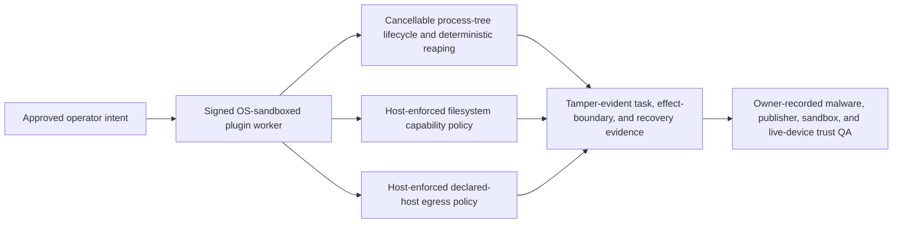

The current runner now stops members that remain in its dedicated group instead
of merely discarding the response after a subprocess returns. Unit tests cover
TERM-ignoring in-group descendants, blocked stdin plus oversized output,
pause/cancel, and bounded reaping. Authenticated cross-process E2E waits for an
in-group descendant heartbeat, cancels the exact approved run, proves the heartbeat stops before timeout,
keeps `effect_possible: true` with automatic retry disabled, and rejects replay
after restart. Deliberate `setsid`/`setpgid` escape remains unenforced until the
OS-sandboxed helper end goal. A process may already have issued an effect before
termination; this is lifecycle control, not effect rollback, OS sandboxing,
host-level egress enforcement, publisher trust, signing/notarization, or
live-device proof.

## Active command cancellation slice

Current implementation:

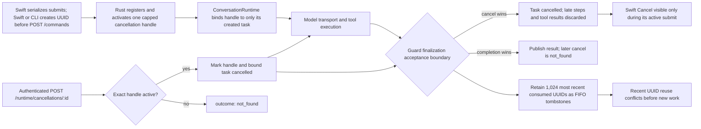

Production end goal:

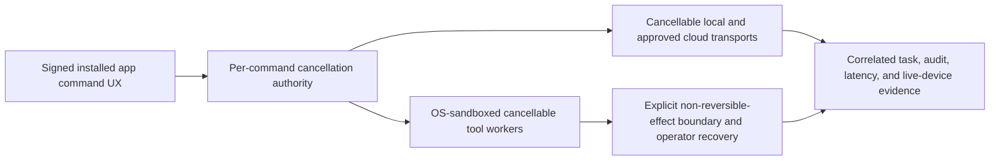

The current registry is process-local, capped at 128 active handles, and keeps
the 1,024 most recently consumed UUIDs as FIFO tombstones after final result
acceptance. Recent reuse conflicts, preventing a delayed stale cancellation
from targeting later work inside that window. Clients must still generate fresh
random UUIDs because tombstones are evicted after the cap and lost on restart.
It proves targeted cooperative
cancellation and honest `cancellation_requested`/`not_found` evidence for the local core; it does
not reverse an external effect, survive a process crash, provide distributed
cancellation, or replace signed/notarized live-device and plugin-trust proof.

## Atomic approval-decision and approved-execution slice

Current implementation:

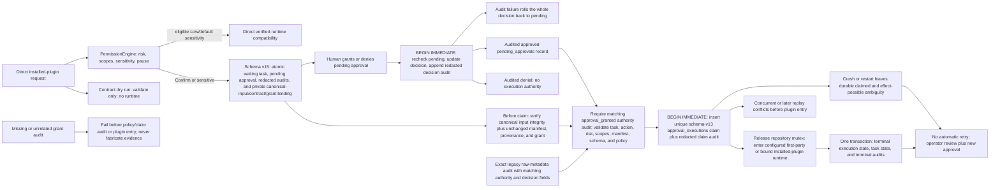

Production end goal:

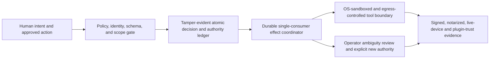

The current decision transaction prevents an approval grant from existing
without its redacted authority audit; an audit failure leaves the record
pending across restart. The subsequent claim prevents concurrent or restart
replay from consuming the same approval twice. Installed-plugin Confirm or
sensitive requests do not enter a runtime before approval; schema v15 binds the
canonical input and exact manifest/provenance/grant contract privately, while
pending/approval and audit surfaces expose only redaction evidence. Low/default-sensitivity
and dry-run compatibility remains explicit. These controls do not prove that an external system applied a
side effect exactly once. Any interruption after claim is intentionally
effect-possible and non-retryable. The target still requires host sandbox and
egress enforcement, signed/notarized distribution, live-device QA, plugin
trust evidence, and operator-recorded external evidence.

## App/Core IPC authentication slice

Current implementation:

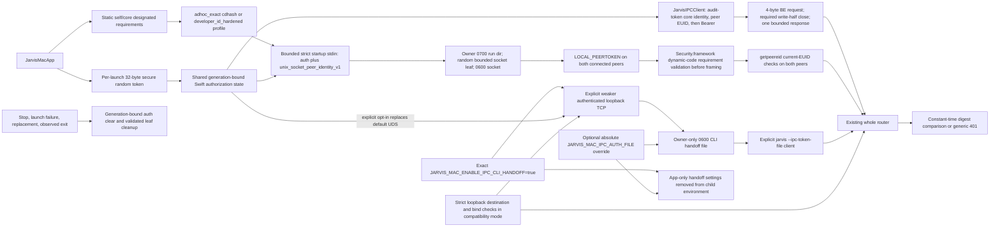

Production end goal:

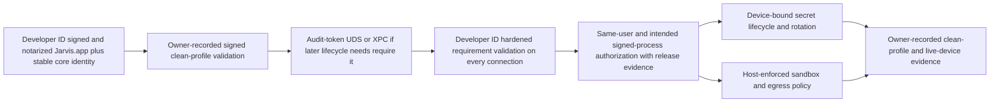

The current slice proves bounded UDS framing, `LOCAL_PEERTOKEN`-bound dynamic
code-requirement checks before request parsing, current-EUID checks, bearer
possession and lifecycle, whole-router parity, owner-only filesystem setup,
fail-closed limits, validated leaf cleanup, and an explicitly enabled loopback
TCP/token compatibility path. The repository-owned ad-hoc lane proves exact-
build cdhash identity mechanics and rejects a same-EUID wrong-code process; it
does not prove Developer ID publisher identity, device authentication, XPC,
App Sandbox enforcement, host egress policy, notarization, or live-device
behavior.

## Trusted system-wake slice

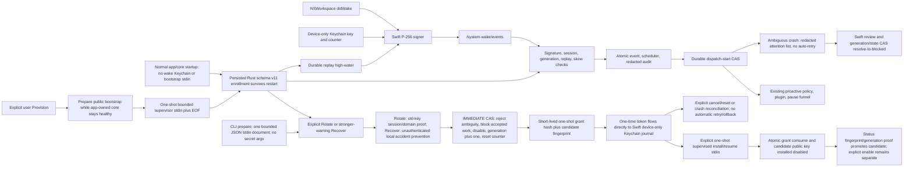

Production end goal:

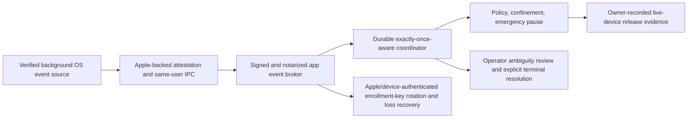

The current slice supports explicit local rotation and lost-key recovery. The
packaged app route requires per-launch bearer possession while an explicit
legacy server does not; recovery confirmation remains accident prevention in
either mode. It does not claim device authentication, OS identity, ownership proof, Apple
attestation, OS wake provenance, same-user/process isolation, background
launch, exactly-once side effects, live-device QA, or production readiness.
Manual SQLite or Keychain mutation is not a recovery procedure.

Jarvis is a local-first macOS assistant foundation. The current repository
contains a Rust workspace with the core contracts, default app-supervised UDS
transport plus explicit loopback compatibility server,
SQLite-backed repository primitives, policy/model-routing rules, in-process
and installed-plugin contracts, scheduler persistence/recovery, release
readiness/evidence-status, redacted diagnostics, CLI client, and a
Swift/SwiftUI Mac shell under `apps/mac` with core supervision, management tabs,
voice input/output adapters, scheduler notifications, Keychain launch credential
injection, native menu-bar presence, and unsigned distribution launch proof.

## Current Implementation And Evidence Boundary Diagram

This diagram includes implemented repo-local surfaces plus manual external
evidence lanes that current code can inventory, validate structurally, or
bundle after owner validation. Those manual lanes are not local proof that the
external release checks have happened.

```mermaid
flowchart TB
    User["User or local test operator"]
    User --> CLI["jarvis-cli human-readable command/ask/tools; --json for exact IPC payloads"]
    User --> MacShell["JarvisMacApp SwiftUI shell"]
    User --> MenuBar["native MenuBarExtra presence and core lifecycle controls"]
    MenuBar --> MacShell
    ReleaseWorkflow["repo-owned release workflow and docs alignment"] --> Docs["DESIGN, README, architecture map, release checklist, build/test commands, knowledge-base"]
    ReleaseWorkflow --> Sweep["isolated worktree/branch production sweep"]
    Sweep --> PostMergeCleanupAudit["post-merge cleanup audit: open PRs, main workflow runs, worktrees, merged/unmerged codex branches, clean checkout"]
    Sweep --> LocalGate["./scripts/release-local.sh"]
    GitHubCI["GitHub Actions release-local macOS workflow"] --> LocalGate
    LocalGate --> CIWorkflowSmoke["release-ci-workflow-smoke.sh"]
    LocalGate --> VersionConsistency["release-version-consistency.sh check"]
    LocalGate --> E2E["local_ipc_e2e ignored release proof"]
    LocalGate --> Smoke["jarvis-cli smoke"]
    LocalGate --> OperatorQASmoke["release-operator-qa-smoke.sh"]
    LocalGate --> PackageCheckGuidance["package-distribution.sh check-guidance-self-test"]
    LocalGate --> PackageEntitlementsPolicy["package-distribution.sh entitlements-policy-self-test"]
    LocalGate --> PackageVersionSelfTest["package-distribution.sh version-consistency-self-test"]
    LocalGate --> PackageProvenanceSelfTest["package-distribution.sh provenance-self-test"]
    LocalGate --> UnsignedStructure["package-distribution.sh unsigned-structure-check"]
    LocalGate --> UnsignedLaunch["package-distribution.sh unsigned-launch-check"]
    LocalGate --> SignedDistributionRunbook["jarvis release signed-distribution-runbook read-only signed artifact triage"]
    LocalGate --> LiveDeviceQA["release-live-device-qa.sh check/self-test preflight"]
    LocalGate --> PluginTrustRunbook["jarvis release plugin-trust-runbook read-only plugin trust triage"]
    LocalGate --> PluginTrustQA["release-plugin-trust-qa.sh check/self-test preflight"]
    LocalGate --> EvidenceBundlePreflight["release-evidence-bundle.sh check/self-test/template preflight"]
    EvidenceTemplate["release-evidence-bundle.sh write-template"] --> EvidenceBundleEnv["sourceable final-bundle env with flags default false"]
    LocalGate --> LiveDeviceTemplate["release-live-device-qa.sh write-template"]
    LiveDeviceTemplate --> LiveDeviceEnv["sourceable live-device QA env with flags default false"]
    LocalGate --> PluginTrustTemplate["release-plugin-trust-qa.sh write-template"]
    PluginTrustTemplate --> PluginTrustEnv["sourceable plugin-trust QA env with flags default false"]
    LocalGate --> EvidenceDoctor["release-evidence-doctor.sh check/self-test evidence inventory and next-step commands"]
    LocalGate --> ExternalHandoff["release-external-handoff.sh check/self-test operator handoff generator"]
    ExternalHandoff --> ExternalHandoffDir["live-device, plugin-trust, final-bundle templates plus readiness/evidence/runbook snapshots"]
    ExternalHandoffDir --> ExternalHandoffManifest["release-handoff-manifest.json with release version, git commit, endpoint, file digests, and proof boundary"]
    LocalGate --> DocsDriftSmoke["release-docs-drift-smoke.sh docs and KB command/boundary drift check"]
    LocalGate --> SwiftGate["Swift package build/test"]
    LocalGate --> CargoGate["fmt, clippy, tests, build, package"]
    LocalGate --> MigrationSmoke["storage-migration-backup-smoke.sh backup, restore, newer-schema, and v1-v13 fixture proof"]
    ReleaseReadiness["/release/readiness and jarvis release readiness"] --> Docs
    ReleaseReadinessFallback["serverless CLI readiness fallback"] --> ReleaseReadiness
    EvidenceStatus["/release/evidence-status and jarvis release evidence-status"] --> EvidenceDoctor
    EvidenceStatus --> LiveQASemanticValidator["live QA semantic validator: bundle/version/core/executable identity/timestamp/transcript/command/owner checks"]
    EvidenceStatus --> FinalBundleValidator["final bundle validator: path/digest/app code identity/local-signature/archive-URI/owner-attestation and child-report checks"]
    LiveQASemanticValidator --> RepoEvidenceLookup["repository-backed command-result lookup: task/audit record must exist"]
    RepoEvidenceLookup --> Repository["SQLite tasks and audit entries"]
    LiveQASemanticValidator --> ReleaseReadiness
    subgraph ManualExternal["Manual external evidence, not local gate proof"]
        LiveDeviceAssert["release-live-device-qa.sh assert-complete"]
        LiveDeviceQAReport["target/release-live-device-qa-report.json owner-recorded voice, non-voice, and exact app identity evidence"]
        PluginTrustAssert["release-plugin-trust-qa.sh assert-complete"] --> PluginTrustQAReport["target/release-plugin-trust-qa-report.json owner-recorded plugin trust evidence"]
        PluginTrustRunbook -. guides .-> PluginTrustAssert
        SignedArtifacts["Developer ID signed, notarized, and stapled zip/pkg"] --> EvidenceBundleRun["release-evidence-bundle.sh bundle"]
        SignedArtifacts --> SignedProvenance["package-distribution.sh signed provenance report"]
        SignedProvenance --> SignedAppIdentity["app executable path/SHA-256 plus Identifier, TeamIdentifier, and CDHash"]
        SignedDistributionRunbook -. guides .-> SignedArtifacts
        SignedProvenance --> EvidenceBundleRun
        EvidenceBundleEnv --> EvidenceBundleRun
        LiveDeviceEnv --> LiveDeviceAssert
        SignedAppIdentity --> LiveDeviceAssert
        LiveDeviceAssert --> InstalledAppIdentity["codesign/stapler/Gatekeeper plus installed executable digest and code identity"]
        InstalledAppIdentity --> LiveDeviceQAReport
        PluginTrustEnv --> PluginTrustAssert
        CleanProfileFinderQA["owner-recorded clean-profile install and Finder/LaunchServices QA"] --> LiveDeviceQAReport
        ManualInstalledAppQA["owner-recorded manual installed-app command, audit, memory, scheduler, plugin, pause, diagnostics, notifications, restart QA"] --> LiveDeviceQAReport
        LiveNotificationQA["owner-recorded live macOS notification prompt and delivery QA"] --> EvidenceBundleRun
        LiveDeviceQAReport --> EvidenceBundleRun
        PluginTrustQAReport --> EvidenceBundleRun
        EvidenceBundleRun --> EvidenceArchive["archived final release evidence bundle with owner attestation"]
    end
    EvidenceBundleRun -. referenced by .-> EvidenceStatus
    UnsignedStructure["package-distribution.sh --unsigned-structure-check"] --> ReleaseApp["target/distribution/Jarvis.app"]
    UnsignedLaunch["package-distribution.sh --unsigned-launch-check"] --> ReleaseApp
    ReleaseApp --> AppMetadata["Info.plist plus bundled-core version marker"]
    ReleaseApp --> BundledCLI["Contents/Resources/bin/jarvis-cli"]
    UnsignedStructure --> UnsignedPackageMetadata["unsigned pkg identifier, version, and /Applications install-location metadata"]
    UnsignedLaunch --> UnsignedPackageMetadata
    UnsignedLaunch --> CleanProfile["temporary HOME and SQLite app state"]
    UnsignedLaunch --> DefaultUDSRouteProof["JarvisMacApp plus Swift client: health, command, task/audit, background scheduler completion, diagnostics, pause/block/resume over default UDS"]
    UnsignedLaunch --> WrongCodeProof["same-EUID wrong-code peer closed before framing; ad-hoc exact-build mechanics"]
    WrongCodeProof --> DefaultUDSRouteProof
    DefaultUDSRouteProof --> MacCore
    MacShell --> MacCore["JarvisMacCore IPC client, supervisor, and view models"]
    MenuBar --> MacCore
    MacShell --> ActivityUI["Run activity summary, bounded event stream, and audit view"]
    MacShell --> MemoryUI["Memory CRUD, review, count-only index governance, and disabled-by-default local context toggle"]
    MacShell --> PluginUI["Plugin manifest and installed registry/provenance view"]
    MacShell --> WorkspaceGrantUI["opaque workspace grant add, remove, and restart controls"]
    WorkspaceGrantUI --> BookmarkStore["atomic restrictive security-scoped bookmark store"]
    BookmarkStore --> BookmarkResolve["fail-closed full-set resolution, bounded delivery, exit monitor, balanced access lifetime"]
    MacShell --> SchedulerAttentionUI["Scheduler attention summary plus delivered-notification evidence fields"]
    MacShell --> SchedulerActionsUI["Scheduler run-due and stale-recovery controls"]
    MacShell --> SchedulerAutomationUI["Persisted default-off app-supervised automation toggle"]
    SchedulerAutomationUI --> SchedulerAutomationLoop["Bounded core scheduler flags plus optional startup stale recovery"]
    SchedulerAutomationUI --> SchedulerAttentionPoller["Cancellable redacted attention poller"]
    SchedulerAttentionPoller --> SchedulerNotificationOutbox["Bounded schema-v14 durable occurrence outbox"]
    SchedulerNotificationOutbox --> SchedulerNotifications
    SchedulerAttentionUI --> SchedulerNotifications["Scheduler notification model, reset, and evidence recapture"]
    SchedulerNotifications --> NotificationAuthorization["Existing macOS authorization check; never prompts in background"]
    NotificationAuthorization --> UserNotifications["authorized: stable occurrence-revision submission"]
    NotificationAuthorization --> SchedulerSuppressionIntent["denied or not determined: suppressed_not_authorized intent"]
    SchedulerSuppressionIntent --> SchedulerNotificationAck["authenticated revision-CAS acknowledgement attempt"]
    UserNotifications --> SchedulerNotificationAck["authenticated revision-CAS acknowledgement attempt after adapter return"]
    SchedulerNotificationAck --> SchedulerNotificationOutbox
    MacShell --> VoiceInput["Speech/AVFoundation input controls"]
    VoiceInput --> VoiceAutoSubmit["opt-in final-transcript auto-submit"]
    MacShell --> SpeechOutput["AVFoundation speech-output preview controls"]
    ActivityUI --> MacCore
    MemoryUI --> MacCore
    PluginUI --> MacCore
    SchedulerAttentionUI --> MacCore
    SchedulerActionsUI --> MacCore
    ReleaseReadiness --> MacCore
    EvidenceStatus --> MacCore
    VoiceInput --> MacCore
    VoiceAutoSubmit --> MacCore
    SpeechOutput --> MacCore
    MacCore --> Supervisor["JarvisCoreSupervisor configured or bundled process"]
    BookmarkResolve --> StartupEnvelope["bounded strict v1 startup stdin; roots, IPC auth, unix_socket_peer_identity_v1 transport, plus optional trusted-wake document"]
    StartupEnvelope --> Supervisor
    Supervisor --> CLI
    MacCore --> IPCAuthState["shared per-launch managed bearer plus UDS generation"]
    IPCAuthState -->|"audit-token code requirement, peer EUID, plus bearer"| IPCAuth["whole-router strict auth middleware"]
    IPCAuthState --> UDS["owner 0700 runtime directory and 0600 random socket leaf"]
    UDS --> PeerCodeIdentity["LOCAL_PEERTOKEN and Security.framework validation before framing"]
    PeerCodeIdentity --> FramedIPC["bounded request; write-half EOF; trailing-byte rejection; one response"]
    FramedIPC --> IPCAuth
    CLIHandoffOptIn["exact JARVIS_MAC_ENABLE_IPC_CLI_HANDOFF=true"] --> LoopbackCompat["explicit weaker authenticated loopback TCP"]
    LoopbackCompat --> TokenFile["owner-only CLI handoff file"]
    CLIHandoffOverride["optional absolute JARVIS_MAC_IPC_AUTH_FILE"] --> TokenFile
    IPCAuthState -->|"explicit opt-in replaces UDS"| LoopbackCompat
    CLIHandoffOptIn --> ChildEnvStrip["handoff settings and token-file path absent from child environment"]
    CLIHandoffOverride --> ChildEnvStrip
    TokenFile --> CLI
    MacCore -->|"default strict UDS; compatibility HTTP only by opt-in"| IPCAuth
    CLI -->|"explicit authenticated compatibility or legacy server"| IPCAuth
    IPCAuth --> IPC["jarvis-core::ipc shared router"]
    E2E --> IPC
    Smoke --> IPC

    subgraph Core["jarvis-core"]
        IPC --> Health["/health"]
        IPC --> Contract["/contract"]
        IPC --> ReleaseReadiness
        IPC --> EvidenceStatus
        IPC --> Diagnostics["/diagnostics/export"]
        PauseApi --> PauseState["explicit health and pause surfaces retain operator reason"]
        PauseState --> DiagnosticPauseProjection["diagnostic pause projection: state, updated_at, emergency_pause_reason_present, fixed redacted marker"]
        DiagnosticPauseProjection --> Diagnostics
        IPC --> Commands["/commands"]
        IPC --> Inspection["/tasks, /audit, /activity/summary, /activity/events, /model-routes, /memory incl index status/rebuild, /approvals, /permissions/grants, /permissions/policy-review, /plugins"]
        IPC --> ApprovalExecute["/approvals/:id/execute atomic approved replay"]
        ApprovalExecute --> ApprovalPreclaim["task, action, scope, manifest, input schema, current-policy, and grant-chain validation"]
        InstalledRunner --> InstalledPolicy["PermissionEngine risk, scopes, sensitivity, and pause gate"]
        InstalledPolicy -->|"Confirm or sensitive"| InstalledBinding["schema-v15 private canonical-input plus manifest/provenance/grant binding"]
        InstalledBinding --> ApprovalExecute
        InstalledPolicy -->|"eligible Low/default sensitivity"| InstalledDirect["verified direct runtime"]
        InstalledRunner --> InstalledDryRun["contract-only dry run; no runtime entry"]
        ApprovalPreclaim --> ApprovalClaim["schema-v13 unique durable claim plus redacted claim audit"]
        ApprovalClaim --> ApprovalTerminal["terminal execution, task state, and audits commit atomically"]
        ApprovalClaim --> ApprovalAmbiguous["claimed restart is effect-possible; no automatic retry"]
        IPC --> PublisherReview["/plugins/installed/:id/publisher/verify"]
        IPC --> PublisherSignature["/plugins/installed/:id/publisher/signature/verify"]
        IPC --> InstalledRunner["installed plugin execution boundary"]
        IPC --> PauseApi["/emergency-pause"]
        IPC --> SchedulerApi["/scheduler/jobs"]
        IPC --> SchedulerAttention["/scheduler/attention redacted handoff"]
        IPC --> SchedulerRecovery["/scheduler/recover-stale and opt-in startup stale recovery"]
        IPC --> ModelToolCatalog["/tools/model redacted default first-party model-tool catalog"]

        Commands --> Runtime["ConversationRuntime"]
        Runtime --> ModelExec["ModelExecutor trait"]
        ModelExec --> FakeLocal["FakeLocalModel default"]
        ModelExec --> OllamaLocal["Ollama-native bounded NDJSON transport"]
        Runtime --> MemoryRetrieval["explicit bounded lexical memory retrieval"]
        MemoryRetrieval --> OllamaLocal
        OllamaLocal --> StreamQuarantine["1 MiB wire and 512 KiB response caps; terminal done validation"]
        StreamQuarantine --> ProviderEnvelope
        ModelExec --> CloudExec["guarded cloud executor split"]
        CloudExec --> CloudMemoryReject["reject local memory context before transport"]
        CloudExec --> ChatGPTProvider["OpenAI-compatible HTTP provider with Keychain-injected API key"]
        CloudExec --> CodexAccount["Codex account adapter"]
        CodexAccount --> CodexCLI["logged-in Codex CLI subprocess; strict no-tools/no-web config, minimized env, timeout and monitored 1 MiB response"]
        ModelExec --> ProviderEnvelope["strict JSON provider response envelope"]
        ProviderEnvelope --> LocalToolDiscipline["local-model tool discipline: strict envelope, runtime-derived inventory, invalid-tool rejection/recovery, bounded schema/policy path"]
        Commands --> WasmModelOptIn["installed_wasm_tools per-command opt-in; default false"]
        Commands --> SwiftExecutionOptIn["Swift console tool execution opt-in; default dry-run"]
        WasmModelOptIn --> LocalWasmCatalog["reactive local route only; enabled eligible current local_wasm schemas"]
        LocalWasmCatalog --> LocalToolDiscipline
        LocalToolDiscipline --> ToolPlan["bounded registered or opted-in WASM tool requests"]
        LocalToolDiscipline --> ModelFailure
        Runtime --> ToolPlan
        ToolPlan --> PluginPolicy
        Runtime --> RuntimeControl["RuntimeControl pause/cancel flags"]
        RuntimeControl --> StreamQuarantine
        Runtime --> RuntimeStore["RuntimeCommandStore persistence hook"]
        Runtime --> RuntimeAudit["runtime AuditEntry list"]
        Runtime --> ModelFailure["structured failed response for provider errors"]

        Commands --> Router["ModelRouter evidence pass"]
        Router --> LocalRoute["local-first route"]
        Router --> ChatGPTGate["ChatGPT gate and redaction logic"]

        Commands --> PluginDispatch["command-pattern plugin dispatch"]
        PluginDispatch --> PluginPolicy["PermissionEngine policy check"]
        PluginPolicy --> PluginHost["PluginHost"]
        PluginHost --> ManifestValidation["manifest and JSON schema validation"]
        PluginHost --> FirstParty["production system_status plus optional workspace_inspect"]
        FirstParty --> RootAuthority["explicit opaque root ID mapped to held directory descriptor"]
        RootAuthority --> NoFollow["no-follow relative traversal, secret/type/size guards"]
        NoFollow --> LocalOnlyResult["bounded untrusted result; local-model-only continuation"]
        LocalOnlyResult --> LocalRoute
        FirstParty --> RegisteredToolCatalog["registered first-party model-tool catalog"]
        RegisteredToolCatalog --> ModelToolCatalog
        RegisteredToolCatalog --> LocalToolDiscipline
        RegisteredToolCatalog --> ChatGPTProvider
        PluginHost --> TimeoutCancel["timeout and cancellation handling"]
        InstalledRunner --> InstalledValidation["stored manifest/action/input/output validation"]
        InstalledRunner --> ProvenanceCheck["manifest, source-tree, and command hash verification"]
        InstalledRunner --> RepositorySnapshot["snapshot and revalidate installed state under repository mutex"]
        RepositorySnapshot --> GuestUnlocked["release mutex before subprocess or Wasmi guest execution"]
        GuestUnlocked --> FinalRaceCheck["pause/cancel check before output and completion audit acceptance"]
        FinalRaceCheck --> InstalledAudit
        InstalledRunner --> InstalledGrant["disabled-by-default metadata_only grant"]
        InstalledRunner --> InstalledEnable["/plugins/installed/:id/execution explicit subprocess grants"]
        ProvenanceCheck --> InstalledEnable
        ProvenanceCheck --> PublisherReview
        ProvenanceCheck --> PublisherSignature
        PublisherReview --> PublisherAudit["operator-pinned origin audit evidence"]
        PublisherSignature --> SignatureAudit["trusted-key signature audit evidence"]
        PluginHost --> NetworkDeclarations["network_access declared_hosts validation and subprocess_stdio_network gate"]
        NetworkDeclarations --> PluginTrustQAGate["manual plugin trust QA report gate"]
        NetworkDeclarations --> PluginPolicy
        InstalledRunner --> SubprocessRunner["local_subprocess direct Command JSON stdin/stdout runner"]
        InstalledRunner --> WasmRunner["local_wasm Wasmi jarvis_json_v1 runner"]
        CloudExec --> CloudWasmDeny["installed WASM catalog unavailable"]
        SubprocessRunner --> SubprocessModelDeny["never model-planned"]
        SubprocessRunner --> SafePath["canonical command under source_path, no shell interpolation"]
        SubprocessRunner --> SandboxBoundary["audit truth: subprocess_started can be true; os_sandbox_enforced remains false until real OS sandbox or egress policy exists"]
        SubprocessRunner --> ProgressFrames["bounded stderr JSON progress frames"]
        SubprocessRunner --> InstalledAudit["blocked, dry-run, completed, or failed audit evidence"]
        SandboxBoundary --> InstalledAudit
        ProgressFrames --> InstalledAudit
        WasmRunner --> WasmProvenance["exact module-byte provenance plus wasm_compute grant"]
        WasmRunner --> WasmABI["exports memory, jarvis_alloc, jarvis_run; reject every import and WASI"]
        WasmRunner --> WasmLimits["4 MiB module, 256 KiB request, 1 MiB output, 16 MiB memory, zero table elements, 10M fuel"]
        RuntimeCancel["POST /runtime/cancellations/:id"] --> WasmRunner
        WasmRunner --> WasmPolicy["low-risk compute only; no proactive, memory, model, filesystem, environment, or network authority"]
        WasmLimits --> InstalledAudit
        WasmPolicy --> RuntimeControl
        WasmABI --> WasmBoundary["Wasmi language confinement true; OS sandbox false"]
        WasmBoundary --> InstalledAudit

        SchedulerApi --> Scheduler["Scheduler"]
        SchedulerAttention --> Scheduler
        SchedulerRecovery --> Scheduler
        Scheduler --> SchedulerPolicyAudit["redacted proactive policy audit before due execution"]
        Scheduler --> SchedulerStaleAudit["stale running recovery audit"]
        PauseApi --> RuntimeControl
    end

    IPC --> RepoState["optional SqliteRepository backing"]
    RuntimeStore --> RepoState
    Inspection --> RepoState
    PublisherReview --> RepoState
    PublisherSignature --> RepoState
    PauseApi --> RepoState
    SchedulerApi --> RepoState
    SchedulerAttention --> RepoState
    SchedulerRecovery --> RepoState
    RepoState --> Tasks["tasks"]
    RepoState --> Audit["append-only audit_entries"]
    RepoState --> Memory["memory_items"]
    Memory --> MemoryReview["unreviewed/sensitive memory review counts"]
    Memory --> MemoryIndex["atomic versioned projection manifest"]
    MemoryIndex --> MemoryIndexStatus["count-only missing/stale/deleted/orphan/corrupt status"]
    Memory --> MemoryRetrieval
    MemoryIndex --> MemoryRetrieval
    MemoryRetrieval --> MemorySafety["reviewed active Public/Workspace/Personal only; current index; non-proactive; four hits and 4 KiB context"]
    RepoState --> StoredPause["emergency_pause"]
    RepoState --> StoredScheduler["scheduler_jobs"]
    RepoState --> SchedulerNotificationOutbox
    SchedulerPolicyAudit --> Audit
    SchedulerStaleAudit --> Audit
    RepoState --> StoredApprovals["pending_approvals"]
    RepoState --> SchemaMigrationsCurrent["schema_migrations"]
    SchemaMigrationsCurrent --> SchemaV12["schema v12 WASM grant/runtime migration"]
    SchemaV12 --> SchemaV13["schema v13 durable approval execution claims"]
    SchemaV13 --> SchemaV14["schema v14 bounded scheduler notification occurrences"]
    SchemaV14 --> SchemaV15["schema v15 installed invocation approval bindings"]
    SchemaV15 --> HistoricalFixtureMatrix["representative legacy fixture preservation"]
    RepoState --> MigrationBackups[".jarvis-migration-backups app-owned snapshots"]
    MigrationBackups --> RestorePath["restore original DB/WAL/SHM on migration-open failure"]

    Types["shared contract types"] --> Runtime
    Types --> IPC
    Types --> PluginHost
    Types --> PluginPolicy
    Types --> RepoState
```

The current IPC `/commands` endpoint invokes `ConversationRuntime` with the
deterministic `FakeLocalModel` by default or an opt-in Ollama-compatible local
HTTP or ChatGPT/OpenAI-compatible provider selected from typed env config. It
returns runtime steps, route metadata, plugin results, and audit entries, and
can persist task, audit, and redacted append-only model-route state through
`SqliteRepository` when the state is constructed with repository backing. It
also records local-first `ModelRouter` evidence and can execute deterministic
first-party plugin commands through the policy engine. The runtime supports
bounded model-planned first-party tool calls plus a default-off per-command
`installed_wasm_tools` extension for eligible installed WASM actions after a
reactive local route is selected, with schema validation, policy checks,
approval stops including sensitivity confirmation before guest entry, audit evidence, and deterministic 16-action / 1 KiB-description /
16 KiB-schema / 64 KiB-catalog limits. Discovery snapshots 64 eligible-grant
candidates under lock, hashes bounded 8,192-entry / 4,096-file / 64-level /
64 MiB provenance after
unlock, and rechecks unchanged registry state. Ollama-compatible and
ChatGPT/OpenAI-compatible text responses can use a strict JSON envelope with
`message`, `complete`, and `tool_requests`, which feeds the same bounded
first-party tool path; ChatGPT/OpenAI-compatible responses can also return
native OpenAI `tool_calls` for the advertised first-party tool definitions.
The Ollama-compatible prompt advertises the exact runtime-derived catalog as a
JSON allowlist of `plugin_id`/`action` pairs. `/tools/model` remains the redacted
default first-party catalog projected into ChatGPT/OpenAI-compatible tool
definitions; eligible installed WASM schemas are added only to an opted-in
reactive local-model request. Invalid provider-planned plugin IDs,
undeclared actions, malformed inputs, and oversized tool plans fail closed with
registered-tool guidance and redacted audit evidence before policy checks or
tool execution. Plain text remains backward-compatible. Cloud/proactive routes
and installed subprocess plugins cannot advertise or execute installed
model-planned tools; this is not broad third-party tool execution. Model-provider execution
failures now stay inside
the command contract: the runtime marks the task failed, appends
`model_step_failed` with redacted provider diagnostics, and returns route
evidence instead of letting IPC translate the failure into a transport error.
Installed-plugin direct execution has two explicit runtime branches. The
repository-locked `local_subprocess` branch retains bounded JSON stdio and
reports `os_sandbox_enforced: false`. The `local_wasm` branch requires the
`wasm_compute` grant, exact module-byte provenance, no imports, and the
`jarvis_json_v1` exports `memory`, `jarvis_alloc`, and `jarvis_run`; it permits
only low-risk, non-proactive computation and enforces 4 MiB module, 256 KiB
request, 1 MiB output, 16 MiB memory, zero table elements, and 10 million fuel ceilings. Schema v12
preserves this state across restart. Pause, cancellation, timeout, traps, and
fuel exhaustion fail closed. Redacted installed-record/runtime fields and the
Swift Plugin tab distinguish Wasmi language confinement from OS sandboxing and
never expose module bytes, paths, hashes, or execution bodies. This branch may
be model-planned only when the individual command opts in, routing selects a
reactive local provider, and advertisement plus immediate pre-entry
revalidation confirm that the enabled record remains eligible and provenance
matching. First-party identifier collisions fail closed. The catalog never
contains module bytes, paths, hashes, publisher material, or subprocess
configuration. This current
diagram does not claim same-user IPC, OS sandboxing, marketplace/publisher
trust, malware analysis, signing/notarization, or live-device evidence.
Both branches snapshot and revalidate installed state under the repository
mutex, release it before guest execution, and reacquire repository access only
for redacted audit persistence. Pause/cancel checks after unlock and before
output/completion-audit acceptance prevent repository starvation and late
success publication.
The macOS Model tab labels the approved ChatGPT/OpenAI-compatible cloud routes
as `OpenAI API` and `Codex account`. Both selections keep the same guarded
cloud-provider boundary: the app-supervised core is restarted with local model
execution disabled, `JARVIS_CHATGPT_ENABLED=true`, the selected cloud model,
and `JARVIS_CHATGPT_REQUIRES_APPROVAL=true`. `OpenAI API` uses the configured
OpenAI-compatible base URL and a Keychain-injected OpenAI API key. `Codex
account` uses `JARVIS_CHATGPT_AUTH=codex_account` and shells through the
logged-in Codex CLI selected by `JARVIS_CODEX_EXECUTABLE`, so it does not
require an OpenAI Platform API key. Jarvis passes redacted context over stdin,
uses a private temporary response file, clears unrelated inherited environment
values, ignores user config/project rules, fixes approval policy to `never`,
requests the CLI read-only sandbox, uses strict config with web search disabled,
mechanically disables the current CLI tool/integration feature set, discards
child logs, kills the child if its private response file crosses 1 MiB, and
rechecks before reading. The Jarvis payload contains only redacted route
context, although Codex adds its own runtime/system context. Unsupported older
CLI argument contracts fail closed before model execution. The core `/health` payload reports
cloud-provider enabled/auth-mode/model/approval state so Swift can display and
match the active cloud provider without relying on pending form state.
`package-distribution.sh` now writes a signed-distribution provenance report
during the full Developer ID lane after app/pkg signing, notarization, stapling,
Gatekeeper assessment, exact notary `Accepted` status capture, notary log
capture with SHA-256 digest binding, and artifact SHA-256 digest capture. Its
Apple-tool evidence is generated and semantically checked from `codesign`,
`pkgutil --check-signature`, `xcrun notarytool`, `xcrun stapler`, and `spctl`
output before broader release evidence can use it; package signing now keeps
microphone entitlement on the app bundle/executable while signing the bundled
core with a narrower no-microphone entitlement template; the writer also rejects
rejected or pending notary statuses, negated Gatekeeper text such as
`not accepted`, and app zips that do not contain exactly one top-level
`Jarvis.app` payload. The report is required by
`release-evidence-bundle.sh`, `release-evidence-doctor.sh`, and
`/release/evidence-status`, but it still does not replace clean-profile install,
Finder launch, live-device QA, or plugin-trust QA evidence.
`/release/readiness` derives a conservative read-only readiness summary from
contract feature metadata, the release-checklist blocker set, and explicitly
enabled release evidence status. By default it treats standard `target/`
evidence files as inventory only so stale local reports cannot silently clear
manual blockers; when the running core is started or restarted with
`JARVIS_RELEASE_READINESS_EVIDENCE_MODE=external`, a valid live-device QA report
can clear only the live voice/audio readiness item and related owner-recorded
live-device blockers. The live report must pass the
same semantic validator used by `/release/evidence-status`: schema/type,
`self_test_fixture=false`, expected installed app path, expected bundle ID,
matching short/build version, installed bundled core path/version/SHA-256
binding, UTC `Z` timestamps, completion not earlier than start, observed
transcript matching the spoken test phrase after trimming, observed command text
matching the expected command text after trimming, and
`command_result_evidence_id` shaped as a `task:<uuid>` or `audit:<uuid>`
reference and, when readiness/evidence-status is served by repository-backed
IPC state, resolved against existing task or task-associated audit evidence.
The final `release-evidence-doctor.sh --assert-complete` path performs the same
CLI evidence-status parity check, with `JARVIS_EVIDENCE_STATUS_ENDPOINT`
available for repository-backed command-result evidence lookup. It still keeps
`production_ready: false` unless `evidence_mode_enabled: true` reflects a
running external-mode core, every required evidence-status item is present, no
missing or invalid evidence remains, and evidence-cleared features leave no
pending readiness features. Even then, the true state means validated
owner-recorded external evidence is present; Jarvis has not itself performed
signing, notarization/stapling, live-device QA, plugin trust QA, or manual
release QA.
`jarvis release readiness` prefers that IPC endpoint and falls back to the same
local `IpcState` readiness summary when no server is available; the fallback is
operator triage only and does not claim server-backed runtime evidence. The
default readable output stays compact, while `--all-commands` prints the full
recommended release runbook without requiring operators to parse JSON.
`/release/evidence-status` and `jarvis release evidence-status` expose the
standard signed artifact, signed-distribution provenance report, live-device QA
report, plugin-trust QA report, and final evidence bundle inventory as
structured JSON with present, missing, or invalid item status. Artifact paths
remain presence-only checks except the app bundle, whose `Info.plist` bundle id,
short version, build version, and approved microphone/Speech privacy prompt copy
must match expected release metadata, and the
bundled core executable, whose adjacent `jarvis-cli.version` marker must match
the expected release version; missing or stale marker details point operators
back to the unsigned launch check for local evidence or the signed packaging
lane for final release evidence. JSON
reports receive semantic validation for signed provenance version/bundle
metadata, bundled core path/version/SHA-256 binding, Apple-tool-derived
signing/notary/staple/Gatekeeper fields,
required flags, SHA-256 digests, signed-provenance zip/pkg/core/notary-log digest
matches against current artifact files, live-device bundle/version/timestamp
evidence, structured scheduler notification observation fields, repository-backed
live command-result task/audit evidence resolution when IPC state has a
repository, non-future plugin-trust review and egress validation timestamps,
deny/allow egress fixture notes, per-category plugin evidence artifact
URI/SHA-256 bindings, and final bundle path/digest/archive-URI/local-signature
evidence.
Final bundle inspection also revalidates the signed-provenance, live-device QA,
and plugin-trust QA child reports referenced by the bundle instead of accepting
matching report digests alone. This mirrors release-evidence-doctor
inventory plus report inspection only; it does not perform signing,
notarization, stapling, installation, Finder launch, executable runtime
validation, live-device QA, marketplace review, malware scanning, OS
sandboxing, or host-level egress enforcement.
Repository-backed IPC state stores approval-required first-party command and
installed-plugin invocation decisions
in `pending_approvals`, exposes them through CLI/IPC inspection endpoints, and
lets a user grant or deny the pending record without executing the side effect.
Approved records can then be explicitly executed through
`/approvals/:id/execute` or `jarvis approvals execute <approval-id>`. The path
validates the approved task, exact action, scopes, current manifest, input
schema, and current policy before an immediate transaction inserts the unique
schema-v13 execution claim and redacted claim audit. The permanent claim blocks
concurrent and restart replay. Terminal execution state, task state, and audits
commit together; a claimed interruption remains effect-possible and requires
operator review plus new approval rather than automatic retry.
For direct installed-plugin requests, contract dry runs remain non-executing and
eligible Low/default-`workspace` invocations retain direct execution. Confirm
actions or sensitive invocations return before runtime entry and atomically
persist the waiting task, pending approval, redacted evidence, and a private
schema-v15 `installed_plugin_approval_bindings` row. The row binds canonical
input and its digest, the exact manifest/provenance contract digest, and the
execution grant. Approval replay revalidates all of that state plus risk,
scopes, policy, pause, cancellation, and grant evidence before the common
schema-v13 claim. The approval-required run response, approval record,
permission views, audits, and diagnostics omit the stored input and binding
digests; schema-validated output after approved execution remains part of the
existing execution response contract.
The read-only `/permissions/grants` endpoint combines approval history,
high-risk pending counts, installed-plugin execution-grant state, provenance
integrity status, and unverified plugin counts into one permission-center
surface for CLI and Swift inspection. `/permissions/policy-review` adds a
read-only severity-ranked review list for pending approvals, high-risk plugin
actions, unverified installed-plugin provenance, and unverified origin claims.
It also surfaces active scheduler triggers without exposing scheduler command
text, using due and recurring trigger severity to keep proactive routines
inspectable from the same review queue. Unreviewed memory items also appear in
that review queue with category/key and sensitivity only; memory values stay
out of policy review and diagnostics export.
Due scheduler execution now records `scheduler_proactive_policy_checked`
before command submission. That audit entry reuses the policy-review trigger
classification, records command redaction explicitly, and keeps scheduler
command text out of the due-run audit surface. Scheduler-originated first-party
plugin calls are also submitted as proactive calls, so plugin actions must opt
in through manifest `proactive` plus `proactive_run` permission; non-opted-in
actions fail closed with redacted audit evidence and no side effect.
The read-only `/scheduler/attention` endpoint summarizes due, running, and
failed scheduler jobs for app handoff without returning scheduler command
text. Schema v14 also provides a repository-required, bounded
`/scheduler/notification-outbox` surface. Rust commits a due occurrence before
execution, records pause-blocked occurrences before returning, and atomically
revision-escalates failures and stale-running recovery. Swift submits a stable
occurrence-revision notification and uses revision CAS acknowledgement only
after notification-center submission or explicit no-authorization suppression.
The handoff is at-least-once: a crash before acknowledgement or concurrent app
consumer may repeat the stable request, and no repository assertion proves OS
display. The Swift Scheduler tab renders the same summary above the job list,
can invoke bounded `/scheduler/run-due` and `/scheduler/recover-stale`
actions through typed IPC client methods, refreshes jobs and attention after
completion, and shows concise last-action state without exposing scheduler
command bodies. It also owns a protocol-backed notification model that can
request macOS notification authorization and deliver due, failed, and
emergency-pause-blocked attention items through a `UserNotifications` adapter.
Swift tests cover scheduler run/recovery/outbox IPC routing, model refresh
behavior, authorization, delivery, partial acknowledgement failures,
restart replay, fail-closed denied-permission paths
with fake adapters, and the concrete macOS `UNNotificationRequest` payload
constructed by the app adapter; live OS notification permission prompts and delivery
still require manual packaged-app validation.
CLI E2E now runs `release-live-device-qa.sh --assert-complete` with a
repository-backed command result and a script-generated live-device QA report,
then verifies `jarvis release evidence-status` accepts that report and
external-mode readiness moves `live_voice_loop` to implemented while production
readiness remains blocked by the other signed-distribution and final-evidence
gates. This proves script/status/readiness compatibility for owner-recorded
live-device evidence, not automated microphone, Speech, audio-output, or
notification validation on a real Mac.
The packaged app now adds a persisted default-off automation setting. A
deliberate restart supplies bounded scheduler and optional stale-recovery flags
to only the app-supervised core. While enabled, one cancellable coordinator
polls the redacted attention handoff and asks the notification model to deliver
only when existing macOS authorization is already present. This adds no hidden
permission prompt, trusted-wake enablement, LaunchAgent, or OS-wake claim.
The mutating `/scheduler/recover-stale` endpoint and matching CLI command
support explicit operator recovery when persisted jobs are stuck in `Running`
after a killed process or crash. Recovery marks matching jobs failed, returns
diagnostic scheduler jobs without command text, and appends
`scheduler_stale_running_recovered` with command redaction evidence.
`jarvis serve --scheduler-recover-stale-on-startup` can run the same recovery
path before accepting IPC traffic, with configurable age and limit flags and an
`automatic_recovery: true` audit payload marker. This is opt-in lease cleanup,
not unbounded background rewriting of scheduler history.
Installed plugin run requests have an explicit fail-closed boundary that
revalidates stored manifest metadata, checks the requested action, validates
input schema, verifies the local install provenance snapshot, honors
disabled-by-default `metadata_only` semantics, evaluates risk/scopes/sensitivity
through `PermissionEngine`, and appends audit evidence.
Contract-only dry runs can return `dry_run` after
manifest/action/input validation with `side_effect_executed=false`.
Eligible Low/default-sensitivity requests remain compatible with direct runtime
entry. Confirm or sensitive requests return `approval_required` with
`side_effect_executed=false` and an inspectable pending approval/task; neither
Wasmi nor the subprocess starts before explicit approval and durable claim.
`local_subprocess` manifests can be explicitly enabled through
`/plugins/installed/:id/execution` with `execution_grant: subprocess_stdio`, or
`subprocess_stdio_network` for actions that declare network access; only after
`/plugins/installed/:id/provenance/verify` confirms the deterministic
source-tree snapshot, manifest hash, and subprocess command hash still match
the install-time snapshot can the runner start the declared command directly
with JSON stdin and JSON stdout, with canonical source-path checks, timeout
enforcement, output schema validation, and audit evidence recording whether the
subprocess started.
The safe installed-plugin inspection endpoints return a redacted view: local
source paths, manifest paths, subprocess command paths, publisher-signature
material, and provenance hashes are omitted from `/plugins/installed` and
`/plugins/installed/:id`, while execution grant, integrity status,
publisher-origin review state, action metadata, and redaction markers remain
visible for operator review.
Publisher-origin review is a separate fail-closed step: the operator can mark
the manifest author claim as verified only after local provenance matches the
install snapshot and the supplied trusted origin exactly matches the stored
claim. This clears the unverified-origin policy review item and records audit
evidence. Signed manifests can also be verified after local provenance matches:
Jarvis verifies an Ed25519 signature over the portable unsigned manifest
identity with local `source_path` omitted only when the operator supplies a
trusted public key that exactly matches the manifest key. This records signature
verification audit evidence while keeping local file/path trust in provenance,
but it is not marketplace trust or malware analysis.
Network-capable actions must request the `network` permission and declare exact
plain-hostname allowlists; invalid declarations fail manifest validation and
policy review surfaces network-capable installed actions. This is manifest
governance, not OS-level network sandboxing.
The local release gate now runs `./scripts/release-plugin-trust-qa.sh --check`
and `--self-test` so marketplace review, malware scanning, signed publisher
policy, OS-level process/network sandbox validation, and host-level egress
validation stay visible as manual release evidence. `--write-template`
generates the sourceable `JARVIS_PLUGIN_QA_*` checklist with validation flags
defaulted to `false`; `--check` is a runbook and `--self-test` proves JSON
report mechanics only; `--assert-complete` records owner validation flags plus
owner/timestamp/evidence-note fields, including a host egress policy label plus
deny/allow fixture notes and per-category archived evidence artifact URI/SHA-256
bindings, and does not turn those external checks into repo-local proof.
The command runtime supports opt-in ChatGPT/OpenAI-compatible execution only
after route policy allows it. Installed-plugin execution includes bounded
no-import Wasmi language confinement, but still does not provide OS-level
process/network sandboxing, host-level egress filtering, marketplace trust, or
a signed/notarized packaged Mac approval flow.
File-backed `SqliteRepository::open` creates a preflight migration backup for
existing databases below the current schema version and restores the original
DB/WAL/SHM files if opening/configuring/migrating fails. The backup is
app-owned local state, not a redacted export.
Repository-backed IPC state also exposes task, audit, model-route, memory,
permission-grant, scheduler, plugin manifest, installed-plugin, and
installed-plugin execution-grant inspection endpoints, so the CLI and Swift
shell can inspect durable local state without reaching into SQLite directly.
The Swift Plugin tab renders first-party manifests plus repository-backed
installed-plugin records through the redacted inspection contract: local paths,
subprocess command paths, publisher-signature material, and provenance hashes
stay hidden, while execution grant, provenance integrity status,
origin-review state, action metadata, executable status, and redaction markers
remain visible. If the installed registry endpoint is unavailable, the tab
keeps first-party manifests visible and shows an installed-registry warning
instead of failing the whole plugin surface.
`/activity/summary` adds a repository-backed progress snapshot for current
status counts, active task count, redacted recent task metadata, and recent
audit entries.
`/activity/events` exposes the same evidence as bounded server-sent events for
CLI progress watching and a manual Swift Runs-tab "Watch Events" action. The
Swift client collects only bounded streams, decodes `activity_summary`,
`activity_progress`, and `activity_error` frames, and updates the visible
activity summary from the latest event without exposing recent task command
bodies. Installed subprocess plugins can emit bounded `jarvis_progress` JSON
frames on stderr, and model execution appends structured model-step completion
or failure audit entries plus bounded model-output chunk metadata. Jarvis
records parsed plugin stage/message events in the run response and append-only
audit log, emits redacted `activity_progress` SSE frames from recent
installed-plugin, model-step, and model-output chunk audit evidence, and keeps
raw stderr, raw model chunk text, installed-plugin local paths, and provenance
hashes redacted from run, audit, and activity-summary evidence. For Ollama, the
counts can derive from native NDJSON transport fragments, but only after the
bounded stream reaches its terminal frame and the full response or tool
envelope validates. The Swift watch buffers each bounded SSE response and keeps
the assistant transcript final-only. These are post-validation local progress
evidence surfaces, not raw-token UI streaming or an unbounded real-time plugin
UI stream.
The release-proof path remains local: `./scripts/release-local.sh` runs Rust
formatting, linting, tests, ignored release-proof tests, build/package, CLI
smoke, repository-backed operator QA smoke, unsigned distribution launch proof,
live-device QA preflight/self-test, plugin-trust QA preflight/template/self-test,
release-evidence bundle preflight/self-test, and Swift package build/test.
The public GitHub Actions workflow runs that same local gate on pinned `macos-15`
with SHA-pinned checkout/toolchain actions and Rust `1.95.0` for pull requests,
pushes to `main`, and manual dispatch.
`release-ci-workflow-smoke.sh` is part of the gate so workflow drift away from
`./scripts/release-local.sh` fails locally before PR evidence is claimed.
This lane is also exposed through `/contract` and release readiness as
`release_ci_gate`, with a boundary limited to repo-owned public CI evidence.
The current implementation diagram mirrors those `release-local.sh` lanes,
including the unsigned distribution launch proof and live-device QA preflight
nodes. That evidence proves only the current implemented foundation surfaces.
`./scripts/release-operator-qa-smoke.sh` starts an isolated repository-backed
core and verifies command, audit, routes, memory mutation/review/restore,
scheduler attention/run-due/outbox acknowledgement, activity, permission review, diagnostics,
emergency pause, release readiness, and restart recovery in one operator-facing
CLI smoke. The same local lane is exposed as the implemented
`operator_release_qa_smoke` and `release_ci_gate` contract features so Swift and release docs can cite
it without implying clean-profile installed-app QA. `./scripts/package-distribution.sh
--unsigned-launch-check` is part of `./scripts/release-local.sh` and adds
release-built distribution layout launch evidence for the bundled core, unsigned
installer payload structure, isolated HOME, app-owned Swift-client
health/command/task/audit/diagnostics/pause/block/resume over the default UDS,
SQLite state, and bundled `jarvis-cli --version` alignment
with the expected release version. These checks do not prove Developer ID
signing, notarization, installer behavior, Finder/LaunchServices validation,
App Store distribution, or live-device microphone/Speech/audio-output
validation. The
`cargo run -p jarvis-cli -- release live-device-runbook` command gives release
operators a read-only view of the live voice blocker, live-device report status,
and exact next commands before they move to the external device, and the default
local gate executes it to keep the operator runbook from drifting. The
`./scripts/release-live-device-qa.sh --check` command keeps the manual
live-device QA runbook executable in the default gate;
`--assert-complete` is an owner-recorded assertion after real-device checks and
writes a JSON evidence report with installed-app metadata, voice-loop evidence
fields, owner/device/profile/timestamp/evidence notes, structured
spoken-command observation fields, validation flags, schema identity, and proof
boundary, not an automated proof. The installed app metadata must match the
approved `Info.plist` privacy copy exactly:
`NSMicrophoneUsageDescription` is `Jarvis uses microphone input only when you explicitly start local voice capture.`, and
`NSSpeechRecognitionUsageDescription` is `Jarvis uses speech recognition only to turn your spoken command into a local assistant request.`. Owner-recorded evidence-note fields must contain
non-placeholder text, not values such as `TODO`, `pending`, `n/a`, `fixture`, or
`self-test fixture`, and self-test fixture identity is reserved for the script's
internal fake-fixture self-test. The `--assert-complete` path rejects those
placeholder notes before writing release evidence, and `--self-test` uses the
fake app fixture to cover valid assertion/report mechanics plus placeholder
live-voice and non-voice evidence-note rejection in the local gate.
The `./scripts/release-plugin-trust-qa.sh --check` command similarly keeps
marketplace, malware-analysis, signed-publisher-policy, OS sandbox, and
host-level egress checks on the release path; `--write-template` writes a
sourceable plugin-trust QA env file, and `--assert-complete` writes a manual
JSON evidence report only after owner validation flags are true and
owner/timestamp/evidence-note fields are populated, including structured host
egress policy, deny-fixture, allow-fixture evidence, and per-category archived
artifact URI/SHA-256 bindings. The report now carries `schema_version: 1`,
`evidence_type: owner_recorded_plugin_trust_qa`, current release `version`, and
`self_test_fixture: false`, must use
`review_source: owner-asserted-manual-review` for operator evidence, and the
evidence doctor/status validators reject wrong-version, self-test,
misidentified, or non-owner-source plugin-trust report shapes.
Bundle, doctor, and evidence-status revalidation also reject plugin-trust reports
whose per-category artifact URI bindings are bare paths or temporary locations,
so downstream evidence consumers preserve the durable archive rule even if a
report is modified after `--assert-complete`.
CLI E2E now runs `release-plugin-trust-qa.sh --assert-complete` with
owner-recorded archive URI/SHA-256 evidence fields, rebinds the generated
report digest into the final release-evidence bundle fixture, and verifies
`jarvis release evidence-status` accepts both the plugin-trust QA report and
bundle as present without treating marketplace, malware, sandbox, or host-egress
review as repo-local proof.
The release runbook surface now includes a final evidence-bundle handoff:
`cargo run -p jarvis-cli -- release evidence-bundle-runbook` and the redacted
IPC `/release/evidence-bundle-runbook` endpoint summarize the signed
provenance, live-device QA, plugin-trust QA, and `release_evidence_bundle`
rows, then print the final-bundle, evidence-doctor, external evidence-status,
and external readiness commands. Rust E2E covers readable/JSON CLI output plus
normalized `ReleaseRunbookResponse` endpoint payloads, and Swift IPC/model tests
load the same runbook in the Release tab. The external handoff directory also
writes `evidence-bundle-runbook.json`, and its manifest binds that snapshot
with byte counts and SHA-256 digests.
The `./scripts/release-evidence-bundle.sh --check` command ties the expected
signed distribution artifact paths, live-device QA report, plugin-trust QA
report, and owner validation flags into a final bundle manifest path. `--check`,
`release-evidence-doctor.sh`, and `/release/evidence-status` are read-only
inventory plus semantic validation surfaces; they do not perform signing,
notarization, stapling, installation, live-device QA, plugin-trust QA, final
bundle creation, or host-level egress enforcement. Final bundle manifests now
carry `schema_version: 1`, `evidence_type: release_evidence_bundle`, and
`owner_recorded_release_evidence`, and the doctor/status validators reject
stale, weak, placeholder-backed, or misidentified final-bundle report shapes. The `--check` runbook
points operators to the sourceable final-bundle template before `--bundle`, and
readiness exposes the source-and-run template command alongside the inline
owner-flag example.
`--self-test` uses fake artifacts/reports only; `--bundle` writes a manifest after the referenced
evidence exists, the owner flags are true, and the local app signature, app
stapling ticket, installer signature, installer stapling ticket, and app zip
payload validate through Apple-tool-derived checks. Production bundle creation keeps local signature validation
mandatory, parses every required live-device/plugin-trust report flag, requires
non-empty and non-placeholder owner-recorded evidence-note fields in both QA
reports plus the final bundle owner attestation, confirms the live-device QA bundle id/version/build
metadata and approved microphone/Speech privacy prompt copy match the expected
release, requires the live report's app executable SHA-256, Identifier,
TeamIdentifier, CDHash, and signed-provenance path/SHA-256 to match the signed
candidate, checks live-device voice and notification timestamps are ordered UTC values,
and records SHA-256 digests for distribution artifacts and QA reports before
writing evidence.
The `./scripts/release-evidence-doctor.sh --check` command inventories the
standard signed-artifact, live-device QA, plugin-trust QA, and final bundle
manifest paths so operators can see present, missing, or invalid evidence before
`--bundle`; it validates local app bundle metadata and the packaged bundled-core
version marker before counting those local artifacts as present, and it rejects
final bundles that reference semantically invalid signed-provenance,
live-device QA, or plugin-trust QA child reports even when the recorded child
digests match. Signed-provenance and live-device inspection also reject exact
app executable digest or code-identity drift. When evidence is missing it prints the package preflight, both
supported signing credential forms, external handoff directory generator,
live-device template/assertion, plugin-trust template/assertion, and final
evidence-bundle template/bundle commands. It is a diagnostic inventory, not
release proof or signing/notary validation by itself.

The production-readiness sweep is coordinated through isolated worktrees and
topic branches against the public repository
`https://github.com/malak333/Jarvis`. Phase-3 slices have landed for model-route
persistence, installed plugin subprocess execution boundaries, voice input controls, packaged app
release smoke, permission grants UX, docs architecture alignment, versioning,
distribution packaging, Keychain credential launch injection, Swift memory
management, plugin provenance surfaces, and scheduler attention handoff.
Later slices also landed scheduler notification controls and installed
subprocess progress-event auditing; stale worktree names are historical unless
verified active in the current checkout.
The six-worker structure is implementation coordination, not release evidence;
each phase still needs matching docs, knowledge-base facts, and E2E or focused
verification evidence for the surface it changes.

## Current Command Flow

```mermaid
sequenceDiagram
    participant Client as CLI or Swift shell
    participant IPC as jarvis-core IPC
    participant Runtime as ConversationRuntime
    participant Router as ModelRouter
    participant Policy as PermissionEngine
    participant Plugins as PluginHost
    participant Wasm as Installed local_wasm runner
    participant Store as Optional SqliteRepository

    Client->>IPC: POST /commands
    IPC->>Runtime: execute command with configured local model executor
    Runtime->>Store: create task and append runtime audit when configured
    Runtime->>Router: select local-first route and provider evidence
    Runtime->>Store: append redacted model_route_records when configured
    Runtime->>Plugins: derive registered first-party model tool inventory
    opt installed_wasm_tools and reactive local route
        Runtime->>Store: derive enabled eligible provenance-matching WASM schemas
        Runtime->>Runtime: merge collision-free redacted WASM catalog
    end
    Runtime->>Runtime: advertise exact route-scoped inventory
    alt model envelope plans registered tool call
        Runtime->>Runtime: look up exact first-party or opted-in WASM plugin_id and action
        alt plugin/action/input invalid
            Runtime->>Store: append tool_request_rejected when configured
            Runtime-->>Runtime: rejected tool result with registered-tool guidance
            Runtime->>Runtime: feed rejection into the next bounded model step
        else valid registered tool request
        Runtime->>Policy: validate declared scopes, risk, sensitivity
        alt approval required or blocked
            Runtime->>Store: append approval/block audit when configured
        else allowed
            alt eligible installed local_wasm
                Runtime->>Store: revalidate enabled grant, schema, and exact provenance
                Runtime->>Wasm: execute with pause, cancel, and budgets
                Wasm-->>Runtime: bounded schema-validated result
            else registered first-party
                Runtime->>Plugins: execute schema-validated first-party tool
                Plugins-->>Runtime: tool result
            end
            Runtime->>Store: append tool result audit when configured
        end
        end
    end
    Runtime-->>IPC: task, local route, steps, tool results, runtime audit
    alt first-party plugin command
        IPC->>Policy: evaluate plugin scopes and risk
        IPC->>Store: append plugin_policy_evaluated when configured
        alt dry_run
            IPC->>Store: append plugin_dry_run when configured
        else approval required
            IPC->>Store: persist pending_approvals row and approval audit
            IPC-->>Client: waiting_for_approval with approval_required result
            Client->>IPC: approve or deny pending approval
            IPC->>Store: BEGIN IMMEDIATE decision row plus redacted decision audit
            Store-->>IPC: commit both or roll both back to pending
            Client->>IPC: explicitly execute an audited approved approval
            IPC->>Store: require matching approval_granted audit; accept exact compatible legacy raw metadata
            Store-->>IPC: missing or unrelated evidence fails without fabricated audit or claim
            IPC->>Policy: validate task, exact action/scopes, current manifest, input schema, and policy
            IPC->>Store: BEGIN IMMEDIATE unique claim plus redacted approval_execution_claimed
            Store-->>IPC: one durable winner; duplicates conflict
            IPC->>Plugins: replay original first-party plugin action
            IPC->>Store: atomically finish execution, task, and terminal audits
            Note over IPC,Store: claimed crash/restart is effect-possible and never auto-retried
        else allowed
            IPC->>Plugins: execute configured production first-party action
            Plugins-->>IPC: schema-validated plugin result
            IPC->>Store: append plugin result audit when configured
        end
    end
    opt direct installed-plugin run
        IPC->>Store: validate action/schema, enabled grant, and current provenance
        IPC->>Policy: evaluate risk, scopes, explicit sensitivity, and pause
        alt contract dry run
            IPC-->>Client: dry_run with side_effect_executed false
        else eligible Low/default sensitivity
            IPC->>Plugins: enter verified installed runtime directly
        else Confirm or sensitive
            IPC->>Store: atomically persist waiting task, pending approval, redacted audits, and schema-v15 private binding
            IPC-->>Client: approval_required without runtime entry
            Client->>IPC: decide, then POST /approvals/:id/execute with fresh cancellation_id
            IPC->>Store: verify grant chain, canonical input, manifest/provenance/grant binding, and current policy
            IPC->>IPC: register handle, bind approved task, activate at claim boundary
            IPC->>Store: atomically claim once before installed runtime entry
            Client->>IPC: optional authenticated POST /runtime/cancellations/:id
            IPC->>IPC: cancellation wins acceptance; discard output
            IPC->>Store: atomically terminalize claim and task as cancelled
            Note over Client,IPC: Approval Center retains the UUID and shows Cancel Run while active
            Note over IPC,Store: changed binding fails before claim; claimed failure is never auto-retried
        end
    end
    IPC-->>Client: route-specific response with redacted audit/result projection
```

## Current Workspace Layout

```text
.
|-- Cargo.toml
|-- DESIGN.md
|-- README.md
|-- .github/
|   `-- workflows/release-local.yml
|-- apps/
|   `-- mac/
|       |-- Package.swift
|       |-- Sources/
|       |   |-- JarvisMacApp/
|       |   `-- JarvisMacCore/
|       `-- Tests/
|           |-- JarvisMacAppTests/
|           `-- JarvisMacCoreTests/
|-- crates/
|   |-- jarvis-cli/
|   |   `-- src/main.rs
|   `-- jarvis-core/
|       |-- src/
|       |   |-- ipc.rs
|       |   |-- lib.rs
|       |   |-- model.rs
|       |   |-- plugin.rs
|       |   |-- policy.rs
|       |   |-- router.rs
|       |   |-- runtime.rs
|       |   |-- scheduler.rs
|       |   |-- storage.rs
|       |   `-- types.rs
|       `-- tests/e2e_scaffold.rs
|-- scripts/
|   |-- release-local.sh
|   |-- release-ci-workflow-smoke.sh
|   |-- release-docs-drift-smoke.sh
|   |-- package-distribution.sh
|   |-- packaged-app-release-smoke.sh
|   |-- release-live-device-qa.sh
|   |-- release-plugin-trust-qa.sh
|   |-- release-evidence-bundle.sh
|   |-- release-evidence-doctor.sh
|   |-- release-external-handoff.sh
|   `-- release-operator-qa-smoke.sh
`-- docs/
```

## Implemented Rust Responsibilities

- `jarvis-core::types`: Stable shared records and enums for tasks, audit
  entries, sensitivity, risk, approval, task status, and errors.
- `jarvis-core::ipc`: shared router served by default over a bounded strict UDS
  request/write-half-close/response transport, with explicit loopback HTTP compatibility, for
  `/health`, `/contract`,
  `/commands`, `/tasks`, `/audit`, `/activity/summary`, `/activity/events`,
  `/model-routes`, `/memory`, `/approvals`, `/approvals/:id/execute`,
  `/permissions/grants`, `/permissions/policy-review`, `/plugins/manifests`,
  `/plugins/installed`, `/plugins/installed/:id/execution`,
  `/plugins/installed/:id/run`, `/plugins/installed/:id/publisher/verify`,
  `/plugins/installed/:id/publisher/signature/verify`, `/tools/model`,
  `/diagnostics/export`, `/release/readiness`, `/release/evidence-status`,
  `/emergency-pause`, `/scheduler/jobs`, `/scheduler/run-due`,
  `/scheduler/attention`, and `/scheduler/recover-stale`.
  The command endpoint runs the runtime with the configured local model
  executor, records local-first route evidence, can execute
  deterministic first-party plugin commands through policy, returns
  route/step/plugin/audit evidence, and obeys emergency-pause state.
  Installed-plugin run attempts fail closed with manifest/action validation,
  disabled execution semantics, and durable audit evidence.
- `jarvis-core::runtime`: Command runtime scaffolding with max-step enforcement,
  bounded model-planned first-party tool orchestration plus explicit
  per-command, reactive-local-only eligible installed WASM orchestration,
  runtime hooks, task
  cancellation, emergency-pause blocking/cancellation, model/tool step audit
  entries, a fake local model path, and a persistence hook for SQLite-backed
  task/audit durability.
- `jarvis-core::model`: `ModelExecutor` trait, model request/response/tool
  contracts, route metadata, deterministic `FakeLocalModel`, typed provider
  env config, strict provider response envelope parsing for first-party tool
  requests, redacted provider errors, and Ollama-compatible plus
  ChatGPT/OpenAI-compatible HTTP providers.
- `jarvis-core::router`: Local-first model route selection, ChatGPT opt-in gate,
  restricted-data blocking, approval delegation to `PermissionEngine`, and
  simple secret-token redaction before ChatGPT routing.
- `jarvis-core::policy`: Capability scopes, approval grants, risk-tier
  decisions, emergency-pause fail-closed behavior, confirmation requirements,
  and audit-required flags.
- `jarvis-core::plugin`: Plugin/action manifests, JSON schema validation,
  permission metadata, approval-required handling, proactive-action checks,
  timeout handling, cooperative cancellation signal, and two deterministic
  first-party test plugins.
- `jarvis-core::scheduler`: Inspectable scheduler jobs with manual, one-time,
  and interval trigger contracts plus cancellation and stale-running detection
  support. IPC state can explicitly or opt-in automatically recover stale
  running jobs through the same redacted audit path. Jobs are in-memory when the
  IPC state has no repository and restored/updated through SQLite when
  repository backing is enabled.
- `jarvis-core::storage`: SQLite schema migrations for tasks, append-only
  audit entries, append-only redacted model-route records, emergency pause,
  memory items with provenance/sensitivity/review/soft-delete fields,
  scheduler jobs, pending approvals, and installed plugin metadata/grants.
- `jarvis-cli`: Local CLI for serving the IPC API with optional `--db-path`
  SQLite backing, calling health/command/ask/pause/task/audit/memory/plugin
  endpoints, exporting redacted diagnostics, listing/scheduling/cancelling
  scheduler jobs over HTTP, showing concise operator-readable command, plugin,
  tool, task, route, activity, readiness, and evidence-status output by default,
  preserving raw payloads with `--json` or `JARVIS_CLI_JSON=1`, surfacing
  unavailable-IPC recovery guidance, and running `jarvis smoke` against
  ephemeral local servers.
- `apps/mac/JarvisMacCore`: Swift IPC client, core supervisor, command-console
  model, voice state/actions, Speech/AVFoundation input adapter,
  AVFoundation speech-output adapter, and management models that decode Rust
  health/contract/command/pause/task/audit/memory/plugin/scheduler/diagnostics
  JSON contracts. Approval management loads pending approvals for decisions and
  approved-unexecuted approvals for explicit one-shot execution when
  `/contract` exposes the matching endpoints.
- `apps/mac/JarvisMacApp`: SwiftUI shell with health status,
  degraded-mode banner, transcript, activity/audit panel, memory, plugin,
  approval, run/audit, scheduler, diagnostics, voice-state tabs, send,
  voice input/output controls, pause/resume, and refresh controls.

## End-Goal Production Architecture

```mermaid
flowchart TB
    MacApp["Developer ID signed, notarized, stapled, installed Jarvis.app"]
    MacApp --> MenuBarProd["native menu-bar presence, status, and main-window route"]
    MacApp --> UX["voice, text console, settings, activity, memory, permissions, diagnostics"]
    MenuBarProd --> UX
    UX --> MemoryUX["memory create, edit, review, delete, restore/archive review"]
    UX --> ApprovalUI["approval prompts and permission center"]
    UX --> PauseUI["emergency pause and resume"]
    UX --> CancelUI["per-command Cancel while submission is active"]
    UX --> IPCClient["versioned IPC client"]
    MacApp --> Supervisor["app-supervised core process"]
    MacApp --> SchedulerAutomationProd["user-enabled scheduler automation and attention lifecycle"]
    SchedulerAutomationProd --> Supervisor
    MenuBarProd --> Supervisor
    Supervisor --> PeerIdentity["audit-token UDS peer identity with developer_id_hardened requirements"]
    IPCClient --> PeerIdentity
    PeerIdentity --> SignedIdentityEvidence["stable app/core IDs, same team, hardened runtime, owner-recorded clean-profile proof"]
    PeerIdentity --> IPCServer["jarvis-core local IPC server"]

    subgraph CoreProd["jarvis-core production runtime"]
        IPCServer --> RuntimeProd["ConversationRuntime with tool-call orchestration"]
        RuntimeProd --> ModelRouterProd["ModelRouter"]
        RuntimeProd --> PolicyProd["PermissionEngine"]
        RuntimeProd --> PluginHostProd["policy-gated PluginHost"]
        RuntimeProd --> SchedulerProd["scheduler and trigger engine"]
        RuntimeProd --> MemoryPolicy["memory classification and review flow"]
        RuntimeProd --> RepoProd["SqliteRepository"]
        RepoProd --> BackupManager["migration backup and restore manager"]
        RuntimeProd --> DiagnosticsProd["diagnostics and redacted export data"]
        PauseStateProd["explicit operator pause reason"] --> DiagnosticPauseProjectionProd["state, updated_at, emergency_pause_reason_present, fixed redacted marker"]
        DiagnosticPauseProjectionProd --> DiagnosticsProd
        RuntimeProd --> CancelAuthority["targeted command cancellation and final result-acceptance boundary"]

        ModelRouterProd --> LocalModels["real local model providers by default"]
        ModelRouterProd --> CloudModels["cloud models only after enablement, approval, redaction, and audit"]
        LocalModels --> LocalWasmOptInProd["explicit per-command installed WASM opt-in"]
        LocalWasmOptInProd --> LocalWasmCatalogProd["eligible exact-provenance local_wasm; 16 actions, 1 KiB descriptions, 16 KiB schemas, 64 KiB catalog"]
        CloudModels --> CloudWasmDenyProd["installed WASM catalog unavailable"]
        CloudModels --> OpenAIAPI["OpenAI-compatible API with Keychain credential"]
        CloudModels --> CodexAccountProd["Codex account through authenticated Codex CLI"]
        LocalModels --> NativeStreamingProd["provider-native streaming with cancellation and bounded quarantine"]
        NativeStreamingProd --> LiveMetadataProd["redacted live progress metadata and final-only transcript"]
        NativeStreamingProd --> NativeToolCalls["native provider tool-call or strict envelope adapter"]
        OpenAIAPI --> NativeToolCalls
        CodexAccountProd --> NativeToolCalls
        NativeToolCalls --> PluginHostProd

        PluginHostProd --> FirstPartyPlugins["production first-party plugins"]
        FirstPartyPlugins --> WorkspaceRootsProd["implemented app-owned bookmark grants and opaque root IDs"]
        WorkspaceRootsProd --> WorkspaceSandboxProd["descriptor confinement, OS sandbox, content classification, budgets"]
        WorkspaceSandboxProd --> LocalContextProd["untrusted local retrieval context"]
        PluginHostProd --> InstalledPlugins["installed local plugins with manifests"]
        PluginHostProd --> ToolSandbox["declared scopes, schemas, timeouts, cancellation, future OS sandbox boundary"]
        InstalledPlugins --> InstalledPolicyProd["per-invocation risk, scope, sensitivity, pause, and provenance policy"]
        InstalledPolicyProd --> InstalledDirectProd["eligible Low direct invocation"]
        InstalledPolicyProd --> InstalledDryRunProd["non-executing contract dry run"]
        InstalledPolicyProd --> InstalledPendingProd["Confirm/sensitive pending approval with exact private input/contract/grant binding"]
        InstalledDirectProd --> WasmComputeProd
        InstalledDirectProd --> SubprocessProd
        InstalledPlugins --> WasmComputeProd["no-import WASM compute runtime with exact-byte provenance"]
        InstalledPlugins --> SubprocessProd["separate repository-locked local subprocess runtime"]
        LocalWasmCatalogProd --> PolicyProd
        PolicyProd --> WasmComputeProd
        SubprocessProd --> SubprocessModelDenyProd["direct/operator execution only; never model-planned"]
        WasmComputeProd --> WasmDefenseProd["language confinement plus production OS sandbox defense in depth"]
        SubprocessProd --> ToolSandbox
        WasmDefenseProd --> ToolSandbox
        InstalledPlugins --> PluginProgressProd["audited plugin progress events and UI handoff"]

        SchedulerProd --> ProactiveJobs["approved proactive routines and triggers"]
        SchedulerProd --> ProactivePolicy["redacted proactive policy checks before execution"]
    end

    ApprovalUI --> PolicyProd
    ApprovalUI --> DecisionLedgerProd["atomic decision plus redacted authority audit"]
    InstalledPendingProd --> DecisionLedgerProd
    DecisionLedgerProd --> BoundClaimProd["durable single-consumer claim after binding and policy revalidation"]
    BoundClaimProd --> WasmComputeProd
    BoundClaimProd --> SubprocessProd
    DecisionLedgerProd --> PermissionGrantStore
    PauseUI --> PolicyProd
    PauseUI --> RuntimeProd
    CancelUI --> CancelAuthority
    CancelAuthority --> RuntimeProd
    CancelAuthority --> ToolSandbox
    PauseUI --> SchedulerProd
    SchedulerProd --> SchedulerAttentionProd["redacted due, failed, and pause-blocked attention"]
    SchedulerProd --> SchedulerOutboxProd["durable bounded occurrence outbox; due-before-run and atomic failure escalation"]
    SchedulerAttentionProd --> SchedulerAutomationProd
    SchedulerAutomationProd --> SchedulerOutboxProd
    SchedulerOutboxProd --> NotificationAuthorizationProd["existing authorization check without hidden prompt"]
    NotificationAuthorizationProd --> AuthorizedNotificationsProd["authorized stable occurrence-revision submission"]
    NotificationAuthorizationProd --> SchedulerSuppressionProd["denied or not determined suppression intent"]
    SchedulerSuppressionProd --> SchedulerAckProd["authenticated revision-CAS ack attempt"]
    AuthorizedNotificationsProd --> SchedulerAckProd["authenticated revision-CAS ack attempt after adapter return"]
    SchedulerAckProd --> SchedulerOutboxProd
    SchedulerOutboxProd --> AtLeastOnceBoundaryProd["at-least-once: pre-ack crash or concurrent consumer may repeat"]
    AuthorizedNotificationsProd --> NotificationQAProd["owner-recorded live notification evidence"]

    RepoProd --> TaskStore["task lifecycle"]
    RepoProd --> AuditStore["append-only audit log"]
    RepoProd --> ModelRouteStore["redacted append-only model route records"]
    MemoryUX --> MemoryPolicy
    RepoProd --> MemoryStore["canonical memory with provenance, sensitivity, review, delete"]
    MemoryStore --> VectorGovernance["rebuildable local index governance"]
    VectorGovernance --> BoundedLexicalRetrieval["implemented explicit local lexical retrieval with untrusted-context framing"]
    BoundedLexicalRetrieval --> LocalModels
    VectorGovernance --> SemanticRetrieval["future governed hybrid/vector retrieval with user-visible provenance"]
    RepoProd --> PauseStore["emergency pause state"]
    PauseStore --> PauseStateProd
    RepoProd --> PluginRegistry["plugin registry metadata"]
    PluginRegistry --> PluginTrustPolicy["publisher identity, signing, future OS sandbox policy, and marketplace policy"]
    RepoProd --> PermissionGrantStore["approval history and execution grants"]
    RepoProd --> SchedulerStore["durable scheduler jobs"]
    RepoProd --> SchemaMigrations["schema migrations and recovery points"]
    BackupManager --> AppOwnedBackupFiles["app-owned SQLite backup files"]
    BackupManager --> RestoreValidation["restore validation and failure diagnostics"]

    MacKeychain["macOS Keychain"] --> Supervisor
    AppFiles["app-owned files and plugin bundles"] --> RuntimeProd
    DiagnosticsProd --> Diagnostics["local diagnostics export without arbitrary pause reason text"]
    Diagnostics --> MacApp
    ReleaseOps["release operator"] --> PublicCI["public GitHub release-local PR gate"]
    PublicCI --> FinalReleaseGate["./scripts/release-local.sh on macOS prerequisite proof"]
    FinalReleaseGate --> CredentialedPackageLane["credentialed package-distribution.sh signing and notarization lane"]
    ReleaseOps --> CredentialedPackageLane
    CredentialedPackageLane --> SignedApp["Developer ID signed, notarized, and stapled app zip"]
    CredentialedPackageLane --> SignedInstaller["Developer ID signed and notarized /Applications installer package"]
    CredentialedPackageLane --> SignedAppProvenanceProd["signed app executable digest, Identifier, TeamIdentifier, and CDHash"]
    ReleaseOps --> CleanProfileQA["clean-profile install and Finder/LaunchServices launch QA"]
    ReleaseOps --> LiveDeviceQAProd["owner-recorded live microphone, Speech, transcript handoff, and audio-output QA"]
    SignedAppProvenanceProd --> InstalledIdentityBindingProd["point-in-time installed executable and signed-provenance binding"]
    LiveDeviceQAProd --> InstalledIdentityBindingProd
    LiveDeviceQAProd --> CommandEvidenceProd["repository-backed task/audit command-result evidence"]
    ReleaseOps --> NotificationQAProd["live macOS notification prompt and delivery QA"]
    ReleaseOps --> PluginTrustQAProd["marketplace, malware, signed-publisher, OS sandbox, and egress QA"]
    ReleaseOps --> ManualReleaseQA["manual installed-app command, audit, memory, scheduler, plugin, pause, diagnostics, notifications, restart QA"]
    SignedApp --> FinalEvidenceBundle["archived final release evidence bundle"]
    SignedInstaller --> FinalEvidenceBundle
    InstalledIdentityBindingProd --> FinalEvidenceBundle
    CleanProfileQA --> FinalEvidenceBundle
    LiveDeviceQAProd --> CommandEvidenceProd
    CommandEvidenceProd --> FinalEvidenceBundle
    NotificationQAProd --> FinalEvidenceBundle
    PluginTrustQAProd --> FinalEvidenceBundle
    ManualReleaseQA --> FinalEvidenceBundle
    FinalEvidenceBundle --> MacApp
    FinalEvidenceBundle --> IPCServer
```

Production readiness for that end-state still requires Developer ID signed and
notarized app/installer artifacts, clean-profile installation and
Finder/LaunchServices validation, owner-recorded live microphone/Speech
capture, spoken transcript handoff, live audio-output validation for the signed
installed app, live OS notification prompt/delivery validation, external
plugin-trust QA evidence, and an archived final release evidence bundle. The current
repository proves only the implemented Rust and Swift surfaces listed
above; local, OpenAI-compatible HTTP, and authenticated Codex CLI account
provider boundaries are implemented, but full assistant behavior is not.
The target release evidence chain keeps the signed candidate and live-device
report joined by the app executable digest and structured code identity. That
binding prevents a valid report for one build from being bundled with another;
it remains point-in-time evidence and does not claim continuous runtime
integrity or installation attestation.
A model-selection restart waits for the app-supervised process to exit before
relaunch and accepts post-launch health only when provider/auth-mode/model
metadata matches the requested configuration, preventing stale-core health
from being presented as the new selection.
A public PR may cite local gate output and cross-process E2E results as
evidence for those surfaces, but must not extend that evidence to signed
packaging, live-device microphone/Speech/audio-output validation, autonomous
external action, or broader production operation.

## Current Vs Target Implementation Phases

| Area | Current implementation | Target production state | Phase |
| --- | --- | --- | --- |
| Menu-bar presence | Native SwiftUI `MenuBarExtra` shares the existing app-owned supervisor, console, and model configuration state; it exposes a stable main-window route, conservative lifecycle status, health refresh, fail-closed start/stop availability, and quit. | Signed and installed `Jarvis.app` remains reachable after its main window closes, without creating a second core owner, and passes live Finder/LaunchServices window-reopen and lifecycle QA. | Swift scene/model contract and architecture implemented; signed installed-app GUI QA remains manual release evidence. |
| Mac shell | Buildable Swift/SwiftUI shell with health, command transcript, pause/resume, activity/audit rendering, bounded activity event-stream watch, memory classification, redacted retention-plan review, and create/update/review/delete/restore controls, model/plugin/scheduler/diagnostics/release-readiness tabs, degraded-mode handling, and a `JarvisCoreSupervisor` abstraction for configured or bundled local core binaries. The Model tab decodes active provider/model health metadata, lists installed Ollama models from `/api/tags`, merges recommended downloadable Llama/Mistral/Phi/Gemma/Qwen options including Gemma 4, Gemma 3, Qwen3.6, Qwen3, Qwen2.5, Qwen2.5-Coder, and Qwen2.5-VL tags, shows RAM estimates from installed model size or curated pre-download estimates, pulls missing selections through `/api/pull`, starts/stops selected Ollama residency through `/api/generate` keep-alive requests, and restarts only the app-supervised core with selected model environment overrides. The Plugin tab renders first-party manifests plus redacted installed-plugin registry records with execution grant, provenance integrity, origin-review, action metadata, executable status, and redaction markers while omitting local paths, command paths, signature material, and provenance hashes; it degrades gracefully when the repository-backed installed registry is unavailable. The Scheduler tab can inspect/create/cancel jobs, request attention notifications, run due jobs through bounded `/scheduler/run-due`, and recover stale running jobs through bounded `/scheduler/recover-stale`, then refreshes jobs/attention, shows concise last-action state, and exposes delivered-notification evidence fields with reset/recapture controls without exposing scheduler command bodies. The Release tab renders `/release/readiness` blockers, external evidence-mode state, recommended commands, implemented proofs, pending features, proof boundary, `/release/evidence-status` file/report inventory plus invalid evidence details, and read-only signed-distribution/live-device/plugin-trust runbooks while preserving the explicit external-evidence production boundary; evidence rows label path, detail, and production/manual-gate context, present presence-only evidence rows show the caveat on the status line, runbook-load failures surface as warnings without hiding readiness/evidence status, and the production-ready display is fail-closed unless readiness is true, evidence status is complete, and the evidence view has no missing, invalid, stale refresh, or runbook warning state. The Voice tab gates capture behind permission state before start attempts, and the unsigned distribution launch check exercises the release-built `Jarvis.app` layout with temp-profile app-supervised core proof. | Packaged `Jarvis.app` supervises the core, owns voice/text UX, settings, memory and permission surfaces, diagnostics export, release-readiness review, and recovery states. | Shell supervision, Swift model selection/download/start/stop controls for app-supervised Ollama cores, Swift memory management including redacted retention-plan visibility, bounded activity event-stream watch, installed-plugin registry inspection surfaces, Swift scheduler run/recovery and notification evidence controls, Swift release-readiness/evidence-status/runbook inspection with runbook-load warnings, app-level Release row presentation coverage, explicit evidence-mode row coverage, voice permission-before-capture gating, and unsigned distribution launch proof implemented; Developer ID signing, notarization/stapling, signed installer validation, clean-profile /Applications install, Finder/LaunchServices launch, and manual production release QA pending. |
| IPC boundary | App-supervised IPC defaults to a generation-random Unix socket in a current-owner `0700` runtime directory, with the socket `0600`. Strict startup stdin carries `unix_socket_peer_identity_v1`, the absolute bounded socket path, `peer_code_requirement`, `peer_identity_profile`, and a fresh 32-byte bearer. Both peers obtain `LOCAL_PEERTOKEN`, validate the running peer against the designated requirement through Security.framework before framing, and require current-EUID `getpeereid`; one four-byte big-endian length frames one strict bounded JSON request, the client must write-half close, trailing input is rejected before one response, and every router path still requires the bearer. `adhoc_exact` binds an exact cdhash; `developer_id_hardened` requires stable identifiers, same nonempty team, Developer ID Application requirements, and hardened runtime. The release-built smoke proves the full Swift route plus same-EUID wrong-code pre-frame rejection. Exact `JARVIS_MAC_ENABLE_IPC_CLI_HANDOFF=true` retains weaker TCP/token compatibility. | Developer ID signed/notarized app and core exercise the hardened identity profile in a clean installed profile, retain the audit-token UDS boundary or move to XPC only if later lifecycle requirements demand it, add device-bound secret lifecycle and host sandbox/egress enforcement, and archive owner-recorded evidence. | Audit-token designated-requirement validation, default UDS, same-EUID and bearer defense in depth, strict framing, whole-router parity, stable package identifiers, wrong-code packaged rejection, explicit TCP/token compatibility, Swift tests, Rust cross-process E2E, and full Swift-client distribution-layout proof implemented. Repository ad-hoc evidence proves exact-build mechanics only; Developer ID/notarization, device authentication, App Sandbox/egress enforcement, and live-device evidence remain pending. |
| Command runtime | `ConversationRuntime` creates tasks, runs a routed `ModelExecutor` (`FakeLocalModel` by default, Ollama-compatible HTTP or ChatGPT/OpenAI-compatible HTTP when explicitly enabled), records structured audit entries including redacted model-output chunk metadata, and handles pause/cancel including in-flight provider futures. An optional client-generated `cancellation_id` is registered for the full active request, bound to only its created task, and finalized at the result-acceptance boundary; authenticated cancellation returns explicit active/not-found evidence, and a winning cancellation suppresses late model steps and tool results. The runtime enforces max steps, can persist task/audit/model-route state through `RuntimeCommandStore`, exposes repository-backed activity summaries and bounded server-sent activity events for progress visibility, derives provider-visible model tools from the registered first-party model-tool catalog, and, only when `installed_wasm_tools` is explicitly set on a reactive local-model command, adds currently eligible enabled installed `local_wasm` schemas. It executes bounded model-planned calls after schema and policy checks, repeats installed grant/eligibility/exact-provenance validation before WASM entry, accepts strict provider response envelopes and native provider `tool_calls`, rejects invalid model-planned plugin IDs/actions before execution with registered-tool guidance and model-visible rejected results, rejects mixed prose plus JSON `tool_requests`, and returns structured failed command responses when a provider fails. | Multi-step assistant runtime with production model responses, installed plugin/tool orchestration, streaming progress, approval UI handoff, native provider function-calling where appropriate, and robust recovery. | Bounded first-party orchestration and explicit default-off local-only confined WASM orchestration, runtime-derived route-scoped catalogs, invalid-tool fail-closed recovery guidance, opt-in local and ChatGPT provider boundaries, structured provider-failure recovery, direct installed-plugin runners, CLI/IPC/Swift opt-in surfaces, targeted full-command cancellation, pollable activity summaries, audit-backed installed subprocess, model-step, and redacted model-output chunk progress frames, and quarantined Ollama-native NDJSON transport with cancellation implemented; cloud/proactive installed tools and installed subprocess model planning remain excluded, while raw-token UI streaming and unbounded real-time plugin UI progress remain pending. |
| Model routing | Local-first `ModelRouter` exists with sensitivity checks, provider-status route evidence, cloud opt-in gate, approval delegation, and redaction logic. The active `/commands` path can call a configured local provider, an opt-in OpenAI-compatible API provider with a Keychain-injected credential, or an opt-in Codex-account adapter that invokes the logged-in Codex CLI with a bounded timeout and reads only its final-message file. Health exposes the active cloud auth mode so the app can reject an already-running core with mismatched configuration. Provider text responses can return a strict JSON envelope with first-party `tool_requests`, and OpenAI-compatible responses can return native `tool_calls` using function definitions generated from the runtime's registered first-party manifests. Repository-backed command execution persists append-only SQLite model-route records and exposes redacted IPC/CLI inspection without storing route context. Provider failures keep the selected route evidence in the failed command response, and live Ollama testing has proven the opt-in local HTTP route can complete real model commands while the runtime rejects hallucinated tool IDs and can recover by feeding redacted rejection results back to the model. | Local provider integration, explicit cloud escalation through API-key or account auth, minimized cloud context, user approval where required, native tool-call support where useful, and durable route evidence in every relevant task. | Local, OpenAI API, and Codex-account provider boundaries, strict provider-envelope first-party tool requests, runtime-derived native OpenAI first-party tool-call adaptation, SQLite route recovery evidence, live Ollama route viability, invalid-tool rejection/recovery, mixed-output failure diagnostics, and structured failure-response evidence implemented with tests; broader production model operations pending. |
| Plugins and tools | Production inventory excludes deterministic `fake_*` fixtures and uses one configured `PluginHost` for default provider advertisement, direct dispatch, approval replay, and first-party runtime execution. `system_status.status` is always present. The macOS app persists user-selected roots as security-scoped bookmarks under opaque IDs and supplies them through bounded startup stdin for descriptor-anchored local-only workspace inspection. Installed `local_wasm` plugins require `wasm_compute`, exact-byte provenance, the no-import `jarvis_json_v1` exports, low-risk non-proactive compute-only policy, and hard module/request/output/memory/fuel limits; pause/cancel/timeout/fuel exhaustion fail closed. A per-command default-false opt-in exposes only eligible records to a reactive local model, with collision rejection, deterministic 16-action / 1 KiB-description / 16 KiB-schema / 64 KiB-catalog limits, and immediate pre-entry revalidation. Cloud/proactive routes and `local_subprocess` remain outside installed model planning. Redacted inspection and Swift presentation distinguish Wasmi confinement from `local_subprocess`; subprocesses now use dedicated Unix process groups with polled pause/cancel, bounded TERM-to-KILL cleanup, leader reaping, and joined I/O workers, while remaining explicitly not OS sandboxed. | Defense-in-depth OS sandboxing for first-party, WASM, and subprocess tools, verified child sandbox-extension inheritance, content classification, durable approval replay, publisher/marketplace/malware trust, and production model-generated tool execution. | App-owned bookmark selection, redacted grant UI, bounded workspace tools, no-import Wasmi language confinement, explicit local-only installed WASM model planning, and cancellable/reaped subprocess process-group lifecycle control are implemented with Rust unit tests and authenticated cross-process E2E. OS sandbox/egress enforcement, verified child extension inheritance, same-user IPC, marketplace/publisher/malware trust, signing/notarization, and live-device QA remain pending. |
| Scheduler | Inspectable scheduler jobs with manual, one-time, interval trigger contracts, explicit run-due execution, an opt-in bounded background trigger loop on `jarvis serve --scheduler-background`, a redacted `/scheduler/attention` handoff for due, running, failed, and emergency-pause-blocked jobs, scheduler trigger items in `/permissions/policy-review` that redact command text, redacted `scheduler_proactive_policy_checked` audit evidence before due command submission, manifest-enforced proactive plugin opt-in for scheduler-originated first-party plugin calls, explicit `scheduler recover-stale` operator recovery for persisted stale `Running` jobs, opt-in startup stale-running recovery through `jarvis serve --scheduler-recover-stale-on-startup`, Swift typed IPC methods and Scheduler tab controls for bounded run-due and stale recovery, a persisted default-off app-supervised automation toggle, bounded supervised-core restart arguments, one cancellable redacted attention poller, a bounded schema-v14 durable occurrence outbox with due-before-execution and atomic failure/stale-recovery escalation, authenticated list plus revision-CAS acknowledgement IPC, and a Swift protocol-backed notification model that submits stable due/failed/pause-blocked occurrence-revision requests only after authorization without prompting. Each tick uses the same visible task/audit records, deterministic due ordering, per-tick limit, policy-review trigger classification, and fail-closed emergency-pause behavior as manual run-due. Repository-backed IPC state restores and updates jobs through SQLite. Emergency pause cancels active scheduler jobs, non-proactive scheduled plugin actions and unsafe due commands fail closed by pausing and cancelling remaining open jobs, and stale recovery marks stuck running jobs failed with redacted audit evidence. | Durable scheduler and trigger engine for approved proactive routines, persisted job state, visible task records, policy-gated execution, stale-run recovery, OS-level app notifications, and stronger background reliability if later required. | App-supervised automation, durable bounded at-least-once notification handoff with explicit acknowledgement, authorized no-prompt attention delivery, durable job state, explicit run-due execution, bounded background loop, redacted app handoff, policy audit, proactive plugin opt-in enforcement, stale recovery, Swift controls, packaged child-argument E2E, and notification payload tests implemented; richer production trigger policy, live OS notification validation, and any LaunchAgent/OS-wake service remain pending. |
| Storage and memory | SQLite migrations store tasks, audit/model-route evidence, emergency pause, canonical memory items, scheduler jobs, approvals, and plugin metadata. A versioned sibling memory-index manifest is atomically rebuilt from active canonical rows; status detects missing, stale, deleted, orphaned, corrupt, and current projections while returning counts only. CLI/IPC and Swift expose explicit status/rebuild controls. A separate disabled-by-default CLI/Swift command option performs deterministic bounded lexical retrieval only for selected local, non-proactive routes. It requires a current index, admits reviewed active Public/Workspace/Personal records, checks pause/cancel, caps query/item/corpus/results/context, frames context as untrusted data, and records only redacted counts. Cloud adapters reject local memory context before transport. | SQLite remains canonical; governed hybrid/vector retrieval may add user-visible citations and richer local ranking while retaining explicit authority, sensitivity policy, deterministic budgets, deletion/review synchronization, provenance, and fail-closed cloud separation. Keychain owns secrets. | CRUD/review/retention, rebuildable index governance, restart persistence, corruption recovery, explicit bounded local lexical context, cloud/proactive/high-sensitivity denial, Swift opt-in, Rust tests, and cross-process CLI/Ollama-stub E2E implemented. Embeddings/vector search, automatic retrieval, autonomous rewrite/purge, and production relevance evaluation remain pending. |
| Safety and approvals | Capability scopes, risk tiers, emergency-pause fail-closed behavior, audit-required flags, and approval-required decisions exist in Rust. Repository-backed IPC persists pending approvals and supports CLI and Swift grant/deny decisions without executing side effects. Each grant or denial rechecks pending state and commits the decision plus its redacted authority audit in one immediate transaction; audit failure rolls the record back to pending, preventing an unaudited grant chain. Direct installed-plugin runs now evaluate risk, scopes, explicit sensitivity, and pause through `PermissionEngine`: dry runs do not execute, eligible Low/default-sensitivity requests remain direct, and Confirm or sensitive requests persist approval without runtime entry. Schema v15 privately binds installed approvals to canonical input, exact manifest/provenance contract, and execution grant while public and audit surfaces redact the input and digests. The common approved-action endpoint requires matching `approval_granted` evidence, validates the approval, still-waiting task, exact action, current risk/scopes, input schema, current policy, and any installed binding, then atomically inserts one unique durable schema-v13 claim. CLI and Swift attach a fresh cancellation UUID; Rust binds it to the approved task and activates it at the claim boundary so authenticated cancellation of that exact active run discards late output and atomically records cancelled execution/task state. Missing, unrelated, or changed evidence fails before policy/claim audit and plugin entry; exact legacy raw-metadata evidence remains compatible only when its authority and decision fields match, and the claim path never fabricates evidence. The claim permanently consumes the approval. Terminal ledger state, task state, and redacted terminal audits commit together; failure, cancellation, timeout, process loss, or persistence interruption after claim can leave the external effect ambiguous and never permits automatic retry. Cooperative cancellation still has a final acceptance boundary, so a completion that wins that boundary can be recorded completed, and an external effect already performed cannot be reversed. The Swift Approval Center suppresses concurrent duplicate submits and hides approved records after `approval_execution_claimed` or terminal `approval_executed` evidence. `/permissions/grants` also exposes approval history/counts plus installed-plugin grant and provenance integrity state. `/permissions/policy-review` exposes severity-ranked pending approval, high-risk action, provenance, origin, network-access, active scheduler trigger, and memory-review items, while `/memory/retention-plan` gives memory reviewers a redacted candidate/action queue without executing deletion or rewrite. The Swift permission center renders both grant history and policy review status. | Human approval prompts, permission center, grants history, policy review, signed-publisher trust, memory review workflows, no bypass for high-risk side effects, and operator evidence review plus a new approval for any justified retry after an ambiguous claim. | Policy engine plus CLI/IPC/Swift atomic approval-decision and first-party/installed-plugin durable one-shot claim surfaces, schema-v15 installed invocation binding/redaction, client-reachable approved-run cancellation, decision-audit rollback and grant-chain restart proof, atomic terminal persistence, HTTP 409 replay conflicts, migration backfill, concurrent/restart/terminal-state tests, provenance-aware permission grant inspection, read-only policy review, scheduler trigger review, memory review visibility plus operator retention-action planning, operator-pinned publisher-origin review, trusted-key publisher-signature verification, and network-action review implemented; distributed exactly-once delivery, broader plugin marketplace, and autonomous memory governance are not claimed. |
| Voice and diagnostics | Swift has typed transcript staging, opt-in final-transcript auto-submit into the same `CommandConsoleModel.submit` path used by text commands, unavailable/degraded/interrupted states, and manual submit as the default/fallback path. The Voice tab owns the protocol-backed macOS Speech/AVFoundation input adapter model and exposes permission request, start/stop capture, interruption controls, visible adapter and speech-output errors, a disabled-by-default auto-submit toggle with explicit unavailable reasons, and no production-build manual state override buttons that can forge release-visible voice state. Deterministic fake-adapter tests cover permission, capture, transcript staging, opt-in auto-submit, unavailable auto-submit reasons, interruption, and error states; direct `MacSpeechVoiceAdapter` tests cover denied, restricted, and not-yet-requested Speech/microphone preflight before capture. The tab also owns a protocol-backed AVFoundation speech-output adapter with preview, stop, interrupt, natural completion handling, a concrete synthesizer test seam for trimmed utterance playback and stop/interrupt boundaries, and utterance identity tracking so stale AVSpeech completion/cancel callbacks cannot mark newer playback idle, plus deterministic tests for playback state, failures, natural adapter completion, concrete adapter branch behavior, and stale callback rejection. Live microphone capture, spoken transcript handoff, live audio output, and live scheduler notification delivery become release-candidate evidence only after the owner records a valid live-device QA report for the expected installed app path and matching bundle/version/build plus bundled-core path/version/SHA-256 binding, including non-future generated/report timestamps, non-empty owner evidence values, structured spoken-command observation fields whose observed transcript matches the spoken test phrase, whose expected command text matches the observed command text, and whose command-result evidence reference is `task:<uuid>` or `audit:<uuid>` and resolves to existing repository-backed task or task-associated audit evidence through IPC evidence-status, plus structured scheduler notification observation whose kind is `due_now`, `failed`, or `blocked_by_emergency_pause`, whose thread identifier is `jarvis.scheduler`, and whose timestamp matches the owner-recorded notification timestamp. Fallback/no-server CLI evidence-status fails closed for shape-only command evidence; shell scripts keep shape-only preflight because they do not own the SQLite repository. Redacted diagnostics export exists over CLI/IPC and omits command bodies, scheduler commands, model route contexts, audit payloads, memory values, and cancellation reason text. | Voice input/output loop, interruption/cancel behavior, microphone degraded modes, release-truthful auto-submit availability, and local diagnostics export integrated into the packaged app. | Adapter-backed SwiftUI voice input/output controls and typed-transcript parity implemented; production Voice tab now shows adapter/playback errors and disables unavailable auto-submit paths, while live voice parity remains pending unless explicitly enabled readiness evidence status sees a valid `release-live-device-qa.sh --assert-complete` report plus repository-backed command-result evidence and structured scheduler notification observation when served through IPC. |
| Release proof | Local Rust and Swift build/test/smoke commands plus the ignored cross-process `local_ipc_e2e` release-proof test document the foundation boundary. `/release/readiness`, `jarvis release readiness`, and the Swift Release tab summarize implemented proofs, pending feature boundaries, recommended commands, and manual production blockers; default readiness is conservative, while a core started or restarted with `JARVIS_RELEASE_READINESS_EVIDENCE_MODE=external` can compute `production_ready: true` only when every required evidence-status item is present, no missing or invalid evidence remains, and evidence-cleared features leave no pending readiness features. `/release/evidence-status` and `jarvis release evidence-status` expose the release-evidence-doctor artifact/report inventory as structured JSON while preserving a file/report-inspection plus owner-recorded semantic-validation boundary for app bundle metadata, Apple-tool-derived signed distribution evidence, live-device, plugin-trust, and final bundle reports. CLI/IPC evidence-status/readiness requires a live-device `command_result_evidence_id` to resolve to an existing task or task-associated audit row through repository-backed IPC state; fallback/no-server CLI evidence-status fails closed for that field, while offline scripts keep shape-only fixture checks. `storage-migration-backup-smoke.sh` proves legacy DB backup creation, restore after migration-open failure, newer-schema diagnostics, and representative schema v1-v13 fixture preservation. `release-operator-qa-smoke.sh` adds local repository-backed operator QA for command, audit, routes, memory mutation/review/restore, scheduler attention/run-due, activity, permission review, diagnostics, emergency pause, release readiness, and restart recovery. `release-version-consistency.sh --check` derives the canonical release version from Rust package metadata and is part of `release-local.sh`, so package, live QA, evidence bundle, and evidence doctor defaults stay aligned with the CLI/core crate versions. `package-distribution.sh --check` is part of `release-local.sh`, the readiness recommended-command list, and the signed-distribution runbook before the unsigned launch and credentialed signing commands; it validates packaging prerequisites and split app/core entitlement templates without performing signing, notarization, stapling, installation, or live-device QA. `package-distribution.sh --entitlements-policy-self-test` is part of `release-local.sh` and proves the app entitlement template keeps microphone access while the bundled core entitlement template omits it. `package-distribution.sh --unsigned-structure-check` builds and inspects the release app and unsigned installer payload shape plus identifier/version/install-location package metadata without Apple credentials. `package-distribution.sh --provenance-self-test` verifies the signed-provenance writer, exact Gatekeeper acceptance parsing, app-zip payload shape guard, and Apple-tool output guards with stubbed local commands. `package-distribution.sh --unsigned-launch-check` is part of `release-local.sh` and launches the release-built app executable with isolated HOME, verifies bundled-core health, command, audit, background scheduler completion, durable notification suppression/acknowledgement, diagnostics, pause/block/resume, SQLite state, bundled-core version marker alignment, unsigned installer payload structure, unsigned package metadata, stable required ad-hoc app/core identifiers, legitimate audit-token requirement acceptance, and same-EUID wrong-code pre-frame rejection with app microphone entitlement plus bundled-core no-microphone entitlement through the distribution layout. The deprecated `packaged-app-release-smoke.sh` wrapper delegates to that unsigned launch check and is not part of readiness recommendations. `release-live-device-qa.sh --check` is also part of the default gate and keeps the live-device manual QA runbook/preconditions executable; `--self-test` covers the assertion/report mechanics with a fake app fixture, including non-future generated/report timestamps, expected-vs-observed command evidence, task/audit command evidence ID shape, and structured notification kind/title/body/thread/timestamp fields. `release-plugin-trust-qa.sh --check`, `--write-template`, and `--self-test` keep plugin marketplace review, malware scanning, signed publisher policy, OS sandbox, egress evidence capture, ordered non-future UTC review timestamps, owner-asserted review-source validation, per-category durable artifact URI/SHA-256 bindings, and placeholder/temp artifact rejection on the same release path without claiming those external systems are repo-local. `release-evidence-bundle.sh --check`, `--write-template`, and `--self-test` keep final evidence-manifest mechanics on the release path; the template command writes the sourceable `JARVIS_EVIDENCE_*` checklist with validation flags defaulting false and overwrite protection defaulting false before `--bundle` references signed/notarized artifacts plus live-device and plugin-trust reports after owner validation flags are true, rejects an existing output path unless `JARVIS_EVIDENCE_OVERWRITE_OUTPUT=true` is intentionally set after preserving the old artifact, requires app bundle `Info.plist` metadata, live-device QA installed app path, bundle metadata, bundled-core path/version/SHA-256 binding, voice-loop evidence, non-future generated/voice timestamps, transcript observation, command observation, and structured scheduler notification observation to match `/release/evidence-status` semantics, requires plugin-trust non-future generated/review/egress timestamps, `review_source: owner-asserted-manual-review`, non-placeholder evidence notes, deny/allow fixture notes, and per-category archived artifact URI/SHA-256 bindings to match `/release/evidence-status` semantics, verifies signed-provenance zip/pkg/notary-log digests plus Apple-tool Developer ID/notary/stapler/Gatekeeper semantics against the current artifact evidence, rejects app zips that do not contain exactly one top-level `Jarvis.app` payload with `Info.plist`, the app executable, and bundled core, requires live-device QA bundled-core SHA-256 to match signed-provenance bundled-core SHA-256, requires final-bundle owner completion to occur after all child report generation timestamps and before final bundle generation, and records artifact/report SHA-256 digests that doctor and evidence-status verify against the current configured files. `release-evidence-doctor.sh --check` inventories the standard signed-artifact, app bundle metadata, QA report, voice-loop evidence, live-device command/timestamp/evidence-ID evidence, plugin-trust timestamp/review-source evidence, and final bundle paths without executing bundled-core artifacts, reports actionable missing evidence, and prints the next package preflight/signing/template/assertion/bundle commands; `--assert-complete` is included in the readiness runbook as the final inventory assertion after bundle generation and before the external evidence-mode core restart and readiness check, and keeps the stronger bundled-core executable version check; `--self-test` covers inventory mechanics, app zip payload shape, app bundle metadata matching, signed-provenance artifact/notary-log digest and Apple-tool semantic matching, live-device-to-signed-provenance bundled-core digest binding, final-bundle path/digest/timestamp matching, future-dated report rejection, plugin-trust non-owner review-source rejection, and next-step guidance with fake artifacts/reports. CLI E2E reuses the same complete release-evidence fixture across repository-backed `jarvis release evidence-status` and `release-evidence-doctor.sh --assert-complete`, and proves that setting external mode only on the CLI does not clear readiness against a non-external running core, while Swift tests decode live CLI fallback JSON for readiness and evidence-status to catch fixture drift. Full `package-distribution.sh` can build a Developer ID signed and notarized app zip plus a signed and notarized `/Applications` installer package when Apple credentials are provided, supports both notarytool profile and Apple ID credential forms in the signed-distribution runbook, validates signed installer package identifier/version/`/Applications` metadata after `pkgbuild`, preserves the notarytool logs referenced by signed provenance, and uses app microphone entitlement on the app surfaces plus the no-microphone template on the bundled core. | Developer ID signed and notarized packaged app release with clean-profile Mac smoke, app-supervised core, command, audit, pause, restart, migration, recovery, diagnostics, real-provider checks, completed live-device QA assertion including repository-backed voice-command evidence and structured scheduler notification observation, completed plugin trust QA assertion, sourceable final evidence checklist, final doctor assertion, and archived final evidence bundle. | Local foundation proof, migration backup and fixture-preservation proof, evidence-aware release-readiness summary in CLI/IPC/Swift, structured release evidence status in CLI/IPC/Swift, CLI/doctor release-evidence fixture parity, live CLI fallback JSON decoding in Swift, required repository-bound command-result evidence validation and structured scheduler notification observation validation for live-device reports, local app bundle metadata evidence, local operator QA smoke, package entitlement-policy self-test, signed-provenance Apple-tool semantic self-test, unsigned distribution structure proof, unsigned distribution launch proof in the default local gate, live-device QA preflight plus assertion/report self-test, plugin-trust QA preflight plus sourceable template, ordered non-future timestamp, structured egress assertion, owner-review-source assertion/report self-test, per-category durable artifact URI/SHA-256 binding, and placeholder/temp artifact rejection, final evidence-bundle preflight plus app-zip payload/core-digest/timestamp binding/overwrite-protection self-tests, release evidence doctor inventory/next-step guidance/assertion/self-test, local split-entitlement evidence, distribution artifact packaging, and CLI-only external-mode fail-closed coverage implemented; signed zip/pkg artifacts, notarization/stapling, clean-profile install, Finder/live-device/manual QA evidence, external plugin-trust assertions, and the final evidence bundle remain pending until owner-recorded evidence is provided. |
| Production workflow | Phase 3 and follow-on release-hardening work were split into isolated branches/worktrees for model route persistence, plugin subprocess execution, voice adapter production, packaged app launch proof, permission grants UX, docs architecture alignment, distribution launch proof, live-device QA evidence-capture mechanics, and plugin trust QA evidence-capture mechanics. | Public repo release train with PR evidence, reproducible local gates, owner-reviewed release notes, and no hidden readiness claims. | Isolated PR workflow documented; release governance still manual. |
| Docs, KB, and E2E discipline | Docs and knowledge-base files record implementation boundaries, the current/end-goal diagrams, and local proof commands. Current E2E evidence is Rust/CLI cross-process, Swift package contract/model coverage including scheduler run/recovery IPC client and model actions, packaged-layout supervision proof, distribution-layout launch proof, and local release-gate preflight/self-tests for live-device, plugin-trust, and final evidence-bundle capture. | Every feature phase updates docs and durable KB facts, adds or names the relevant E2E coverage, and blocks broader readiness claims when coverage is missing. | Phase discipline documented; broader signed distribution and external manual evidence pending. |

The Swift Model tab download path now uses streamed Ollama `/api/pull` JSON-line
progress, auto-reloads `/api/tags` after successful pulls, treats `:latest`
inventory aliases as installed for base-model selections, normalizes
update-required pull failures into actionable Ollama update guidance, and gates
Start until the selected model is installed. Swift focused integration tests
cover the model/controller path, and `JarvisMacAppTests` covers the app-level
Start/Download/Stop gating plus progress presentation without requiring a live
Ollama daemon.

Signed-distribution runbook E2E now pins the full release-handoff contract:
the signed artifact evidence key set, exact operator command sequence, exact
manual-check text, and parity between `--json` and `--format json`. This keeps
the current implementation diagram honest: the repository can prove the
runbook and local evidence inspection contract, while actual Developer ID
signing, notarization, stapling, installation, and manual QA remain target-state
operator evidence.

## 2026-06-11 Autonomous Sweep Status

The active sweep state is documented in
[Production readiness sweep - 2026-06-11](production-readiness-sweep-2026-06-11.md).
That note records the six-agent audit ownership, the live readiness snapshot,
and the relevant E2E coverage for this docs-sync phase.

The 2026-06-12 refresh is documented in
[Production readiness sweep - 2026-06-12](production-readiness-sweep-2026-06-12.md).
That note records the original post-PR #259 readiness snapshot, the merged
#247/#248/#249/#253/#254/#256/#257/#258/#259 PR state, the final local and
hosted release-gate evidence for that sweep, and the production evidence
boundary that remained in force.

Current readiness should always be refreshed before release claims with
`cargo run -p jarvis-cli -- release readiness --json` and
`gh run list --branch main --workflow "Jarvis Release Local Gate" --limit 3`.
The
historical 2026-06-12 UTC baseline after PR #268 started from `main` at
`8cccb5b`, with the hosted `Release local gate` green for PR #268 run
`27428860335` / job `81073692261`. The latest verified main baseline at
`main` commit `042c60e` has hosted `Release local gate` success for push run
`29344743720` / job `87125361398` and continues to report `production_ready: false`,
`evidence_mode_enabled: false`, `verified_feature_count: 23`, and `pending_feature_count: 1`, with
`live_voice_loop` still `pending_manual_validation`, while the local repo-owned
release handoff, workflow hygiene, docs drift smoke, evidence-note validation,
installed-plugin plus model-step/model-output activity-progress proof,
handoff manifest digest-binding, release-local command heartbeat,
final-bundle reports archive URI validation, architecture readiness baseline
drift protection, final-bundle output path collision guards, external handoff
manifest integrity self-testing, release evidence-mode visibility, and the
resilient baseline drift guard, final-bundle evidence report env precedence, and
external handoff evidence metadata hardening, Swift Release tab readiness
presentation guardrails, placeholder child evidence-note rejection, external
handoff evidence-status parity, and missing live-device evidence-field
fail-closed E2E coverage have improved without converting
local evidence inspection into production proof.
`jarvis release evidence-status --json` remains expected to report
`complete: false` with three satisfied evidence rows, six missing
external/manual evidence artifacts, and zero invalid evidence rows after the
local generated app presence artifacts exist. Fresh worktrees can still report
local paths as missing until `release-local.sh` or
`package-distribution.sh --unsigned-launch-check` regenerates them. The status
surface still does not perform signing,
notarization, stapling, installation, live-device QA, plugin-trust QA, final
evidence bundling, or manual QA. The final bundle writer must also reject
output paths that collide with signed-provenance, live-device QA,
plugin-trust QA, app zip, or installer package input paths, so it cannot
replace evidence it has just validated.

## Data Ownership

- SQLite is the implemented structured-state backend for tasks, audit entries,
  redacted model-route records, emergency pause, memory items, scheduler jobs,
  pending approvals, and installed plugin registry/grant metadata.
- Migration backup snapshots are app-owned local files under
  `.jarvis-migration-backups` by default. They copy the SQLite DB plus WAL/SHM
  sidecars when present, may contain personal memory/audit/plugin metadata, and
  must not be treated as redacted diagnostics exports. Keychain secrets are not
  stored in SQLite backups.
- Audit entries are protected by SQLite triggers that reject update and delete
  operations.
- Memory items carry provenance, sensitivity, review timestamps, soft-delete
  state, and restore through the repository-backed IPC path.
- macOS Keychain is the implemented credential boundary for app-supervised
  model provider secrets; the Swift launcher reads known provider credentials
  and injects missing process environment variables without persisting secrets
  in SQLite.
- The end-goal architecture still expects app-owned files for large artifacts,
  transcripts, diagnostics exports, plugin bundles, local model configs, and
  attachments.
- The local index manifest is rebuildable from canonical active records and
  never becomes source of truth. Explicit bounded local lexical retrieval is
  implemented; embeddings/vector retrieval and automatic context selection
  remain future work.

## Implemented SQLite Schema

```mermaid
erDiagram
    TASKS ||--o{ AUDIT_ENTRIES : "task_id"
    TASKS ||--o{ MODEL_ROUTE_RECORDS : "task_id"
    TASKS ||--o{ PENDING_APPROVALS : "task_id"
    TASKS ||--o{ APPROVAL_EXECUTIONS : "task_id"
    TASKS ||--o| INSTALLED_PLUGIN_APPROVAL_BINDINGS : "task_id unique"
    PENDING_APPROVALS ||--o| APPROVAL_EXECUTIONS : "approval_id unique"
    PENDING_APPROVALS ||--o| INSTALLED_PLUGIN_APPROVAL_BINDINGS : "approval_id unique"
    TASKS {
        text id PK
        text session_id
        text user_input
        text status
        text created_at
        text updated_at
    }
    AUDIT_ENTRIES {
        text id PK
        text task_id FK
        text event_type
        text summary
        text payload_json
        text created_at
    }
    MODEL_ROUTE_RECORDS {
        integer sequence PK
        text id
        text task_id FK
        text outcome
        text selected_provider
        text reason
        text sensitivity
        text approval_status
        integer redaction_applied
        text evidence_json
        text created_at
    }
    MEMORY_ITEMS {
        text id PK
        text category
        text key
        text value
        text provenance
        text sensitivity
        text reviewed_at
        text deleted_at
    }
    EMERGENCY_PAUSE {
        integer singleton PK
        integer paused
        text reason
        text updated_at
        text updated_by
    }
    SCHEDULER_JOBS {
        text id PK
        text name
        text command
        text trigger_json
        text status
        text created_at
        text updated_at
        text cancelled_at
        text cancellation_reason
    }
    PENDING_APPROVALS {
        text id PK
        text task_id FK
        text action
        text requested_scopes
        text risk_tier
        text sensitivity
        text status
        text reason
        text requested_at
        text decided_at
        text decided_by
    }
    APPROVAL_EXECUTIONS {
        text id PK
        text approval_id FK
        text task_id FK
        text action
        text state
        text claimed_at
        text finished_at
    }
    INSTALLED_PLUGIN_APPROVAL_BINDINGS {
        text approval_id PK_FK
        text task_id FK
        text plugin_id
        text action
        text input_json "private canonical input"
        text input_sha256 "private"
        text contract_sha256 "private manifest/provenance binding"
        text execution_grant
        text created_at
    }
    INSTALLED_PLUGINS {
        text id PK
        text manifest_json
        text source_path
        text provenance_json
        integer execution_enabled
        text execution_grant
        text installed_at
    }
    SCHEMA_MIGRATIONS {
        integer version PK
        text applied_at
    }
```

## Readiness Boundary

Current evidence supports a local foundation claim: the workspace has typed
contracts and tested scaffolding for IPC, policy, routing, runtime, storage,
plugins, scheduler, CLI behavior, bounded fake-model and provider-envelope
first-party tool orchestration, explicit default-off reactive-local installed
WASM model planning, local-model invalid-tool fail-closed guidance,
release readiness/evidence-status, evidence-bundle mechanics, and a Swift
command/management shell with runs, approvals, permissions, memory, plugin,
scheduler, diagnostics, release, voice input/output, Keychain credential
injection, and core supervision coverage. It also has local packaged-app and
unsigned distribution smoke evidence. It does not support a claim that Jarvis is
a finished voice assistant, signed/notarized packaged Mac app, autonomous
external-action agent, plugin marketplace, or production cloud-integrated
system.
The storage migration proof shows preflight file-backed SQLite backups,
restore after migration-open failure, newer-schema diagnostics, and
representative schema v1-v13 fixture preservation for persisted repository
rows. It does not prove installer upgrade behavior or Finder/LaunchServices
recovery UX.
The six-agent autonomous sweep model is a workflow convention, not proof by
itself. Only checked-in implementation, documented commands, and captured local
verification output should be used as release evidence. For each new feature
or phase, the architecture map, release checklist, build/test commands, and
knowledge-base notes should either name the relevant E2E coverage or document
the remaining blocker before any stronger production-readiness language is
used.
The Swift memory slice covers typed retention-plan and count-only index status,
explicit rebuild, a disabled-by-default command-context toggle, request
encoding, and model refresh tests. Cross-process CLI coverage proves
missing/corrupt recovery, mutation staleness, restart persistence, delete
cleanup, restore invalidation, reviewed-record-only lexical context delivery to
a captured local Ollama request, audit/response redaction, proactive denial,
and stale-index blocking before transport. It does not prove embeddings/vector
retrieval, automatic context selection, purge automation, memory rewriting, or
production relevance quality.
The release runbook IPC/App slice from PR #254 is covered by Rust contract and
runbook payload tests plus Swift runbook decode, IPC request, and Release model
refresh tests. That coverage proves read-only operator guidance visibility in
the app and keeps the current-state diagram aligned with implementation; it does
not perform signing, notarization, live-device QA, plugin-trust review, or final
evidence bundling.
The live-device QA template-guidance slice keeps the current release-proof lane
repo-owned by embedding one sourceable `JARVIS_RELEASE_CORE_ENDPOINT`, the
release-core command evidence capture that reuses it, the sourceable assertion
command, and post-report external evidence-mode status/readiness checks against
that same endpoint in the generated `release-live-device-qa.env` template.
Script self-test coverage verifies those comments stay present without claiming
any live-device validation was performed.
The live-device runbook endpoint-guidance slice mirrors that release-core
command evidence capture, one-time endpoint variable, and external
evidence-mode endpoint guidance in both the CLI fallback runbook and the IPC
`/release/live-device-runbook` payload, with Rust E2E and Swift decode coverage.
It improves operator command ordering only; it still does not perform signing,
notarization, clean-profile install, Finder/LaunchServices launch, live-device
QA, plugin-trust QA, or final evidence bundling.
The release handoff command-guidance slice carries the same live-device
release-core command evidence capture, `task:<uuid>`/`audit:<uuid>` recording
rule, `JARVIS_RELEASE_CORE_ENDPOINT` handoff, and endpoint-aware external
evidence-mode status/readiness commands into the package preflight and
evidence-doctor missing-evidence next-step guidance. The package guidance
self-test and evidence-doctor self-test pin those operator commands as read-only
handoff text; no signing, notarization, live-device QA, plugin-trust QA, or
final evidence bundle is created.
The signed-distribution and plugin-trust runbook endpoint-guard slice reuses
that same `JARVIS_RELEASE_CORE_ENDPOINT` handoff for their evidence-status
commands before doctor checks or final bundling, with CLI E2E, IPC unit, and
Swift fixture coverage. It improves copied-command safety only; no external
validation is performed by the runbooks.
The external release handoff slice adds
`./scripts/release-external-handoff.sh --write target/release-external-handoff`
as a single operator handoff generator. It writes the live-device,
plugin-trust, and final-bundle sourceable env templates plus read-only
readiness, evidence-status, and release-runbook JSON snapshots plus a generated
`release-evidence-checklist.md` naming exact signed-distribution artifacts,
live-device command and scheduler notification fields, plugin artifact
URI/SHA-256 bindings, and final archive URI with all external validation flags
still defaulted false. It also writes `release-handoff-manifest.json` with
generation metadata, release version, git commit, snapshot endpoint, proof
boundary, byte counts, and SHA-256 digests for every generated handoff file. Its
`--self-test` verifies the expected file list, release version, current git
commit, byte counts, and SHA-256 digests before passing. Its `--check` and
`--self-test` paths are part of the local release gate as handoff mechanics only;
no signing, notarization, clean-profile install,
Finder/LaunchServices launch, live-device QA, plugin-trust QA, host-level egress
enforcement, or final evidence archival is performed.
The same slice hardens owner evidence-note validation so live-device,
plugin-trust, and final-bundle reports reject embedded placeholder wording such
as `TODO`, `pending`, `fixture`, `example`, or `self-test`, not only exact
placeholder values. The current final-bundle script also validates the reports
archive URI in its fake self-test lane, so temporary paths and bare archive
locations are rejected before bundle writes in both shell self-test and CLI E2E
coverage.
Post-PR #320 CLI E2E also removes required owner-recorded live voice,
command-observation, audio-output-device, and notification-observation fields
from live-device QA reports and proves `/release/evidence-status` plus
external-mode readiness remain fail-closed.
The release docs drift slice adds `release-docs-drift-smoke.sh` to the local
gate so the canonical release-local command matrix and release evidence
boundary phrases remain represented in build/test docs, the release checklist,
the architecture map, and the project KB.
