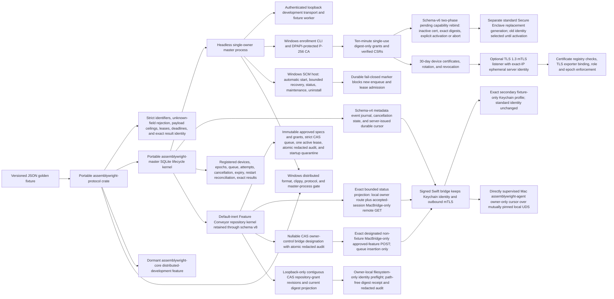
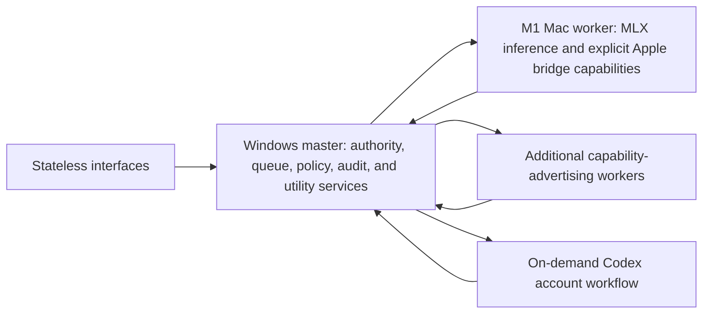

# Architecture Map

## Distributed development portable foundation

Current implementation:

Target development-mode architecture:

The repository now owns a portable contract seam, a durable master kernel, and
a headless master executable. The contract seam provides the current protocol
version, typed device/task/step/attempt/lease/cancellation identifiers, bounded
capability advertisements, handshake messages, job and result envelopes, strict
bound-before-decode JSON entry points, nil-identity rejection, and a golden
compatibility fixture. `assemblywright-master` schema version 8 preserves the
schema-v4 distributed-device lifecycle, the schema-v5 Feature Conveyor, and
schema-v6 dedicated pending capability-rebind evidence, then adds the durable
Emergency Pause revision, then adds one nullable compare-and-set owner-control
MacBridge designation. The Feature Conveyor persists the first
default-inert Durable Feature Conveyor repository kernel. Its immutable
owner-approved specification revisions bind canonical manifest and evidence
digests, three independent repository-grant revisions, dependencies, and a
snapshotted review provider/model. Its queue has a 100-item nonterminal ceiling,
one global compare-and-set revision, strict head/dependency ordering, and one
durable active lease. Enqueue, reorder, claim, lifecycle, cancellation,
abandonment, and startup quarantine commit with redacted audit evidence in the
same immediate transaction. Success releases the lease only with verified
healthy-main evidence; cancellation retains it until explicit safe
abandonment, and restart ambiguity is quarantined without automatic retry.
Master-process upgrades from supported legacy schemas v1-v7 to v8 are
backup-first under the owner lock, verify the versioned backup before migration,
and restore through a fsynced sibling plus atomic replacement when
migration-open fails. Direct file-backed legacy migration through
`MasterKernel::open` fails closed. This persistence slice exposes one
owner-token-authenticated loopback-only
`GET /v1/feature-conveyor/status` observation seam. Its pure-SELECT projection
returns only bounded lifecycle metadata and aggregate lifecycle counts for the
current queue and retained lease. A fixed-enum advisory object bound to queue,
Emergency Pause, and optional feature lifecycle revisions identifies the
queue-head dependency blocker or retained-lease/pause state and
one display-only next owner action. It does not determine claimability or
  authorize that action. The local owner observation route is unchanged; a dedicated
`GET /v1/distributed/feature-conveyor/status` reuses the exact projection only
after an accepted exporter-bound MacBridge session, denies other roles, and
forwards no owner token. The Swift helper validates the exact schema-v8
allowlist and the app displays it only while authenticated. A separate
owner-token-authenticated loopback grant surface records one strict contiguous
compare-and-set digest-only revision and inspects current grant metadata for a
repository. It is Emergency-Pause-revision bound, blocks active grants while
paused, permits revocation, performs no repository access, and is absent from
the remote router. A separate owner-token-authenticated loopback preflight binds
one strict canonical scope to the exact active registration grant and pause
revision, then performs only bounded point-in-time standard `.git`, symbolic
HEAD, and exact loose-ref identity observation for one single-component branch.
Windows holds the fixed-volume path and identity-chain handles without delete
sharing through the final atomic authorization and audit recheck. It executes no Git process, loads no
repository config or attributes, rejects network/reparse/worktree/submodule
paths, and does not prove clean-tree or content state. It stores and returns no
path, appends only redacted audit,
and emits a path-free digest receipt that grants no snapshot or claimability.
Another owner-token-authenticated loopback action designates one exact current,
non-fixture MacBridge. Only that designated device may submit one revision-bound
already-approved specification through the dedicated remote POST; the signed
helper exposes it only as a one-shot `--confirm` command with bounded stdin and
a redacted receipt. This adds queue insertion but no claim, coding worker,
Codex, repository, review-provider invocation, GitHub publication, Mac control
UI, live-device proof, unattended operation, or activation authority.

The existing distributed-device portion of `assemblywright-master` persists explicitly
registered device metadata, active connection epoch and sequence state, queued
steps, immutable leased job envelopes, attempts, cancellation/expiry outcome,
accepted payload digests, the enrollment authority binding, digest-only grants,
device-certificate serial/revocation state, and a metadata-only event journal
with one server-issued stream ID and contiguous sequence. It migrates existing
schema-v1/v2 databases transactionally. It enforces the 256-step admission ceiling, four
global leases, one live lease per device connection, registered capability
context/result limits, exact leased-attempt result identity, and durable
abandon-before-reissue on disconnect or restart. Each authoritative enqueue,
lease, terminal result, cancellation, disconnect, expiry, and restart
reconciliation transition appends its event in the same transaction.
`assemblywright-core` re-exports the
contracts only when the default-off `distributed-development` feature is
selected; it does not yet consume `assemblywright-master`.
The `distributed_protocol_contract_e2e` test serializes the current seam from
Mac capability advertisement through master acceptance, leased job, exact
result acceptance, and wrong-lease rejection. The
`master_lifecycle_e2e` suite adds file-backed fake-worker coverage for durable
success, duplicate and wrong-lease denial, cancellation, expiry,
capability-specific bounds, restart abandonment, late-result rejection, and
safe reissue. `master_process_e2e` additionally starts the actual master and
fixture-worker child processes, proves one-owner database exclusion, bearer
non-disclosure, unauthorized and oversized-body denial, authenticated loopback
health and job completion, and restart reconciliation.
`enrollment_identity_e2e` proves digest-only grants, signed-CSR issuance,
expiry/replay denial, rotation, revocation, schema-v1-to-v6 migration, and the
two-phase same-device capability rebind: pending certificates cannot
authenticate, the replacement-key acknowledgement and CA activation receipt
are independently authenticated, exact lost-output activation is idempotent,
Emergency Pause and stale/mixed/replayed/expired activation fail, immutable
redacted audit rolls back with authority state, and failed or aborted staging
preserves the active registration and certificate. It also
covers real Windows DPAPI round trips and the real CLI stdin boundary.
`event_cursor_e2e` proves bounded paging, durable resume, stream mismatch and
future-cursor rejection, metadata redaction, plus disconnect and requeue events
after restart. The Mac `assemblywright-agent` reuses the hardened local UDS transport,
requires direct-parent supervision and a fresh startup-stdin bearer, and stores
only stream ID, sequence, and update time under a single-owner lock.
Its default-off fixture adapter can hold at most one exact Public
`fixture.reasoning` synthetic-echo attempt in memory. It accepts no model, tool,
file, repository, credential, Codex, or Git input; cancellation suppresses the
result and produces an attempt/lease/epoch-bound acknowledgement. No fixture job
or result is written to the cursor database. `local_relay_e2e` proves those
default-off, bounded execution, cancellation, late-output, bearer, identity,
and cursor boundaries cross-process on macOS. The app does not
export the enrolled identity to the agent: the separately signed helper keeps
the Keychain/mTLS session, directly supervises the exact agent build, and
forwards only authenticated metadata batches over a mutually code-identity-
pinned local socket when the explicit agent paths are configured. Only the
additional exact `ASSEMBLYWRIGHT_MAC_DEVELOPER_FIXTURE_JOBS_ENABLED=true` diagnostic may
lease the registered fixture capability and forward its exact job/result or
cancellation/acknowledgement envelopes.
That opt-in also makes the app launch the helper with the exact
`--identity-profile fixture` argument. The helper selects a separate
device-only Keychain service, Secure Enclave key tag, certificate label, and
staged/installed records; absence of the argument preserves the original
standard profile and command behavior. The fixture profile rejects every
capability other than exact `fixture.reasoning` before staging or connecting.
The standard profile alone can repair the observed stale exact fixture
registration through confirmed rebind prepare/stage/promote commands. It uses
a separate replacement key tag, certificate label, and staged record, requires
the same device/name/role/endpoint/CA and a higher revision with one exact MLX
descriptor, and retains the working installed record until an exact Windows
CA-signed activation receipt is validated. Cancellation checks the installed
generation and cannot delete promoted replacement material; once a certificate
acknowledgement exists it also preserves the entire pre-promotion recovery
record because Windows activation may already be terminal. There is no general destructive
standard-profile remove command.
The standard profile can separately enable an exact singleton
`mlx.reasoning` / `local_inference` / `mlx` lane. Its absolute runtime and model
paths arrive through bounded startup stdin; one Public, no-retention request
runs in memory with a cleared offline environment, prompt-only stdin, bounded
stdout, null stderr, and dedicated process-group reaping. Lease, model, epoch,
attempt, cancellation, and digest identity stay bound. Cancellation, timeout,
disconnect, or emergency pause dominates completion and suppresses late
output. This adds no remote planning, repository, tool, credential, network,
Codex, Git, publication, or unattended authority.
`remote_mtls_e2e` adds a real master process and generated enrolled client over
loopback TLS 1.3. It proves mutual certificate authentication, durable
certificate/device checks, pre-handshake health denial, exporter-bound health
and application-handshake replay denial,
reconnect epoch advance, socket-close reconciliation, and revoked-certificate
denial. Raw remote step enqueue is absent. A persistent authenticated session
proves only a device registered with the exact fixture descriptor may lease its
Windows-locally queued synthetic job, and the result/cancellation path is bound
to that authenticated device and connection epoch. MacBridge metadata retrieval
remains bounded and an enrolled inference-worker cannot retrieve that event
stream.
The default-off live closeout `scripts/mac-windows-bridge-live-e2e.sh
--run-fixture` keeps enqueue, pause, and resume on the authenticated Windows
loopback control plane. The Mac side observes only fixed coordination markers,
redacted status, owner-only sanitized task/step event receipts, and the metadata
cursor. A loopback bearer-authenticated metadata-only event query supports that
binding without adding any remote raw enqueue or data route. Its fixed receipt
requires the agent cursor to consume the exact success and cancellation terminal
sequences, seven seconds without late or duplicate cancellation events, and a
full page drain to a post-deadline durable head. Unexpected same-task kinds,
cursor regressions, and an unbounded unrelated-event tail fail closed.
The proof also requires same-stream resume after a fresh app/helper/agent chain and a fresh
authenticated standard-profile connection with an unchanged stable projection.
Certificate revocation and confirmed local fixture profile removal remain
explicit owner cleanup; the receipt is not inference, repository/Codex/Git,
unattended, or release evidence.
The separate live closeout
`scripts/mac-windows-bridge-live-e2e.sh --run-mlx` uses
`scripts/windows-mlx-live-control.ps1` on the Windows loopback control plane.
Its payload-free receipt binds one real completion and pause-dominated
cancellation to exact event sequences, requires seven seconds without late
output, and proves same-stream helper/agent restart. This is live local LLM
evidence only, with frontier cloud review selective; it is not model-quality,
OS-sandbox, repository/Codex/Git, unattended, signing/notarization, or release
evidence.
`windows_service_lifecycle_e2e` installs a unique real SCM service on an elevated
Windows runner and proves automatic-start/recovery configuration, LocalSystem
loopback hosting, SCM plus runtime health, durable maintenance admission denial,
maintenance preservation through recovery restart, resume, explicit
stop/status/start health transitions, uninstall, and state preservation.
`DeveloperBridgeTests` covers the Mac consumer of the next seam. The shared
protocol adds strict, bounded, secret-free enrollment invitation and CSR reply
documents. A confirmed Windows `enrollment pair` process retains and zeroizes
the raw grant without emitting it. Swift stages a non-exported Secure Enclave
P-256 key plus public binding journal in device-only Keychain items, validates
the issued certificate against that key and pinned CA, and uses
Network.framework for a TLS 1.3-only, client-authenticated, exporter-bound
handshake on one persistent outbound connection.
Live enrollment uses the separately provisioned `AssemblywrightMacBridge` app target;
its embedded CLI receives an Apple application identifier and distinct
Keychain access group, while the SwiftPM executable remains compile-only.
The separate `mac-windows-bridge-live-e2e.sh` harness rejects unentitled or
ad-hoc binaries and uses that production CLI and installed Keychain identity
to prove the real Tailscale path and
authenticated health after owner enrollment; CI uses its `--check` preflight
and retains live execution as external device evidence.

This slice does not make Windows the production runtime authority yet. It adds a foreground
headless executable, process-ownership lock, authenticated loopback development
listener, deterministic fixture-worker process, a separate local enrollment
CLI, an explicit optional remote listener, an explicit Windows SCM lifecycle,
and a default-off cross-device Public synthetic fixture-job diagnostic.
The identity flow creates or
reloads an ECDSA P-256 CA whose PKCS#8 private
key is protected by Windows DPAPI for the current operator identity; SQLite
contains only its public fingerprint. Enrollment grants are server-created,
ten-minute, single-use, role/capability-bound, and persisted only as SHA-256
digests. Issuance accepts the secret-bearing strict JSON request only on stdin,
verifies the client CSR signature, ignores client-requested identity fields, and
issues a 30-day client-auth certificate bound to the durable server-selected
device ID. Rotation revokes the replaced serial and revocation disables the
device plus every active serial. `serve --remote-bind` issues an in-memory-key,
24-hour server-auth certificate for the exact concrete bind IP, restricts rustls
to TLS 1.3, requires a CA-valid enrolled client certificate, rechecks exact
certificate serial/digest/device revocation state on every request, binds the
application handshake to the TLS exporter, and reconciles an accepted epoch on
socket close. The Windows service path retains the same single-owner runtime,
adds automatic start and bounded restart recovery, exposes explicit
install/start/stop/status/maintenance/recover/uninstall commands, and persists a
fail-closed maintenance marker that blocks only new enqueue/lease admission.
LocalSystem is loopback-only; remote mTLS requires the same owner account as the
DPAPI CA and accepts credentials only through bounded stdin. Installation
resolves that account to its exact SID and idempotently grants the native
`SeServiceLogonRight`; failure rolls back the partial service. The Mac bridge
uses an explicitly configured private-overlay IP and provides authenticated
health proof. The Swift app has a default-off development lifecycle that may
supervise only the exact separately Apple-signed bridge helper, validates its
fixed identifier and distinct Keychain group, clears its environment, and
renders strict bounded redacted health in a read-only Developer tab. The helper
may additionally receive only exact agent executable/data paths through bounded
stdin, then pin, launch, and directly supervise that agent while forwarding
authenticated metadata pages into its durable cursor. The enrolled key and mTLS
session stay in the helper. The helper is not bundled. A separate owner-controlled live mode now coordinates a real
Windows service stop/start and requires the production Swift lifecycle to
observe Connected, Master Offline, and a fresh Connected state with a higher
epoch. This adds bounded service-outage recovery evidence, but no discovery,
Tailscale/network-interface outage claim, bundled Rust-agent supervision, or
unattended reliability.
It adds no
general live cross-device reliability claim, supplied-password or
owner-account remote-mTLS E2E, host hardening, upgrade/backup/restore automation,
live inference worker, Codex dispatch, repository mutation, or Connection
Setup UI. The distributed device and Feature Conveyor SQLite data remain
bounded kernels inside the Windows master.

`assemblywright-core` is no longer an assistant runtime. It retains only the hardened
peer-identity Unix-socket transport that the Mac agent consumes, its startup
validation, and read-only release readiness/evidence inspection. The
conversation runtime, model providers and routing, plugin host and wasm
sandbox, SQLite task/audit/memory/approval store, scheduler, trusted
system-wake, workspace roots, and permission engine were removed with the
pivot to Developer Mode.

Future transport and runtime work must preserve
fail-closed policy, planning/action separation, sensitivity and redaction,
explicit cancellation, emergency pause, durable audit evidence, bounded
frames, and result acceptance bound to the exact leased attempt.
The full accepted authority, security, routing, recovery, and rollout target is
kept in `docs/distributed-developer-mode-design.md`, and the Feature Conveyor
target is in `docs/feature-conveyor-design.md`.
