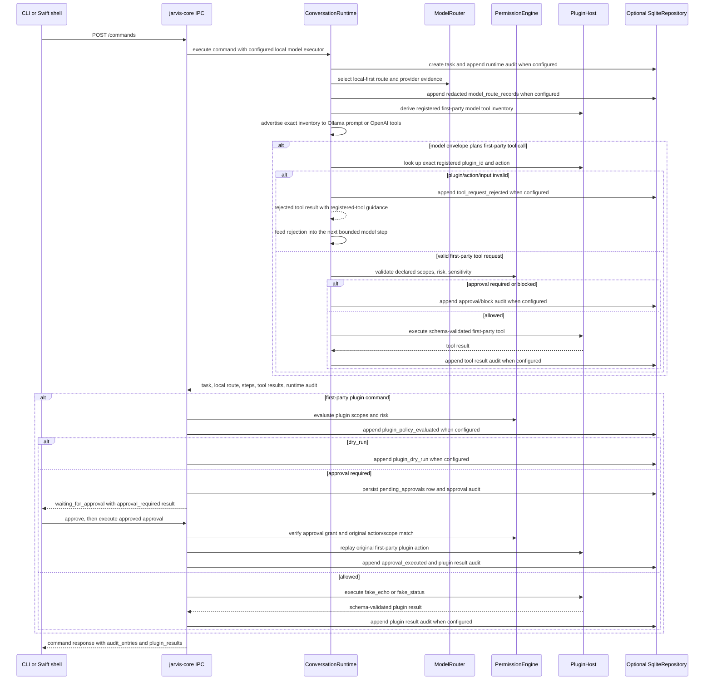
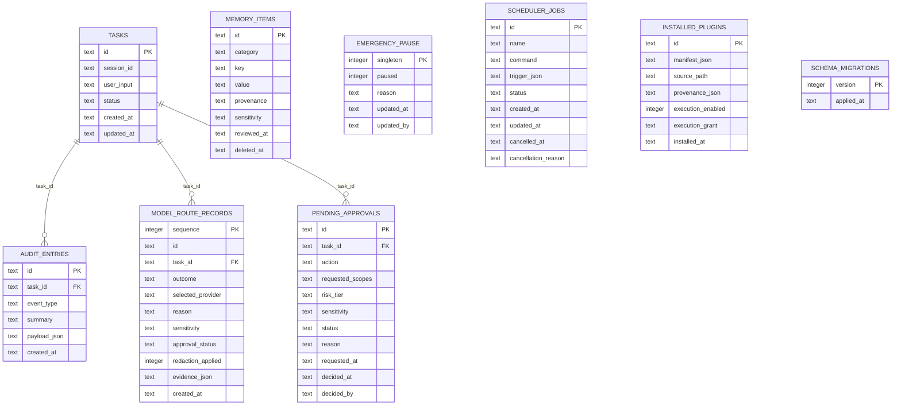

# Architecture Map

Jarvis is a local-first macOS assistant foundation. The current repository
contains a Rust workspace with the core contracts, loopback IPC server,
SQLite-backed repository primitives, policy/model-routing rules, in-process
and installed-plugin contracts, scheduler persistence/recovery, release
readiness/evidence-status, redacted diagnostics, CLI client, and a
Swift/SwiftUI Mac shell under `apps/mac` with core supervision, management tabs,
voice input/output adapters, scheduler notifications, Keychain launch credential
injection, and packaged-app smoke support.

## Current Implementation And Evidence Boundary Diagram

This diagram includes implemented repo-local surfaces plus manual external
evidence lanes that current code can inventory, validate structurally, or
bundle after owner validation. Those manual lanes are not local proof that the
external release checks have happened.

```mermaid
flowchart TB
    User["User or local test operator"]
    User --> CLI["jarvis-cli human-readable command/ask/tools; --json for exact IPC payloads"]
    User --> MacShell["JarvisMacApp SwiftUI scaffold"]
    ReleaseWorkflow["repo-owned release workflow and docs alignment"] --> Docs["DESIGN, README, architecture map, release checklist, build/test commands, knowledge-base"]
    ReleaseWorkflow --> Sweep["isolated worktree/branch production sweep"]
    Sweep --> LocalGate["./scripts/release-local.sh"]
    GitHubCI["GitHub Actions release-local macOS workflow"] --> LocalGate
    LocalGate --> CIWorkflowSmoke["release-ci-workflow-smoke.sh"]
    LocalGate --> VersionConsistency["release-version-consistency.sh check"]
    LocalGate --> E2E["local_ipc_e2e ignored release proof"]
    LocalGate --> Smoke["jarvis-cli smoke"]
    LocalGate --> OperatorQASmoke["release-operator-qa-smoke.sh"]
    LocalGate --> PackageVersionSelfTest["package-distribution.sh version-consistency-self-test"]
    LocalGate --> PackageProvenanceSelfTest["package-distribution.sh provenance-self-test"]
    LocalGate --> UnsignedLaunch["package-distribution.sh unsigned-launch-check"]
    LocalGate --> SignedDistributionRunbook["jarvis release signed-distribution-runbook read-only signed artifact triage"]
    LocalGate --> LiveDeviceQA["release-live-device-qa.sh check/self-test preflight"]
    LocalGate --> PluginTrustRunbook["jarvis release plugin-trust-runbook read-only plugin trust triage"]
    LocalGate --> PluginTrustQA["release-plugin-trust-qa.sh check/self-test preflight"]
    LocalGate --> EvidenceBundlePreflight["release-evidence-bundle.sh check/self-test/template preflight"]
    EvidenceTemplate["release-evidence-bundle.sh write-template"] --> EvidenceBundleEnv["sourceable final-bundle env with flags default false"]
    LocalGate --> LiveDeviceTemplate["release-live-device-qa.sh write-template"]
    LiveDeviceTemplate --> LiveDeviceEnv["sourceable live-device QA env with flags default false"]
    LocalGate --> PluginTrustTemplate["release-plugin-trust-qa.sh write-template"]
    PluginTrustTemplate --> PluginTrustEnv["sourceable plugin-trust QA env with flags default false"]
    LocalGate --> EvidenceDoctor["release-evidence-doctor.sh check/self-test evidence inventory and next-step commands"]
    LocalGate --> SwiftGate["Swift package build/test"]
    LocalGate --> CargoGate["fmt, clippy, tests, build, package"]
    LocalGate --> MigrationSmoke["storage-migration-backup-smoke.sh backup, restore, newer-schema, and v1-v8 fixture proof"]
    ReleaseReadiness["/release/readiness and jarvis release readiness"] --> Docs
    ReleaseReadinessFallback["serverless CLI readiness fallback"] --> ReleaseReadiness
    EvidenceStatus["/release/evidence-status and jarvis release evidence-status"] --> EvidenceDoctor
    EvidenceStatus --> LiveQASemanticValidator["live QA semantic validator: bundle/version/core-digest/timestamp/transcript/command/non-voice-owner/self-test checks"]
    EvidenceStatus --> FinalBundleValidator["final bundle validator: path/digest/local-signature/archive-URI/owner-attestation and child-report semantic checks"]
    LiveQASemanticValidator --> RepoEvidenceLookup["repository-backed command-result lookup: task/audit record must exist"]
    RepoEvidenceLookup --> Repository["SQLite tasks and audit entries"]
    LiveQASemanticValidator --> ReleaseReadiness
    subgraph ManualExternal["Manual external evidence, not local gate proof"]
        LiveDeviceAssert["release-live-device-qa.sh assert-complete"] --> LiveDeviceQAReport["target/release-live-device-qa-report.json owner-recorded voice and non-voice evidence"]
        PluginTrustAssert["release-plugin-trust-qa.sh assert-complete"] --> PluginTrustQAReport["target/release-plugin-trust-qa-report.json owner-recorded plugin trust evidence"]
        PluginTrustRunbook -. guides .-> PluginTrustAssert
        SignedArtifacts["Developer ID signed, notarized, and stapled zip/pkg"] --> EvidenceBundleRun["release-evidence-bundle.sh bundle"]
        SignedArtifacts --> SignedProvenance["package-distribution.sh signed provenance report"]
        SignedDistributionRunbook -. guides .-> SignedArtifacts
        SignedProvenance --> EvidenceBundleRun
        EvidenceBundleEnv --> EvidenceBundleRun
        LiveDeviceEnv --> LiveDeviceAssert
        PluginTrustEnv --> PluginTrustAssert
        LiveNotificationQA["owner-recorded live macOS notification prompt and delivery QA"] --> EvidenceBundleRun
        LiveDeviceQAReport --> EvidenceBundleRun
        PluginTrustQAReport --> EvidenceBundleRun
        EvidenceBundleRun --> EvidenceArchive["archived final release evidence bundle with owner attestation"]
    end
    EvidenceBundleRun -. referenced by .-> EvidenceStatus
    AppReleaseSmoke["packaged-app-release-smoke.sh"] --> LocalApp["temp Jarvis.app bundle"]
    LocalApp --> AppMetadata["Info.plist plus ad-hoc codesign when available"]
    LocalApp --> BundledCLI["Contents/Resources/bin/jarvis-cli"]
    AppReleaseSmoke --> CleanProfile["temporary HOME and SQLite app state"]
    MacShell --> MacCore["JarvisMacCore IPC client, supervisor, and view models"]
    MacShell --> ActivityUI["Run activity summary, bounded event stream, and audit view"]
    MacShell --> MemoryUI["Memory CRUD, classification, review, soft-delete, restore, and include-deleted controls"]
    MacShell --> PluginUI["Plugin manifest and installed registry/provenance view"]
    MacShell --> SchedulerAttentionUI["Scheduler attention summary"]
    MacShell --> SchedulerActionsUI["Scheduler run-due and stale-recovery controls"]
    SchedulerAttentionUI --> SchedulerNotifications["Scheduler notification model"]
    SchedulerNotifications --> UserNotifications["macOS UserNotifications adapter"]
    MacShell --> VoiceInput["Speech/AVFoundation input controls"]
    VoiceInput --> VoiceAutoSubmit["opt-in final-transcript auto-submit"]
    MacShell --> SpeechOutput["AVFoundation speech-output preview controls"]
    ActivityUI --> MacCore
    MemoryUI --> MacCore
    PluginUI --> MacCore
    SchedulerAttentionUI --> MacCore
    SchedulerActionsUI --> MacCore
    ReleaseReadiness --> MacCore
    EvidenceStatus --> MacCore
    VoiceInput --> MacCore
    VoiceAutoSubmit --> MacCore
    SpeechOutput --> MacCore
    MacCore --> Supervisor["JarvisCoreSupervisor configured or bundled process"]
    Supervisor --> CLI
    MacCore -->|"HTTP JSON on configured core URL"| IPC["jarvis-core::ipc Axum loopback server"]
    CLI -->|"HTTP JSON on 127.0.0.1:7787 by default; text formatting stays client-side"| IPC
    E2E --> IPC
    Smoke --> IPC

    subgraph Core["jarvis-core"]
        IPC --> Health["/health"]
        IPC --> Contract["/contract"]
        IPC --> ReleaseReadiness
        IPC --> EvidenceStatus
        IPC --> Diagnostics["/diagnostics/export"]
        IPC --> Commands["/commands"]
        IPC --> Inspection["/tasks, /audit, /activity/summary, /activity/events, /model-routes, /memory, /approvals, /permissions/grants, /permissions/policy-review incl scheduler triggers and memory review, /plugins/manifests, /plugins/installed"]
        IPC --> ApprovalExecute["/approvals/:id/execute approved replay"]
        IPC --> PublisherReview["/plugins/installed/:id/publisher/verify"]
        IPC --> PublisherSignature["/plugins/installed/:id/publisher/signature/verify"]
        IPC --> InstalledRunner["installed plugin execution boundary"]
        IPC --> PauseApi["/emergency-pause"]
        IPC --> SchedulerApi["/scheduler/jobs"]
        IPC --> SchedulerAttention["/scheduler/attention redacted handoff"]
        IPC --> SchedulerRecovery["/scheduler/recover-stale and opt-in startup stale recovery"]
        IPC --> ModelToolCatalog["/tools/model redacted first-party model-tool catalog"]

        Commands --> Runtime["ConversationRuntime"]
        Runtime --> ModelExec["ModelExecutor trait"]
        ModelExec --> FakeLocal["FakeLocalModel default"]
        ModelExec --> OllamaLocal["Ollama-compatible local HTTP provider"]
        ModelExec --> ChatGPTProvider["ChatGPT/OpenAI-compatible HTTP provider"]
        ModelExec --> ProviderEnvelope["strict JSON provider response envelope"]
        ProviderEnvelope --> LocalToolDiscipline["local-model tool discipline: strict envelope, advertised first-party inventory, invalid-tool rejection/recovery, bounded schema/policy path"]
        LocalToolDiscipline --> ToolPlan["bounded first-party tool requests"]
        LocalToolDiscipline --> ModelFailure
        Runtime --> ToolPlan
        ToolPlan --> PluginPolicy
        Runtime --> RuntimeControl["RuntimeControl pause/cancel flags"]
        Runtime --> RuntimeStore["RuntimeCommandStore persistence hook"]
        Runtime --> RuntimeAudit["runtime AuditEntry list"]
        Runtime --> ModelFailure["structured failed response for provider errors"]

        Commands --> Router["ModelRouter evidence pass"]
        Router --> LocalRoute["local-first route"]
        Router --> ChatGPTGate["ChatGPT gate and redaction logic"]

        Commands --> PluginDispatch["command-pattern plugin dispatch"]
        PluginDispatch --> PluginPolicy["PermissionEngine policy check"]
        PluginPolicy --> PluginHost["PluginHost"]
        PluginHost --> ManifestValidation["manifest and JSON schema validation"]
        PluginHost --> FirstParty["fake_echo and fake_status plugins"]
        FirstParty --> RegisteredToolCatalog["registered first-party model-tool catalog"]
        RegisteredToolCatalog --> ModelToolCatalog
        RegisteredToolCatalog --> LocalToolDiscipline
        RegisteredToolCatalog --> ChatGPTProvider
        PluginHost --> TimeoutCancel["timeout and cancellation handling"]
        InstalledRunner --> InstalledValidation["stored manifest/action/input/output validation"]
        InstalledRunner --> ProvenanceCheck["manifest, source-tree, and command hash verification"]
        InstalledRunner --> InstalledGrant["disabled-by-default metadata_only grant"]
        InstalledRunner --> InstalledEnable["/plugins/installed/:id/execution explicit subprocess grants"]
        ProvenanceCheck --> InstalledEnable
        ProvenanceCheck --> PublisherReview
        ProvenanceCheck --> PublisherSignature
        PublisherReview --> PublisherAudit["operator-pinned origin audit evidence"]
        PublisherSignature --> SignatureAudit["trusted-key signature audit evidence"]
        PluginHost --> NetworkDeclarations["network_access declared_hosts validation and subprocess_stdio_network gate"]
        NetworkDeclarations --> PluginTrustQAGate["manual plugin trust QA report gate"]
        NetworkDeclarations --> PluginPolicy
        InstalledRunner --> SubprocessRunner["local_subprocess direct Command JSON stdin/stdout runner"]
        SubprocessRunner --> SafePath["canonical command under source_path, no shell interpolation"]
        SubprocessRunner --> SandboxBoundary["audit truth: subprocess_started can be true; os_sandbox_enforced remains false until real OS sandbox or egress policy exists"]
        SubprocessRunner --> ProgressFrames["bounded stderr JSON progress frames"]
        SubprocessRunner --> InstalledAudit["blocked, dry-run, completed, or failed audit evidence"]
        SandboxBoundary --> InstalledAudit
        ProgressFrames --> InstalledAudit

        SchedulerApi --> Scheduler["Scheduler"]
        SchedulerAttention --> Scheduler
        SchedulerRecovery --> Scheduler
        Scheduler --> SchedulerPolicyAudit["redacted proactive policy audit before due execution"]
        Scheduler --> SchedulerStaleAudit["stale running recovery audit"]
        PauseApi --> RuntimeControl
    end

    IPC --> RepoState["optional SqliteRepository backing"]
    RuntimeStore --> RepoState
    Inspection --> RepoState
    PublisherReview --> RepoState
    PublisherSignature --> RepoState
    PauseApi --> RepoState
    SchedulerApi --> RepoState
    SchedulerAttention --> RepoState
    SchedulerRecovery --> RepoState
    RepoState --> Tasks["tasks"]
    RepoState --> Audit["append-only audit_entries"]
    RepoState --> Memory["memory_items"]
    Memory --> MemoryReview["unreviewed/sensitive memory review counts"]
    RepoState --> StoredPause["emergency_pause"]
    RepoState --> StoredScheduler["scheduler_jobs"]
    SchedulerPolicyAudit --> Audit
    SchedulerStaleAudit --> Audit
    RepoState --> StoredApprovals["pending_approvals"]
    RepoState --> SchemaMigrationsCurrent["schema_migrations"]
    SchemaMigrationsCurrent --> HistoricalFixtureMatrix["representative schema v1-v8 fixture preservation"]
    RepoState --> MigrationBackups[".jarvis-migration-backups app-owned snapshots"]
    MigrationBackups --> RestorePath["restore original DB/WAL/SHM on migration-open failure"]

    Types["shared contract types"] --> Runtime
    Types --> IPC
    Types --> PluginHost
    Types --> PluginPolicy
    Types --> RepoState
```



The current IPC `/commands` endpoint invokes `ConversationRuntime` with the
deterministic `FakeLocalModel` by default or an opt-in Ollama-compatible local
HTTP or ChatGPT/OpenAI-compatible provider selected from typed env config. It
returns runtime steps, route metadata, plugin results, and audit entries, and
can persist task, audit, and redacted append-only model-route state through
`SqliteRepository` when the state is constructed with repository backing. It
also records local-first `ModelRouter` evidence and can execute deterministic
first-party plugin commands through the policy engine. The runtime supports
bounded model-planned first-party tool calls with schema validation, policy
checks, approval stops, and audit evidence. Ollama-compatible and
ChatGPT/OpenAI-compatible text responses can use a strict JSON envelope with
`message`, `complete`, and `tool_requests`, which feeds the same bounded
first-party tool path; ChatGPT/OpenAI-compatible responses can also return
native OpenAI `tool_calls` for the advertised first-party tool definitions.
The Ollama-compatible prompt advertises the exact registered first-party
model-tool catalog as a JSON allowlist of `plugin_id`/`action` pairs, and the
same catalog is inspectable through `/tools/model` and projected into native
ChatGPT/OpenAI-compatible tool definitions. Invalid provider-planned plugin IDs,
undeclared actions, malformed inputs, and oversized tool plans fail closed with
registered-tool guidance and redacted audit evidence before policy checks or
tool execution. Plain text remains backward-compatible. This is not installed-plugin
orchestration or broad third-party tool execution. Model-provider execution
failures now stay inside
the command contract: the runtime marks the task failed, appends
`model_step_failed` with redacted provider diagnostics, and returns route
evidence instead of letting IPC translate the failure into a transport error.
`package-distribution.sh` now writes a signed-distribution provenance report
during the full Developer ID lane after app/pkg signing, notarization, stapling,
Gatekeeper assessment, notary log capture, and SHA-256 digest capture. Its
Apple-tool evidence is generated and semantically checked from `codesign`,
`pkgutil --check-signature`, `xcrun notarytool`, `xcrun stapler`, and `spctl`
output before broader release evidence can use it; the writer also rejects
negated Gatekeeper text such as `not accepted` and app zips that do not contain
exactly one top-level `Jarvis.app` payload. The report is required by
`release-evidence-bundle.sh`, `release-evidence-doctor.sh`, and
`/release/evidence-status`, but it still does not replace clean-profile install,
Finder launch, live-device QA, or plugin-trust QA evidence.
`/release/readiness` derives a conservative read-only readiness summary from
contract feature metadata, the release-checklist blocker set, and explicitly
enabled release evidence status. By default it treats standard `target/`
evidence files as inventory only so stale local reports cannot silently clear
manual blockers; with `JARVIS_RELEASE_READINESS_EVIDENCE_MODE=external`, a
valid live-device QA report can clear only the live voice/audio readiness item
and related owner-recorded live-device blockers. The live report must pass the
same semantic validator used by `/release/evidence-status`: schema/type,
`self_test_fixture=false`, expected installed app path, expected bundle ID,
matching short/build version, installed bundled core path/version/SHA-256
binding, UTC `Z` timestamps, completion not earlier than start, observed
transcript matching the spoken test phrase after trimming, observed command text
matching the expected command text after trimming, and
`command_result_evidence_id` shaped as a `task:<uuid>` or `audit:<uuid>`
reference and, when readiness/evidence-status is served by repository-backed
IPC state, resolved against existing task or task-associated audit evidence. It still keeps
`production_ready: false` unless every required evidence-status item is present,
no missing or invalid evidence remains, and evidence-cleared features leave no
pending readiness features. Even then, the true state means validated
owner-recorded external evidence is present; Jarvis has not itself performed
signing, notarization/stapling, live-device QA, plugin trust QA, or manual
release QA.
`jarvis release readiness` prefers that IPC endpoint and falls back to the same
local `IpcState` readiness summary when no server is available; the fallback is
operator triage only and does not claim server-backed runtime evidence. The
default readable output stays compact, while `--all-commands` prints the full
recommended release runbook without requiring operators to parse JSON.
`/release/evidence-status` and `jarvis release evidence-status` expose the
standard signed artifact, signed-distribution provenance report, live-device QA
report, plugin-trust QA report, and final evidence bundle inventory as
structured JSON with present, missing, or invalid item status. Artifact paths
remain presence-only checks except the app bundle, whose `Info.plist` bundle id,
short version, and build version must match expected release metadata, and the
bundled core executable, whose adjacent `jarvis-cli.version` marker must match
the expected release version; missing or stale marker details point operators
back to the unsigned launch check for local evidence or the signed packaging
lane for final release evidence. JSON
reports receive semantic validation for signed provenance version/bundle
metadata, bundled core path/version/SHA-256 binding, Apple-tool-derived
signing/notary/staple/Gatekeeper fields,
required flags, SHA-256 digests, signed-provenance zip/pkg/core digest matches
against current artifact files, live-device bundle/version/timestamp evidence,
repository-backed live command-result task/audit evidence resolution when IPC
state has a repository,
non-future plugin-trust review and egress validation timestamps, deny/allow
egress fixture notes, and final bundle path/digest/archive-URI/local-signature
evidence.
Final bundle inspection also revalidates the signed-provenance, live-device QA,
and plugin-trust QA child reports referenced by the bundle instead of accepting
matching report digests alone. This mirrors release-evidence-doctor
inventory plus report inspection only; it does not perform signing,
notarization, stapling, installation, Finder launch, executable runtime
validation, live-device QA, marketplace review, malware scanning, OS
sandboxing, or host-level egress enforcement.
Repository-backed IPC state stores approval-required plugin command decisions
in `pending_approvals`, exposes them through CLI/IPC inspection endpoints, and
lets a user grant or deny the pending record without executing the side effect.
Approved records can then be explicitly executed once through
`/approvals/:id/execute` or `jarvis approvals execute <approval-id>`, which
replays only the original first-party plugin command, verifies the current
action and scope contract still match the approval record, applies an approval
grant, and appends `approval_executed` plus plugin completion audit evidence.
The read-only `/permissions/grants` endpoint combines approval history,
high-risk pending counts, installed-plugin execution-grant state, provenance
integrity status, and unverified plugin counts into one permission-center
surface for CLI and Swift inspection. `/permissions/policy-review` adds a
read-only severity-ranked review list for pending approvals, high-risk plugin
actions, unverified installed-plugin provenance, and unverified origin claims.
It also surfaces active scheduler triggers without exposing scheduler command
text, using due and recurring trigger severity to keep proactive routines
inspectable from the same review queue. Unreviewed memory items also appear in
that review queue with category/key and sensitivity only; memory values stay
out of policy review and diagnostics export.
Due scheduler execution now records `scheduler_proactive_policy_checked`
before command submission. That audit entry reuses the policy-review trigger
classification, records command redaction explicitly, and keeps scheduler
command text out of the due-run audit surface. Scheduler-originated first-party
plugin calls are also submitted as proactive calls, so plugin actions must opt
in through manifest `proactive` plus `proactive_run` permission; non-opted-in
actions fail closed with redacted audit evidence and no side effect.
The read-only `/scheduler/attention` endpoint summarizes due, running, and
failed scheduler jobs for app handoff without returning scheduler command
text. The Swift Scheduler tab renders the same summary above the job list,
can invoke bounded `/scheduler/run-due` and `/scheduler/recover-stale`
actions through typed IPC client methods, refreshes jobs and attention after
completion, and shows concise last-action state without exposing scheduler
command bodies. It also owns a protocol-backed notification model that can
request macOS notification authorization and deliver due, failed, and
emergency-pause-blocked attention items through a `UserNotifications` adapter.
Swift tests cover scheduler run/recovery IPC routing, model refresh behavior,
authorization, delivery, deduplication, and fail-closed denied-permission
paths with fake adapters; live OS notification permission prompts and delivery
still require manual packaged-app validation.
The mutating `/scheduler/recover-stale` endpoint and matching CLI command
support explicit operator recovery when persisted jobs are stuck in `Running`
after a killed process or crash. Recovery marks matching jobs failed, returns
diagnostic scheduler jobs without command text, and appends
`scheduler_stale_running_recovered` with command redaction evidence.
`jarvis serve --scheduler-recover-stale-on-startup` can run the same recovery
path before accepting IPC traffic, with configurable age and limit flags and an
`automatic_recovery: true` audit payload marker. This is opt-in lease cleanup,
not unbounded background rewriting of scheduler history.
Installed plugin run requests have an explicit fail-closed boundary that
revalidates stored manifest metadata, checks the requested action, validates
input schema, verifies the local install provenance snapshot, honors
disabled-by-default `metadata_only` semantics, and appends audit evidence.
Contract-only dry runs can return `dry_run` after
manifest/action/input validation with `side_effect_executed=false`.
`local_subprocess` manifests can be explicitly enabled through
`/plugins/installed/:id/execution` with `execution_grant: subprocess_stdio`, or
`subprocess_stdio_network` for actions that declare network access; only after
`/plugins/installed/:id/provenance/verify` confirms the deterministic
source-tree snapshot, manifest hash, and subprocess command hash still match
the install-time snapshot can the runner start the declared command directly
with JSON stdin and JSON stdout, with canonical source-path checks, timeout
enforcement, output schema validation, and audit evidence recording whether the
subprocess started.
The safe installed-plugin inspection endpoints return a redacted view: local
source paths, manifest paths, subprocess command paths, publisher-signature
material, and provenance hashes are omitted from `/plugins/installed` and
`/plugins/installed/:id`, while execution grant, integrity status,
publisher-origin review state, action metadata, and redaction markers remain
visible for operator review.
Publisher-origin review is a separate fail-closed step: the operator can mark
the manifest author claim as verified only after local provenance matches the
install snapshot and the supplied trusted origin exactly matches the stored
claim. This clears the unverified-origin policy review item and records audit
evidence. Signed manifests can also be verified after local provenance matches:
Jarvis verifies an Ed25519 signature over the unsigned manifest only when the
operator supplies a trusted public key that exactly matches the manifest key.
This records signature verification audit evidence, but it is not marketplace
trust or malware analysis.
Network-capable actions must request the `network` permission and declare exact
plain-hostname allowlists; invalid declarations fail manifest validation and
policy review surfaces network-capable installed actions. This is manifest
governance, not OS-level network sandboxing.
The local release gate now runs `./scripts/release-plugin-trust-qa.sh --check`
and `--self-test` so marketplace review, malware scanning, signed publisher
policy, OS-level process/network sandbox validation, and host-level egress
validation stay visible as manual release evidence. `--write-template`
generates the sourceable `JARVIS_PLUGIN_QA_*` checklist with validation flags
defaulted to `false`; `--check` is a runbook and `--self-test` proves JSON
report mechanics only; `--assert-complete` records owner validation flags plus
owner/timestamp/evidence-note fields, including a host egress policy label plus
deny/allow fixture notes, and does not turn those external checks
into repo-local proof.
The command runtime supports opt-in ChatGPT/OpenAI-compatible execution only
after route policy allows it. Installed-plugin execution still does not provide
broader WASM isolation, OS-level process/network sandboxing, host-level egress
filtering, marketplace trust, or a signed/notarized packaged Mac approval flow.
File-backed `SqliteRepository::open` creates a preflight migration backup for
existing databases below the current schema version and restores the original
DB/WAL/SHM files if opening/configuring/migrating fails. The backup is
app-owned local state, not a redacted export.
Repository-backed IPC state also exposes task, audit, model-route, memory,
permission-grant, scheduler, plugin manifest, installed-plugin, and
installed-plugin execution-grant inspection endpoints, so the CLI and Swift
shell can inspect durable local state without reaching into SQLite directly.
The Swift Plugin tab renders first-party manifests plus repository-backed
installed-plugin records through the redacted inspection contract: local paths,
subprocess command paths, publisher-signature material, and provenance hashes
stay hidden, while execution grant, provenance integrity status,
origin-review state, action metadata, executable status, and redaction markers
remain visible. If the installed registry endpoint is unavailable, the tab
keeps first-party manifests visible and shows an installed-registry warning
instead of failing the whole plugin surface.
`/activity/summary` adds a repository-backed progress snapshot for current
status counts, active task count, redacted recent task metadata, and recent
audit entries.
`/activity/events` exposes the same evidence as bounded server-sent events for
CLI progress watching and a manual Swift Runs-tab "Watch Events" action. The
Swift client collects only bounded streams, decodes `activity_summary`,
`activity_progress`, and `activity_error` frames, and updates the visible
activity summary from the latest event without exposing recent task command
bodies. Installed subprocess plugins can also
emit bounded `jarvis_progress` JSON frames on stderr; Jarvis records the parsed
stage/message events in the run response and append-only audit log, emits
redacted `activity_progress` SSE frames from recent audit evidence, and keeps
raw stderr plus installed-plugin local paths and provenance hashes redacted
from run, audit, and activity-summary evidence. These are local progress evidence surfaces, not yet a
per-token model response stream or unbounded real-time plugin UI stream.
The release-proof path remains local: `./scripts/release-local.sh` runs Rust
formatting, linting, tests, ignored release-proof tests, build/package, CLI
smoke, repository-backed operator QA smoke, unsigned distribution launch proof,
live-device QA preflight/self-test, plugin-trust QA preflight/template/self-test,
release-evidence bundle preflight/self-test, and Swift package build/test.
The public GitHub Actions workflow runs that same local gate on `macos-latest`
for pull requests, pushes to `main`, and manual dispatch.
`release-ci-workflow-smoke.sh` is part of the gate so workflow drift away from
`./scripts/release-local.sh` fails locally before PR evidence is claimed.
This lane is also exposed through `/contract` and release readiness as
`release_ci_gate`, with a boundary limited to repo-owned public CI evidence.
The current implementation diagram mirrors those `release-local.sh` lanes,
including the unsigned distribution launch proof and live-device QA preflight
nodes. That evidence proves only the current implemented foundation surfaces.
`./scripts/release-operator-qa-smoke.sh` starts an isolated repository-backed
core and verifies command, audit, routes, memory mutation/review/restore,
scheduler attention/run-due, activity, permission review, diagnostics,
emergency pause, release readiness, and restart recovery in one operator-facing
CLI smoke. The same local lane is exposed as the implemented
`operator_release_qa_smoke` and `release_ci_gate` contract features so Swift and release docs can cite
it without implying clean-profile installed-app QA. `./scripts/packaged-app-release-smoke.sh`
adds local packaged app evidence by assembling a SwiftPM-built `Jarvis.app`
with `Info.plist`, bundled `jarvis-cli`, ad-hoc signing plus audio-input
entitlement evidence when `codesign` is available, temp-profile launch,
app-supervised core health, command, audit, diagnostics, pause, blocked
command, resume, and SQLite state checks. `./scripts/package-distribution.sh
--unsigned-launch-check` is part of `./scripts/release-local.sh` and adds
release-built distribution layout launch evidence for the bundled core, unsigned
installer payload structure, isolated HOME, command/audit/diagnostics,
pause/block/resume, SQLite state, and bundled `jarvis-cli --version` alignment
with the expected release version. These checks do not prove Developer ID
signing, notarization, installer behavior, Finder/LaunchServices validation,
App Store distribution, or live-device microphone/Speech/audio-output
validation. The
`cargo run -p jarvis-cli -- release live-device-runbook` command gives release
operators a read-only view of the live voice blocker, live-device report status,
and exact next commands before they move to the external device, and the default
local gate executes it to keep the operator runbook from drifting. The
`./scripts/release-live-device-qa.sh --check` command keeps the manual
live-device QA runbook executable in the default gate;
`--assert-complete` is an owner-recorded assertion after real-device checks and
writes a JSON evidence report with installed-app metadata, voice-loop evidence
fields, owner/device/profile/timestamp/evidence notes, structured
spoken-command observation fields, validation flags, schema identity, and proof
boundary, not an automated proof. Owner-recorded evidence fields must contain
non-whitespace text, and self-test fixture identity is reserved for the script's
internal fake-fixture self-test. The `--self-test` mode uses that fake app
fixture to cover the assertion/report mechanics in the local gate.
The `./scripts/release-plugin-trust-qa.sh --check` command similarly keeps
marketplace, malware-analysis, signed-publisher-policy, OS sandbox, and
host-level egress checks on the release path; `--write-template` writes a
sourceable plugin-trust QA env file, and `--assert-complete` writes a manual
JSON evidence report only after owner validation flags are true and
owner/timestamp/evidence-note fields are populated, including structured host
egress policy, deny-fixture, and allow-fixture evidence. The report now carries
`schema_version: 1`, `evidence_type: owner_recorded_plugin_trust_qa`, and
`self_test_fixture: false`, must use
`review_source: owner-asserted-manual-review` for operator evidence, and the
evidence doctor/status validators reject stale, self-test, misidentified, or
non-owner-source plugin-trust report shapes.
The `./scripts/release-evidence-bundle.sh --check` command ties the expected
signed distribution artifact paths, live-device QA report, plugin-trust QA
report, and owner validation flags into a final bundle manifest path. `--check`,
`release-evidence-doctor.sh`, and `/release/evidence-status` are read-only
inventory plus semantic validation surfaces; they do not perform signing,
notarization, stapling, installation, live-device QA, plugin-trust QA, final
bundle creation, or host-level egress enforcement. Final bundle manifests now
carry `schema_version: 1`, `evidence_type: release_evidence_bundle`, and
`owner_recorded_release_evidence`, and the doctor/status validators reject
stale, weak, or misidentified final-bundle report shapes. The `--check` runbook
points operators to the sourceable final-bundle template before `--bundle`, and
readiness exposes the source-and-run template command alongside the inline
owner-flag example.
`--self-test` uses fake artifacts/reports only; `--bundle` writes a manifest after the referenced
evidence exists, the owner flags are true, and the local app signature, app
stapling ticket, installer signature, installer stapling ticket, and app zip
payload validate through Apple-tool-derived checks. Production bundle creation keeps local signature validation
mandatory, parses every required live-device/plugin-trust report flag, requires
non-empty owner-recorded evidence fields in both QA reports plus the final
bundle owner attestation, confirms the live-device QA bundle id/version/build
metadata matches the expected release, checks live-device voice and notification
timestamps are ordered UTC values,
and records SHA-256 digests for distribution artifacts and QA reports before
writing evidence.
The `./scripts/release-evidence-doctor.sh --check` command inventories the
standard signed-artifact, live-device QA, plugin-trust QA, and final bundle
manifest paths so operators can see present, missing, or invalid evidence before
`--bundle`; it validates local app bundle metadata and the packaged bundled-core
version marker before counting those local artifacts as present, and it rejects
final bundles that reference semantically invalid signed-provenance,
live-device QA, or plugin-trust QA child reports even when the recorded child
digests match. When evidence is missing it prints the signing, live-device
template/assertion, plugin-trust template/assertion, and final evidence-bundle
template/bundle commands. It is a diagnostic inventory, not release proof or
signing/notary validation by itself.

The production-readiness sweep is coordinated through isolated worktrees and
topic branches against the public repository
`https://github.com/malak333/Jarvis`. Phase-3 slices have landed for model-route
persistence, installed plugin subprocess execution boundaries, voice input controls, packaged app
release smoke, permission grants UX, docs architecture alignment, versioning,
distribution packaging, Keychain credential launch injection, Swift memory
management, plugin provenance surfaces, and scheduler attention handoff.
Later slices also landed scheduler notification controls and installed
subprocess progress-event auditing; stale worktree names are historical unless
verified active in the current checkout.
The six-worker structure is implementation coordination, not release evidence;
each phase still needs matching docs, knowledge-base facts, and E2E or focused
verification evidence for the surface it changes.

## Current Command Flow



## Current Workspace Layout

```text
.
|-- Cargo.toml
|-- DESIGN.md
|-- README.md
|-- .github/
|   `-- workflows/release-local.yml
|-- apps/
|   `-- mac/
|       |-- Package.swift
|       |-- Sources/
|       |   |-- JarvisMacApp/
|       |   `-- JarvisMacCore/
|       `-- Tests/JarvisMacCoreTests/
|-- crates/
|   |-- jarvis-cli/
|   |   `-- src/main.rs
|   `-- jarvis-core/
|       |-- src/
|       |   |-- ipc.rs
|       |   |-- lib.rs
|       |   |-- model.rs
|       |   |-- plugin.rs
|       |   |-- policy.rs
|       |   |-- router.rs
|       |   |-- runtime.rs
|       |   |-- scheduler.rs
|       |   |-- storage.rs
|       |   `-- types.rs
|       `-- tests/e2e_scaffold.rs
|-- scripts/
|   |-- release-local.sh
|   |-- release-ci-workflow-smoke.sh
|   |-- package-distribution.sh
|   |-- packaged-app-release-smoke.sh
|   |-- release-live-device-qa.sh
|   |-- release-plugin-trust-qa.sh
|   |-- release-evidence-bundle.sh
|   |-- release-evidence-doctor.sh
|   `-- release-operator-qa-smoke.sh
`-- docs/
```

## Implemented Rust Responsibilities

- `jarvis-core::types`: Stable shared records and enums for tasks, audit
  entries, sensitivity, risk, approval, task status, and errors.
- `jarvis-core::ipc`: Axum loopback HTTP API for `/health`, `/contract`,
  `/commands`, `/tasks`, `/audit`, `/activity/summary`, `/activity/events`,
  `/model-routes`, `/memory`, `/approvals`, `/approvals/:id/execute`,
  `/permissions/grants`, `/permissions/policy-review`, `/plugins/manifests`,
  `/plugins/installed`, `/plugins/installed/:id/execution`,
  `/plugins/installed/:id/run`, `/plugins/installed/:id/publisher/verify`,
  `/plugins/installed/:id/publisher/signature/verify`, `/tools/model`,
  `/diagnostics/export`, `/release/readiness`, `/release/evidence-status`,
  `/emergency-pause`, `/scheduler/jobs`, `/scheduler/run-due`,
  `/scheduler/attention`, and `/scheduler/recover-stale`.
  The command endpoint runs the runtime with the configured local model
  executor, records local-first route evidence, can execute
  deterministic first-party plugin commands through policy, returns
  route/step/plugin/audit evidence, and obeys emergency-pause state.
  Installed-plugin run attempts fail closed with manifest/action validation,
  disabled execution semantics, and durable audit evidence.
- `jarvis-core::runtime`: Command runtime scaffolding with max-step enforcement,
  bounded model-planned first-party tool orchestration, runtime hooks, task
  cancellation, emergency-pause blocking/cancellation, model/tool step audit
  entries, a fake local model path, and a persistence hook for SQLite-backed
  task/audit durability.
- `jarvis-core::model`: `ModelExecutor` trait, model request/response/tool
  contracts, route metadata, deterministic `FakeLocalModel`, typed provider
  env config, strict provider response envelope parsing for first-party tool
  requests, redacted provider errors, and Ollama-compatible plus
  ChatGPT/OpenAI-compatible HTTP providers.
- `jarvis-core::router`: Local-first model route selection, ChatGPT opt-in gate,
  restricted-data blocking, approval delegation to `PermissionEngine`, and
  simple secret-token redaction before ChatGPT routing.
- `jarvis-core::policy`: Capability scopes, approval grants, risk-tier
  decisions, emergency-pause fail-closed behavior, confirmation requirements,
  and audit-required flags.
- `jarvis-core::plugin`: Plugin/action manifests, JSON schema validation,
  permission metadata, approval-required handling, proactive-action checks,
  timeout handling, cooperative cancellation signal, and two deterministic
  first-party test plugins.
- `jarvis-core::scheduler`: Inspectable scheduler jobs with manual, one-time,
  and interval trigger contracts plus cancellation and stale-running detection
  support. IPC state can explicitly or opt-in automatically recover stale
  running jobs through the same redacted audit path. Jobs are in-memory when the
  IPC state has no repository and restored/updated through SQLite when
  repository backing is enabled.
- `jarvis-core::storage`: SQLite schema migrations for tasks, append-only
  audit entries, append-only redacted model-route records, emergency pause,
  memory items with provenance/sensitivity/review/soft-delete fields,
  scheduler jobs, pending approvals, and installed plugin metadata/grants.
- `jarvis-cli`: Local CLI for serving the IPC API with optional `--db-path`
  SQLite backing, calling health/command/ask/pause/task/audit/memory/plugin
  endpoints, exporting redacted diagnostics, listing/scheduling/cancelling
  scheduler jobs over HTTP, showing concise operator-readable command, plugin,
  tool, task, route, activity, readiness, and evidence-status output by default,
  preserving raw payloads with `--json` or `JARVIS_CLI_JSON=1`, surfacing
  unavailable-IPC recovery guidance, and running `jarvis smoke` against
  ephemeral local servers.
- `apps/mac/JarvisMacCore`: Swift IPC client, core supervisor, command-console
  model, voice state/action scaffold, Speech/AVFoundation input adapter,
  AVFoundation speech-output adapter, and management models that decode Rust
  health/contract/command/pause/task/audit/memory/plugin/scheduler/diagnostics
  JSON contracts. Approval management loads pending approvals for decisions and
  approved-unexecuted approvals for explicit one-shot execution when
  `/contract` exposes the matching endpoints.
- `apps/mac/JarvisMacApp`: SwiftUI shell scaffold with health status,
  degraded-mode banner, transcript, activity/audit panel, memory, plugin,
  approval, run/audit, scheduler, diagnostics, voice-state tabs, send,
  voice input/output controls, pause/resume, and refresh controls.

## End-Goal Production Architecture

```mermaid
flowchart TB
    MacApp["Packaged Jarvis.app"]
    MacApp --> UX["voice, text console, settings, activity, memory, permissions, diagnostics"]
    UX --> MemoryUX["memory create, edit, review, delete, restore/archive review"]
    UX --> ApprovalUI["approval prompts and permission center"]
    UX --> PauseUI["emergency pause and resume"]
    UX --> IPCClient["versioned IPC client"]
    MacApp --> Supervisor["app-supervised core process"]
    Supervisor --> IPCServer["jarvis-core local IPC server"]
    IPCClient --> IPCServer

    subgraph CoreProd["jarvis-core production runtime"]
        IPCServer --> RuntimeProd["ConversationRuntime with tool-call orchestration"]
        RuntimeProd --> ModelRouterProd["ModelRouter"]
        RuntimeProd --> PolicyProd["PermissionEngine"]
        RuntimeProd --> PluginHostProd["policy-gated PluginHost"]
        RuntimeProd --> SchedulerProd["scheduler and trigger engine"]
        RuntimeProd --> MemoryPolicy["memory classification and review flow"]
        RuntimeProd --> RepoProd["SqliteRepository"]
        RepoProd --> BackupManager["migration backup and restore manager"]
        RuntimeProd --> DiagnosticsProd["diagnostics and redacted export data"]

        ModelRouterProd --> LocalModels["real local model providers by default"]
        ModelRouterProd --> ChatGPT["ChatGPT only after enablement, approval, redaction, and audit"]
        LocalModels --> NativeToolCalls["native provider tool-call or strict envelope adapter"]
        ChatGPT --> NativeToolCalls
        NativeToolCalls --> PluginHostProd

        PluginHostProd --> FirstPartyPlugins["first-party plugins"]
        PluginHostProd --> InstalledPlugins["installed local plugins with manifests"]
        PluginHostProd --> ToolSandbox["declared scopes, schemas, timeouts, cancellation, future OS sandbox boundary"]
        InstalledPlugins --> PluginProgressProd["audited plugin progress events and UI handoff"]

        SchedulerProd --> ProactiveJobs["approved proactive routines and triggers"]
        SchedulerProd --> ProactivePolicy["redacted proactive policy checks before execution"]
    end

    ApprovalUI --> PolicyProd
    PauseUI --> PolicyProd
    PauseUI --> RuntimeProd
    PauseUI --> SchedulerProd

    RepoProd --> TaskStore["task lifecycle"]
    RepoProd --> AuditStore["append-only audit log"]
    RepoProd --> ModelRouteStore["redacted append-only model route records"]
    MemoryUX --> MemoryPolicy
    RepoProd --> MemoryStore["memory with provenance, sensitivity, review, delete"]
    RepoProd --> PauseStore["emergency pause state"]
    RepoProd --> PluginRegistry["plugin registry metadata"]
    PluginRegistry --> PluginTrustPolicy["publisher identity, signing, future OS sandbox policy, and marketplace policy"]
    RepoProd --> PermissionGrantStore["approval history and execution grants"]
    RepoProd --> SchedulerStore["durable scheduler jobs"]
    RepoProd --> SchemaMigrations["schema migrations and recovery points"]
    BackupManager --> AppOwnedBackupFiles["app-owned SQLite backup files"]
    BackupManager --> RestoreValidation["restore validation and failure diagnostics"]

    MacKeychain["macOS Keychain"] --> Supervisor
    AppFiles["app-owned files and plugin bundles"] --> RuntimeProd
    DiagnosticsProd --> Diagnostics["local diagnostics export"]
    Diagnostics --> MacApp
    ReleaseOps["release operator"] --> PublicCI["public GitHub release-local PR gate"]
    PublicCI --> FinalReleaseGate["./scripts/release-local.sh on macOS"]
    FinalReleaseGate --> SignedApp["Developer ID signed, notarized, and stapled app zip"]
    ReleaseOps --> SignedApp
    ReleaseOps --> SignedInstaller["Developer ID signed and notarized /Applications installer package"]
    ReleaseOps --> CleanProfileQA["clean-profile install and Finder/LaunchServices launch QA"]
    ReleaseOps --> LiveDeviceQAProd["owner-recorded live microphone, Speech, transcript handoff, and audio-output QA"]
    LiveDeviceQAProd --> CommandEvidenceProd["repository-backed task/audit command-result evidence"]
    ReleaseOps --> NotificationQAProd["live macOS notification prompt and delivery QA"]
    ReleaseOps --> PluginTrustQAProd["marketplace, malware, signed-publisher, OS sandbox, and egress QA"]
    ReleaseOps --> ManualReleaseQA["manual installed-app command, audit, memory, scheduler, plugin, pause, diagnostics, notifications, restart QA"]
    SignedApp --> FinalEvidenceBundle["archived final release evidence bundle"]
    SignedInstaller --> FinalEvidenceBundle
    CleanProfileQA --> FinalEvidenceBundle
    LiveDeviceQAProd --> CommandEvidenceProd
    CommandEvidenceProd --> FinalEvidenceBundle
    NotificationQAProd --> FinalEvidenceBundle
    PluginTrustQAProd --> FinalEvidenceBundle
    ManualReleaseQA --> FinalEvidenceBundle
    FinalEvidenceBundle --> MacApp
    FinalEvidenceBundle --> IPCServer
```



Production readiness for that end-state still requires Developer ID signed and
notarized app/installer artifacts, clean-profile installation and
Finder/LaunchServices validation, owner-recorded live microphone/Speech
capture, spoken transcript handoff, live audio-output validation for the signed
installed app, live OS notification prompt/delivery validation, external
plugin-trust QA evidence, and an archived final release evidence bundle. The current
repository proves only the implemented Rust and Swift scaffold surfaces listed
above; local and ChatGPT/OpenAI-compatible HTTP provider boundaries are
implemented, but full assistant behavior is not.
A public PR may cite local gate output and cross-process E2E results as
evidence for those surfaces, but must not extend that evidence to signed
packaging, live-device microphone/Speech/audio-output validation, autonomous
external action, or broader production operation.

## Current Vs Target Implementation Phases

| Area | Current implementation | Target production state | Phase |
| --- | --- | --- | --- |
| Mac shell | Buildable Swift/SwiftUI scaffold with health, command transcript, pause/resume, activity/audit rendering, bounded activity event-stream watch, memory classification and create/update/review/delete/restore controls, plugin/scheduler/diagnostics/release-readiness tabs, degraded-mode handling, and a `JarvisCoreSupervisor` abstraction for configured or bundled local core binaries. The Plugin tab renders first-party manifests plus redacted installed-plugin registry records with execution grant, provenance integrity, origin-review, action metadata, executable status, and redaction markers while omitting local paths, command paths, signature material, and provenance hashes; it degrades gracefully when the repository-backed installed registry is unavailable. The Scheduler tab can inspect/create/cancel jobs, request attention notifications, run due jobs through bounded `/scheduler/run-due`, and recover stale running jobs through bounded `/scheduler/recover-stale`, then refreshes jobs/attention and shows concise last-action state without exposing scheduler command bodies. The Release tab renders `/release/readiness` blockers, recommended commands, implemented proofs, pending features, proof boundary, and `/release/evidence-status` file/report inventory plus invalid evidence details while preserving the explicit external-evidence production boundary. The local packaged app smoke assembles and ad-hoc signs a deterministic `Jarvis.app` for temp-profile launch proof. | Packaged `Jarvis.app` supervises the core, owns voice/text UX, settings, memory and permission surfaces, diagnostics export, release-readiness review, and recovery states. | Shell supervision scaffold, Swift memory management, bounded activity event-stream watch, installed-plugin registry inspection surfaces, Swift scheduler run/recovery controls, Swift release-readiness and evidence-status inspection, and local assembled-app smoke implemented; Developer ID signing, notarization/stapling, signed installer validation, clean-profile /Applications install, Finder/LaunchServices launch, and manual production release QA pending. |
| IPC boundary | Axum loopback HTTP JSON API for health, commands, task/audit/activity-summary/activity-events/model-route/memory/approval inspection and approved first-party replay execution, plugin manifests, redacted `/tools/model` model-tool catalog inspection, emergency pause, scheduler jobs, `/contract` compatibility plus feature metadata that lists implemented surfaces with proof and production boundaries, `/release/readiness` conservative readiness/blocker inspection, and `/release/evidence-status` read-only artifact/report inventory plus live-device, plugin-trust, and final bundle report semantic validation. Diagnostics export includes aggregate unreviewed/sensitive memory counts without memory values. `jarvis health` and strict IPC commands such as command, pause/resume, scheduler, task/audit/activity/route, memory, approval, diagnostics, installed-plugin, and permission-center operations fail with operator guidance to start `jarvis serve`, run `jarvis smoke`, or use read-only fallback inspection commands when the endpoint is unavailable. `jarvis contract` emits JSON by default and also accepts `--json` for parity with other machine-readable inspection commands. `jarvis release readiness` and `jarvis release evidence-status` keep readable defaults and accept both `--json` and `--format json` for machine-readable compatibility. | Versioned, compatibility-tested app/core API with packaged app smoke coverage, feature/boundary negotiation, readiness/blocker inspection, and clear degraded-mode handling. | Core IPC plus compatibility, feature/boundary contract metadata, model-tool catalog inspection, release-readiness summary, evidence status, server-required unavailable guidance, explicit contract JSON CLI compatibility, and release inspection JSON flag compatibility implemented; broader production compatibility rollout depends on future contract-version bumps, deprecation entries, and client migration evidence. |
| Command runtime | `ConversationRuntime` creates tasks, runs a routed `ModelExecutor` (`FakeLocalModel` by default, Ollama-compatible HTTP or ChatGPT/OpenAI-compatible HTTP when explicitly enabled), records structured audit entries, handles pause/cancel, enforces max steps, can persist task/audit/model-route state through `RuntimeCommandStore`, exposes repository-backed activity summaries and bounded server-sent activity events for progress visibility, derives provider-visible model tools from the registered first-party model-tool catalog, can execute bounded model-planned first-party tool calls after schema and policy checks, accepts strict provider response envelopes and native ChatGPT/OpenAI-compatible `tool_calls` for the same first-party tool path, rejects invalid model-planned plugin IDs/actions before execution with registered-tool guidance and model-visible rejected tool results for bounded recovery, rejects mixed prose plus JSON `tool_requests` as malformed provider output, and returns structured failed command responses when a selected model provider fails. | Multi-step assistant runtime with production model responses, installed plugin/tool orchestration, streaming progress, approval UI handoff, native provider function-calling where appropriate, and robust recovery. | Bounded fake-model, provider-envelope, and native OpenAI first-party tool orchestration, runtime-derived provider-visible first-party catalog plus invalid-tool fail-closed recovery guidance, opt-in local and ChatGPT provider boundaries, structured provider-failure recovery, explicit installed-plugin subprocess runner, CLI/IPC/Swift approval scaffold, pollable activity summaries, CLI plus bounded Swift activity event-stream watch, and audit-backed installed subprocess progress frames including redacted `activity_progress` SSE/UI decoding implemented; per-token model streaming and unbounded real-time plugin UI progress pending. |
| Model routing | Local-first `ModelRouter` exists with sensitivity checks, provider-status route evidence, ChatGPT opt-in gate, approval delegation, and redaction logic. The active `/commands` path can call a configured local provider or opt-in ChatGPT/OpenAI-compatible provider after policy allows the route; provider text responses can return a strict JSON envelope with first-party `tool_requests`, and ChatGPT/OpenAI-compatible responses can return native `tool_calls` using function definitions generated from the runtime's registered first-party manifests. Repository-backed command execution persists append-only SQLite model-route records and exposes redacted IPC/CLI inspection without storing route context. Provider failures keep the selected route evidence in the failed command response, and live Ollama testing has proven the opt-in local HTTP route can complete real model commands while the runtime rejects hallucinated tool IDs and can recover by feeding redacted rejection results back to the model. | Local provider integration, explicit ChatGPT escalation, minimized cloud context, user approval where required, native tool-call support where useful, and durable route evidence in every relevant task. | Local and ChatGPT provider boundaries, strict provider-envelope first-party tool requests, runtime-derived native OpenAI first-party tool-call adaptation, SQLite route recovery evidence, live Ollama route viability, invalid-tool rejection/recovery, mixed-output failure diagnostics, and structured failure-response evidence implemented with tests; broader production model operations pending. |
| Plugins and tools | Deterministic in-process first-party plugins (`fake_echo`, `fake_status`) execute through command-pattern dispatch, bounded fake-model runtime calls, strict provider-envelope runtime calls, and native ChatGPT/OpenAI-compatible tool calls, with manifest validation, policy checks, timeout, cancellation, approval stops, pending approval persistence for approval-gated command scaffolds, and audit evidence. `jarvis plugins list/get` now default to compact operator-readable manifest summaries while `--json` preserves full schemas; `jarvis tools list` stays the model-visible `plugin_id.action` catalog. Local plugin installation validates manifest metadata and safe source paths, captures deterministic source-tree provenance plus local manifest/subprocess SHA-256 provenance, stores disabled registry records with `execution_enabled=false` and `execution_grant=metadata_only`, supports contract-only dry runs with `side_effect_executed=false`, and can run `local_subprocess` plugins only after local provenance verification plus an explicit `subprocess_stdio` grant, or `subprocess_stdio_network` for network-declaring actions, through the constrained JSON stdin/stdout runner. Installed subprocess plugins run with inherited environment cleared and only the documented `JARVIS_PLUGIN_*` metadata plus deterministic `PATH`; stdout is capped at 1 MiB, stderr is capped at 256 KiB, and oversize streams kill the child and fail closed before raw output is parsed or audited. Plugins may emit bounded `jarvis_progress` JSON frames on stderr, and Jarvis exposes only parsed sequence/stage/message events and audit entries, not raw stderr. Publisher-origin claims can be operator-pinned only after provenance matches and the supplied trusted origin exactly equals the manifest author claim. Signed manifests can also be verified with an Ed25519 signature and an explicit trusted public key after provenance matches. Network-capable actions must request `network`, declare exact allowed hostnames rather than IP literals, appear in policy review, and use the network-specific execution grant; installed-plugin run audits include the action's declared allowed hosts while still recording that the local subprocess runner does not enforce an OS sandbox or host-level egress policy. The Swift Plugin tab exposes installed registry state read-only for review. | First-party production plugins plus installed local plugins behind manifests, future OS sandboxing, user grants, UI approval, proactive gating, progress handoff, and production model-generated tool-call execution. | Contract, deterministic first-party paths, provider-envelope and native OpenAI first-party tool calls, readable CLI plugin/tool inspection, metadata-only local install, full source-tree provenance snapshot verification, operator-pinned publisher-origin review, trusted-key publisher-signature verification, manifest-level network host governance with audit-visible declared hosts, explicit subprocess and subprocess-network execution grants, constrained installed-plugin runner with minimal environment isolation and bounded output capture, audit-backed subprocess progress frames, and Swift installed-registry inspection implemented; broader WASM isolation, OS-level network sandboxing, plugin-marketplace trust, and real-time plugin UI streaming pending. |
| Scheduler | Inspectable scheduler jobs with manual, one-time, interval trigger contracts, explicit run-due execution, an opt-in bounded background trigger loop on `jarvis serve --scheduler-background`, a redacted `/scheduler/attention` handoff for due, running, failed, and emergency-pause-blocked jobs, scheduler trigger items in `/permissions/policy-review` that redact command text, redacted `scheduler_proactive_policy_checked` audit evidence before due command submission, manifest-enforced proactive plugin opt-in for scheduler-originated first-party plugin calls, explicit `scheduler recover-stale` operator recovery for persisted stale `Running` jobs, opt-in startup stale-running recovery through `jarvis serve --scheduler-recover-stale-on-startup`, Swift typed IPC methods and Scheduler tab controls for bounded run-due and stale recovery, and a Swift protocol-backed notification model with macOS `UserNotifications` adapter controls for due, failed, and emergency-pause-blocked attention items. Each tick uses the same visible task/audit records, deterministic due ordering, per-tick limit, policy-review trigger classification, and fail-closed emergency-pause behavior as manual run-due. Repository-backed IPC state restores and updates jobs through SQLite. Emergency pause cancels active scheduler jobs, non-proactive scheduled plugin actions and unsafe due commands fail closed by pausing and cancelling remaining open jobs, and stale recovery marks stuck running jobs failed with redacted audit evidence. | Durable scheduler and trigger engine for approved proactive routines, persisted job state, visible task records, policy-gated execution, stale-run recovery, and OS-level app notifications. | Durable job state, explicit run-due execution, opt-in bounded background loop, redacted app handoff summary, scheduler trigger review, redacted proactive policy audit, proactive plugin opt-in enforcement, explicit and opt-in startup stale-running recovery, Swift run/recovery controls, and adapter-backed Swift notification controls implemented; richer production trigger policy and live OS notification validation pending. |
| Storage and memory | SQLite migrations store tasks, append-only audit entries, append-only redacted model-route records, emergency pause, memory items with provenance/sensitivity/review/soft-delete/restore behavior, scheduler jobs, pending approval records, and disabled installed-plugin registry metadata. File-backed repository open creates a preflight migration backup for older schema versions and restores the original DB/WAL/SHM files if opening/configuring/migrating fails. The focused storage smoke now covers representative schema v1-v8 fixture preservation for task, audit, pause, memory, scheduler, approval, plugin/provenance, and route rows. CLI/IPC can inspect model routes, memory classification summaries, memory items, approval decisions, and plugin metadata when repository backing is enabled. The Mac shell can summarize by category/sensitivity, list, filter, create, load, update mutable memory fields, mark reviewed, soft-delete, restore deleted items, and inspect deleted memory through the existing IPC surface. Policy review surfaces unreviewed memory items and deleted sensitive retained memory without values, and diagnostics export includes aggregate memory review counts. It can also read provider credentials from Keychain at supervised-core launch and inject missing secret env vars without storing them in SQLite or diagnostics. | SQLite also owns permissions, executable plugin grants, migration backup/rollback, and memory UX review flows; Keychain owns secrets; vector indexes remain rebuildable. | Core local state, route recovery evidence, plugin metadata registry, migration preflight backup/restore plus v1-v8 fixture preservation, Swift memory classification/CRUD/review/restore UI, memory policy-review and retention-risk visibility, diagnostics counters, and Keychain launch credential boundary implemented; autonomous retention/rewrite automation and vector governance pending. |
| Safety and approvals | Capability scopes, risk tiers, emergency-pause fail-closed behavior, audit-required flags, and approval-required decisions exist in Rust. Repository-backed IPC persists pending approvals, supports CLI and Swift grant/deny decisions without executing side effects, and exposes an explicit approved-action execution endpoint that replays only the original first-party action after action/scope verification and records `side_effect_executed` audit evidence. The Swift Approval Center loads pending approval decisions, approved-unexecuted first-party approvals, and task audit evidence so approved records can be run once from the app and hidden after `approval_executed` evidence exists. `/permissions/grants` also exposes approval history/counts plus installed-plugin grant and provenance integrity state. `/permissions/policy-review` exposes severity-ranked pending approval, high-risk action, provenance, origin, network-access, active scheduler trigger, and memory-review items, and the Swift permission center renders both grant history and policy review status. | Human approval prompts, permission center, grants history, policy review, signed-publisher trust, memory review workflows, and no bypass for high-risk side effects. | Policy engine plus CLI/IPC/Swift approval decision and approved first-party one-shot replay execution surface, provenance-aware permission grant inspection, read-only policy review, scheduler trigger review, memory review visibility, operator-pinned publisher-origin review, trusted-key publisher-signature verification, and network-action review implemented; broader plugin marketplace and autonomous memory governance pending. |
| Voice and diagnostics | Swift has typed transcript staging, opt-in final-transcript auto-submit into the same `CommandConsoleModel.submit` path used by text commands, unavailable/degraded/interrupted states, and manual submit as the default/fallback path. The Voice tab owns the protocol-backed macOS Speech/AVFoundation input adapter model and exposes permission request, start/stop capture, interruption controls, and a disabled-by-default auto-submit toggle, with deterministic fake-adapter tests for permission, capture, transcript staging, opt-in auto-submit, interruption, and error states. It also owns a protocol-backed AVFoundation speech-output adapter with preview, stop, and interrupt controls, plus deterministic fake-adapter tests for playback state and failures. Live microphone capture, spoken transcript handoff, and live audio output become release-candidate evidence only after the owner records a valid live-device QA report for the expected installed app path and matching bundle/version/build plus bundled-core path/version/SHA-256 binding, including non-future generated/report timestamps, non-empty owner evidence values, and structured spoken-command observation fields whose observed transcript matches the spoken test phrase, whose expected command text matches the observed command text, and whose command-result evidence reference is `task:<uuid>` or `audit:<uuid>` and resolves to existing repository-backed task or task-associated audit evidence through IPC evidence-status. Fallback/no-server CLI evidence-status fails closed for shape-only command evidence; shell scripts keep shape-only preflight because they do not own the SQLite repository. Redacted diagnostics export exists over CLI/IPC and omits command bodies, scheduler commands, model route contexts, audit payloads, memory values, and cancellation reason text. | Voice input/output loop, interruption/cancel behavior, microphone degraded modes, and local diagnostics export integrated into the packaged app. | Adapter-backed SwiftUI voice input/output controls and typed-transcript parity implemented; live voice parity remains pending unless explicitly enabled readiness evidence status sees a valid `release-live-device-qa.sh --assert-complete` report plus repository-backed command-result evidence when served through IPC. |
| Release proof | Local Rust and Swift build/test/smoke commands plus the ignored cross-process `local_ipc_e2e` release-proof test document the foundation boundary. `/release/readiness`, `jarvis release readiness`, and the Swift Release tab summarize implemented proofs, pending feature boundaries, recommended commands, and manual production blockers; default readiness is conservative, while `JARVIS_RELEASE_READINESS_EVIDENCE_MODE=external` can compute `production_ready: true` only when every required evidence-status item is present, no missing or invalid evidence remains, and evidence-cleared features leave no pending readiness features. `/release/evidence-status` and `jarvis release evidence-status` expose the release-evidence-doctor artifact/report inventory as structured JSON while preserving a file/report-inspection plus owner-recorded semantic-validation boundary for app bundle metadata, Apple-tool-derived signed distribution evidence, live-device, plugin-trust, and final bundle reports. CLI/IPC evidence-status/readiness requires a live-device `command_result_evidence_id` to resolve to an existing task or task-associated audit row through repository-backed IPC state; fallback/no-server CLI evidence-status fails closed for that field, while offline scripts keep shape-only fixture checks. `storage-migration-backup-smoke.sh` proves legacy DB backup creation, restore after migration-open failure, newer-schema diagnostics, and representative schema v1-v8 fixture preservation. `release-operator-qa-smoke.sh` adds local repository-backed operator QA for command, audit, routes, memory mutation/review/restore, scheduler attention/run-due, activity, permission review, diagnostics, emergency pause, release readiness, and restart recovery. `packaged-app-release-smoke.sh` adds local assembled-app launch evidence for app-supervised core health, command, audit, diagnostics, pause, blocked command, resume, temp SQLite state, microphone usage strings, and ad-hoc audio-input entitlement evidence. `release-version-consistency.sh --check` derives the canonical release version from Rust package metadata and is part of `release-local.sh`, so package, live QA, evidence bundle, and evidence doctor defaults stay aligned with the CLI/core crate versions. `package-distribution.sh --unsigned-structure-check` builds and inspects the release app and unsigned installer payload shape without Apple credentials. `package-distribution.sh --provenance-self-test` verifies the signed-provenance writer, exact Gatekeeper acceptance parsing, app-zip payload shape guard, and Apple-tool output guards with stubbed local commands. `package-distribution.sh --unsigned-launch-check` is part of `release-local.sh` and additionally launches the release-built app executable with isolated HOME and verifies bundled-core health, command, audit, diagnostics, pause/block/resume, and SQLite state through the distribution layout. `release-live-device-qa.sh --check` is also part of the default gate and keeps the live-device manual QA runbook/preconditions executable; `--self-test` covers the assertion/report mechanics with a fake app fixture, including non-future generated/report timestamps, expected-vs-observed command evidence, and task/audit command evidence ID shape. `release-plugin-trust-qa.sh --check`, `--write-template`, and `--self-test` keep plugin marketplace review, malware scanning, signed publisher policy, OS sandbox, egress evidence capture, ordered non-future UTC review timestamps, owner-asserted review-source validation, and placeholder evidence rejection on the same release path without claiming those external systems are repo-local. `release-evidence-bundle.sh --check`, `--write-template`, and `--self-test` keep final evidence-manifest mechanics on the release path; the template command writes the sourceable `JARVIS_EVIDENCE_*` checklist with validation flags defaulting false before `--bundle` references signed/notarized artifacts plus live-device and plugin-trust reports after owner validation flags are true, requires app bundle `Info.plist` metadata, live-device QA installed app path, bundle metadata, bundled-core path/version/SHA-256 binding, voice-loop evidence, non-future generated/voice timestamps, transcript observation, and command observation to match `/release/evidence-status` semantics, requires plugin-trust non-future generated/review/egress timestamps, `review_source: owner-asserted-manual-review`, non-placeholder evidence notes, and deny/allow fixture notes to match `/release/evidence-status` semantics, verifies signed-provenance zip/pkg digests plus Apple-tool Developer ID/notary/stapler/Gatekeeper semantics against the current artifact evidence, rejects app zips that do not contain exactly one top-level `Jarvis.app` payload with `Info.plist`, the app executable, and bundled core, requires live-device QA bundled-core SHA-256 to match signed-provenance bundled-core SHA-256, requires final-bundle owner completion to occur after all child report generation timestamps and before final bundle generation, and records artifact/report SHA-256 digests that doctor and evidence-status verify against the current configured files. `release-evidence-doctor.sh --check` inventories the standard signed-artifact, app bundle metadata, QA report, voice-loop evidence, live-device command/timestamp/evidence-ID evidence, plugin-trust timestamp/review-source evidence, and final bundle paths without executing bundled-core artifacts, reports actionable missing evidence, and prints the next signing/template/assertion/bundle commands; `--assert-complete` is included in the readiness runbook as the final inventory assertion after bundle generation and before the external evidence-mode readiness check and keeps the stronger bundled-core executable version check; `--self-test` covers inventory mechanics, app zip payload shape, app bundle metadata matching, signed-provenance digest and Apple-tool semantic matching, live-device-to-signed-provenance bundled-core digest binding, final-bundle path/digest/timestamp matching, future-dated report rejection, plugin-trust non-owner review-source rejection, and next-step guidance with fake artifacts/reports. CLI E2E reuses the same complete release-evidence fixture across repository-backed `jarvis release evidence-status` and `release-evidence-doctor.sh --assert-complete`, while Swift tests decode live CLI fallback JSON for readiness and evidence-status to catch fixture drift. Full `package-distribution.sh` can build a Developer ID signed and notarized app zip plus a signed and notarized `/Applications` installer package when Apple credentials are provided. | Developer ID signed and notarized packaged app release with clean-profile Mac smoke, app-supervised core, command, audit, pause, restart, migration, recovery, diagnostics, real-provider checks, completed live-device QA assertion, completed plugin trust QA assertion, sourceable final evidence checklist, final doctor assertion, and archived final evidence bundle. | Local foundation proof, migration backup and fixture-preservation proof, evidence-aware release-readiness summary in CLI/IPC/Swift, structured release evidence status in CLI/IPC/Swift, CLI/doctor release-evidence fixture parity, live CLI fallback JSON decoding in Swift, required repository-bound command-result evidence validation for live-device reports, local app bundle metadata evidence, local operator QA smoke, assembled-app smoke, signed-provenance Apple-tool semantic self-test, unsigned distribution structure proof, unsigned distribution launch proof in the default local gate, live-device QA preflight plus assertion/report self-test, plugin-trust QA preflight plus sourceable template, ordered non-future timestamp, structured egress assertion, owner-review-source assertion/report self-test, and placeholder evidence rejection, final evidence-bundle preflight plus app-zip payload/core-digest/timestamp binding self-tests, release evidence doctor inventory/next-step guidance/assertion/self-test, local entitlement evidence, and distribution artifact packaging implemented; signed zip/pkg artifacts, notarization/stapling, clean-profile install, Finder/live-device/manual QA evidence, external plugin-trust assertions, and the final evidence bundle remain pending until owner-recorded evidence is provided. |
| Production workflow | Phase 3 and follow-on release-hardening work were split into isolated branches/worktrees for model route persistence, plugin subprocess execution, voice adapter production, packaged app release smoke, permission grants UX, docs architecture alignment, distribution launch proof, live-device QA evidence-capture mechanics, and plugin trust QA evidence-capture mechanics. | Public repo release train with PR evidence, reproducible local gates, owner-reviewed release notes, and no hidden readiness claims. | Isolated PR workflow documented; release governance still manual. |
| Docs, KB, and E2E discipline | Docs and knowledge-base files record implementation boundaries, the current/end-goal diagrams, and local proof commands. Current E2E evidence is Rust/CLI cross-process, Swift package contract/model coverage including scheduler run/recovery IPC client and model actions, packaged-layout supervision proof, local assembled-app smoke, distribution-layout launch proof, and local release-gate preflight/self-tests for live-device, plugin-trust, and final evidence-bundle capture. | Every feature phase updates docs and durable KB facts, adds or names the relevant E2E coverage, and blocks broader readiness claims when coverage is missing. | Phase discipline documented; broader signed distribution and external manual evidence pending. |

## 2026-06-10 Autonomous Sweep Status

The active sweep state is documented in
[Production readiness sweep - 2026-06-10](production-readiness-sweep-2026-06-10.md).
That note records the six-agent audit ownership, the live readiness snapshot,
and the relevant E2E coverage for this docs-sync phase.

The current readiness payload should be refreshed before release claims. In the
2026-06-11 sweep refresh after PR #222, `jarvis release readiness --json`
reported `production_ready: false`, `verified_feature_count: 17`, and
`pending_feature_count: 1`, with `live_voice_loop` still
`pending_manual_validation`; `jarvis release evidence-status --json` reported
`complete: false`, `satisfied_count: 3`, `missing_count: 6`, and
`invalid_count: 0`. Missing external evidence remains the signed zip, signed
installer package, signed-distribution provenance report, live-device QA
report, plugin-trust QA report, and final release evidence bundle. That is the
correct repo boundary until owner-recorded external evidence exists for signed
distribution, clean-profile install/Finder launch, live
microphone/Speech/transcript/audio validation, plugin-trust QA, durable final
release evidence archival, and evidence-aware readiness is explicitly rerun.

## Data Ownership

- SQLite is the implemented structured-state backend for tasks, audit entries,
  redacted model-route records, emergency pause, memory items, scheduler jobs,
  pending approvals, and installed plugin registry/grant metadata.
- Migration backup snapshots are app-owned local files under
  `.jarvis-migration-backups` by default. They copy the SQLite DB plus WAL/SHM
  sidecars when present, may contain personal memory/audit/plugin metadata, and
  must not be treated as redacted diagnostics exports. Keychain secrets are not
  stored in SQLite backups.
- Audit entries are protected by SQLite triggers that reject update and delete
  operations.
- Memory items carry provenance, sensitivity, review timestamps, soft-delete
  state, and restore through the repository-backed IPC path.
- macOS Keychain is the implemented credential boundary for app-supervised
  model provider secrets; the Swift launcher reads known provider credentials
  and injects missing process environment variables without persisting secrets
  in SQLite.
- The end-goal architecture still expects app-owned files for large artifacts,
  transcripts, diagnostics exports, plugin bundles, local model configs, and
  attachments.
- Any future vector index should remain rebuildable from canonical records.

## Implemented SQLite Schema



## Readiness Boundary

Current evidence supports a local foundation claim: the workspace has typed
contracts and tested scaffolding for IPC, policy, routing, runtime, storage,
plugins, scheduler, CLI behavior, bounded fake-model and provider-envelope
first-party tool orchestration, local-model invalid-tool fail-closed guidance,
release readiness/evidence-status, evidence-bundle mechanics, and a Swift
command/management shell with runs, approvals, permissions, memory, plugin,
scheduler, diagnostics, release, voice input/output, Keychain credential
injection, and core supervision coverage. It also has local packaged-app and
unsigned distribution smoke evidence. It does not support a claim that Jarvis is
a finished voice assistant, signed/notarized packaged Mac app, autonomous
external-action agent, plugin marketplace, or production cloud-integrated
system.
The storage migration proof shows preflight file-backed SQLite backups,
restore after migration-open failure, newer-schema diagnostics, and
representative schema v1-v8 fixture preservation for persisted repository
rows. It does not prove installer upgrade behavior or Finder/LaunchServices
recovery UX.
The six-agent autonomous sweep model is a workflow convention, not proof by
itself. Only checked-in implementation, documented commands, and captured local
verification output should be used as release evidence. For each new feature
or phase, the architecture map, release checklist, build/test commands, and
knowledge-base notes should either name the relevant E2E coverage or document
the remaining blocker before any stronger production-readiness language is
used.
