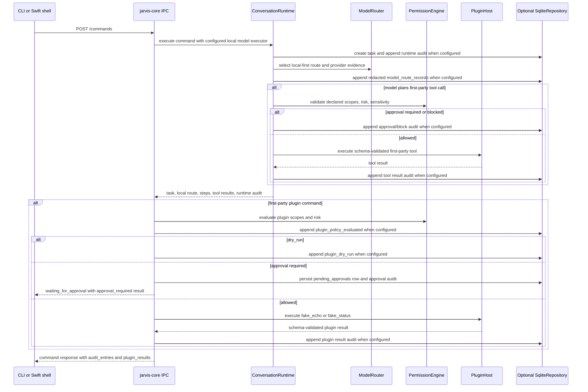
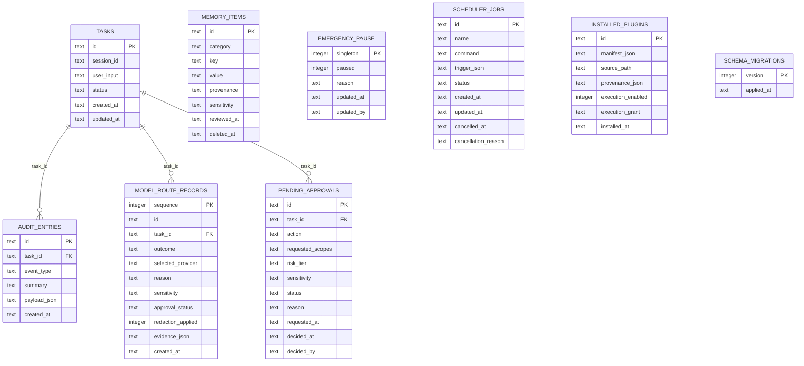

# Architecture Map

Jarvis is a local-first macOS assistant foundation. The current repository
contains a Rust workspace with the core contracts, loopback IPC server,
SQLite-backed repository primitives, policy/model-routing rules, in-process
plugin contracts, scheduler state, CLI client, and a first Swift/SwiftUI Mac
shell scaffold with core supervision and redacted scheduler attention handoff
under `apps/mac`.

## Current Implementation Diagram

```mermaid
flowchart TB
    User["User or local test operator"]
    User --> CLI["jarvis-cli"]
    User --> MacShell["JarvisMacApp SwiftUI scaffold"]
    DocsAgent["six-agent production-readiness audit"] --> Docs["DESIGN, README, architecture map, release checklist, build/test commands, knowledge-base"]
    DocsAgent --> Sweep["isolated worktree/branch production sweep"]
    Sweep --> LocalGate["./scripts/release-local.sh"]
    LocalGate --> E2E["local_ipc_e2e ignored release proof"]
    LocalGate --> Smoke["jarvis-cli smoke"]
    LocalGate --> SwiftGate["Swift package build/test"]
    LocalGate --> CargoGate["fmt, clippy, tests, build, package"]
    LocalGate --> MigrationSmoke["storage-migration-backup-smoke.sh"]
    AppReleaseSmoke["packaged-app-release-smoke.sh"] --> LocalApp["temp Jarvis.app bundle"]
    LocalApp --> AppMetadata["Info.plist plus ad-hoc codesign when available"]
    LocalApp --> BundledCLI["Contents/Resources/bin/jarvis-cli"]
    AppReleaseSmoke --> CleanProfile["temporary HOME and SQLite app state"]
    MacShell --> MacCore["JarvisMacCore IPC client, supervisor, and view models"]
    MacShell --> ActivityUI["Run activity summary and audit view"]
    MacShell --> MemoryUI["Memory CRUD, classification, review, soft-delete, restore, and include-deleted controls"]
    MacShell --> SchedulerAttentionUI["Scheduler attention summary"]
    SchedulerAttentionUI --> SchedulerNotifications["Scheduler notification model"]
    SchedulerNotifications --> UserNotifications["macOS UserNotifications adapter"]
    MacShell --> VoiceInput["Speech/AVFoundation input controls"]
    MacShell --> SpeechOutput["AVFoundation speech-output preview controls"]
    ActivityUI --> MacCore
    MemoryUI --> MacCore
    SchedulerAttentionUI --> MacCore
    VoiceInput --> MacCore
    SpeechOutput --> MacCore
    MacCore --> Supervisor["JarvisCoreSupervisor configured or bundled process"]
    Supervisor --> CLI
    MacCore -->|"HTTP JSON on configured core URL"| IPC["jarvis-core::ipc Axum loopback server"]
    CLI -->|"HTTP JSON on 127.0.0.1:7787 by default"| IPC
    E2E --> IPC
    Smoke --> IPC

    subgraph Core["jarvis-core"]
        IPC --> Health["/health"]
        IPC --> Contract["/contract"]
        IPC --> Diagnostics["/diagnostics/export"]
        IPC --> Commands["/commands"]
        IPC --> Inspection["/tasks, /audit, /activity/summary, /activity/events, /model-routes, /memory, /permissions/grants, /permissions/policy-review incl scheduler triggers, /plugins/manifests, /plugins/installed"]
        IPC --> PublisherReview["/plugins/installed/:id/publisher/verify"]
        IPC --> PublisherSignature["/plugins/installed/:id/publisher/signature/verify"]
        IPC --> InstalledRunner["installed plugin execution boundary"]
        IPC --> PauseApi["/emergency-pause"]
        IPC --> SchedulerApi["/scheduler/jobs"]
        IPC --> SchedulerAttention["/scheduler/attention redacted handoff"]

        Commands --> Runtime["ConversationRuntime"]
        Runtime --> ModelExec["ModelExecutor trait"]
        ModelExec --> FakeLocal["FakeLocalModel default"]
        ModelExec --> OllamaLocal["Ollama-compatible local HTTP provider"]
        Runtime --> ToolPlan["bounded model-planned tool requests"]
        ToolPlan --> PluginPolicy
        Runtime --> RuntimeControl["RuntimeControl pause/cancel flags"]
        Runtime --> RuntimeStore["RuntimeCommandStore persistence hook"]
        Runtime --> RuntimeAudit["runtime AuditEntry list"]

        Commands --> Router["ModelRouter evidence pass"]
        Router --> LocalRoute["local-first route"]
        Router --> ChatGPTGate["ChatGPT gate and redaction logic"]

        Commands --> PluginDispatch["command-pattern plugin dispatch"]
        PluginDispatch --> PluginPolicy["PermissionEngine policy check"]
        PluginPolicy --> PluginHost["PluginHost"]
        PluginHost --> ManifestValidation["manifest and JSON schema validation"]
        PluginHost --> FirstParty["fake_echo and fake_status plugins"]
        PluginHost --> TimeoutCancel["timeout and cancellation handling"]
        InstalledRunner --> InstalledValidation["stored manifest/action/input/output validation"]
        InstalledRunner --> ProvenanceCheck["local manifest and command hash verification"]
        InstalledRunner --> InstalledGrant["disabled-by-default metadata_only grant"]
        InstalledRunner --> InstalledEnable["/plugins/installed/:id/execution explicit subprocess grants"]
        ProvenanceCheck --> InstalledEnable
        ProvenanceCheck --> PublisherReview
        ProvenanceCheck --> PublisherSignature
        PublisherReview --> PublisherAudit["operator-pinned origin audit evidence"]
        PublisherSignature --> SignatureAudit["trusted-key signature audit evidence"]
        PluginHost --> NetworkDeclarations["network_access declared_hosts validation and subprocess_stdio_network gate"]
        NetworkDeclarations --> PluginPolicy
        InstalledRunner --> SubprocessRunner["local_subprocess direct Command JSON stdin/stdout runner"]
        SubprocessRunner --> SafePath["canonical command under source_path, no shell interpolation"]
        SubprocessRunner --> InstalledAudit["blocked, dry-run, completed, or failed audit evidence"]

        SchedulerApi --> Scheduler["Scheduler"]
        SchedulerAttention --> Scheduler
        PauseApi --> RuntimeControl
    end

    IPC --> RepoState["optional SqliteRepository backing"]
    RuntimeStore --> RepoState
    Inspection --> RepoState
    PublisherReview --> RepoState
    PublisherSignature --> RepoState
    PauseApi --> RepoState
    SchedulerApi --> RepoState
    SchedulerAttention --> RepoState
    RepoState --> Tasks["tasks"]
    RepoState --> Audit["append-only audit_entries"]
    RepoState --> Memory["memory_items"]
    RepoState --> StoredPause["emergency_pause"]
    RepoState --> StoredScheduler["scheduler_jobs"]
    RepoState --> StoredApprovals["pending_approvals"]
    RepoState --> SchemaMigrationsCurrent["schema_migrations"]
    RepoState --> MigrationBackups[".jarvis-migration-backups app-owned snapshots"]
    MigrationBackups --> RestorePath["restore original DB/WAL/SHM on migration-open failure"]

    Types["shared contract types"] --> Runtime
    Types --> IPC
    Types --> PluginHost
    Types --> PluginPolicy
    Types --> RepoState
```



The current IPC `/commands` endpoint invokes `ConversationRuntime` with the
deterministic `FakeLocalModel` by default or an opt-in Ollama-compatible local
HTTP provider selected from typed env config. It returns runtime steps, route
metadata, plugin results, and audit entries, and can persist task, audit, and
redacted append-only model-route state through `SqliteRepository` when the
state is constructed with repository backing. It also records local-first
`ModelRouter` evidence and can execute
deterministic first-party plugin commands through the policy engine. The
runtime also supports bounded model-planned first-party tool calls with schema
validation, policy checks, approval stops, and audit evidence.
Repository-backed IPC state stores approval-required plugin command decisions
in `pending_approvals`, exposes them through CLI/IPC inspection endpoints, and
lets a user grant or deny the pending record without executing the side effect.
The read-only `/permissions/grants` endpoint combines approval history,
high-risk pending counts, installed-plugin execution-grant state, provenance
integrity status, and unverified plugin counts into one permission-center
surface for CLI and Swift inspection. `/permissions/policy-review` adds a
read-only severity-ranked review list for pending approvals, high-risk plugin
actions, unverified installed-plugin provenance, and unverified origin claims.
It also surfaces active scheduler triggers without exposing scheduler command
text, using due and recurring trigger severity to keep proactive routines
inspectable from the same review queue.
The read-only `/scheduler/attention` endpoint summarizes due, running, and
failed scheduler jobs for app handoff without returning scheduler command
text. The Swift Scheduler tab renders the same summary above the job list and
owns a protocol-backed notification model that can request macOS notification
authorization and deliver due/failed attention items through a
`UserNotifications` adapter. Swift tests cover the authorization, delivery,
deduplication, and fail-closed denied-permission paths with a fake adapter;
live OS notification permission prompts and delivery still require manual
packaged-app validation.
Installed plugin run requests have an explicit fail-closed boundary that
revalidates stored manifest metadata, checks the requested action, validates
input schema, verifies the local install provenance snapshot, honors
disabled-by-default `metadata_only` semantics, and appends audit evidence.
Contract-only dry runs can return `dry_run` after
manifest/action/input validation with `side_effect_executed=false`.
`local_subprocess` manifests can be explicitly enabled through
`/plugins/installed/:id/execution` with `execution_grant: subprocess_stdio`, or
`subprocess_stdio_network` for actions that declare network access; only after
`/plugins/installed/:id/provenance/verify` confirms the manifest and
subprocess command still match the install-time hash snapshot can the runner
start the declared command directly with JSON stdin and JSON stdout, with
canonical source-path checks, timeout enforcement, output schema validation,
and audit evidence recording whether the subprocess started.
Publisher-origin review is a separate fail-closed step: the operator can mark
the manifest author claim as verified only after local provenance matches the
install snapshot and the supplied trusted origin exactly matches the stored
claim. This clears the unverified-origin policy review item and records audit
evidence. Signed manifests can also be verified after local provenance matches:
Jarvis verifies an Ed25519 signature over the unsigned manifest only when the
operator supplies a trusted public key that exactly matches the manifest key.
This records signature verification audit evidence, but it is not marketplace
trust or malware analysis.
Network-capable actions must request the `network` permission and declare exact
plain-hostname allowlists; invalid declarations fail manifest validation and
policy review surfaces network-capable installed actions. This is manifest
governance, not OS-level network sandboxing.
It supports opt-in
ChatGPT/OpenAI-compatible execution only after route policy allows it. It does
not yet support a broader WASM/OS-network/plugin-marketplace sandbox or a signed
packaged Mac approval flow.
File-backed `SqliteRepository::open` creates a preflight migration backup for
existing databases below the current schema version and restores the original
DB/WAL/SHM files if opening/configuring/migrating fails. The backup is
app-owned local state, not a redacted export.
Repository-backed IPC state also exposes task, audit, model-route, memory,
permission-grant, scheduler, plugin manifest, installed-plugin, and
installed-plugin execution-grant inspection endpoints, so the CLI and Swift
shell can inspect durable local state without reaching into SQLite directly.
`/activity/summary` adds a repository-backed progress snapshot for current
status counts, active task count, recent tasks, and recent audit entries.
`/activity/events` exposes the same evidence as bounded server-sent events for
CLI progress watching. This is local activity streaming evidence, not yet a
per-token model response stream or plugin-internal progress bus.
The release-proof path remains local: `./scripts/release-local.sh` runs Rust
formatting, linting, tests, ignored release-proof tests, build/package, CLI
smoke, and Swift package build/test. That evidence proves only the current
implemented foundation surfaces. `./scripts/packaged-app-release-smoke.sh`
adds local packaged app evidence by assembling a SwiftPM-built `Jarvis.app`
with `Info.plist`, bundled `jarvis-cli`, ad-hoc signing when `codesign` is
available, temp-profile launch, app-supervised core health, command, audit,
diagnostics, pause, blocked command, resume, and SQLite state checks. It does
not prove Developer ID signing, notarization, installer behavior,
entitlements, Finder/LaunchServices validation, App Store distribution, or real
voice permissions.

The production-readiness sweep is coordinated through isolated worktrees and
topic branches against the public repository
`https://github.com/malak333/Jarvis`. Phase-3 slices have landed for model-route
persistence, plugin subprocess sandboxing, voice input controls, packaged app
release smoke, permission grants UX, docs architecture alignment, versioning,
distribution packaging, Keychain credential launch injection, Swift memory
management, plugin provenance surfaces, and scheduler attention handoff.
Follow-on slices continue in separate worktrees, including scheduler
notification controls in `codex/scheduler-notifications`.
The six-worker structure is implementation coordination, not release evidence;
each phase still needs matching docs, knowledge-base facts, and E2E or focused
verification evidence for the surface it changes.

## Current Command Flow



## Current Workspace Layout

```text
.
|-- Cargo.toml
|-- DESIGN.md
|-- README.md
|-- apps/
|   `-- mac/
|       |-- Package.swift
|       |-- Sources/
|       |   |-- JarvisMacApp/
|       |   `-- JarvisMacCore/
|       `-- Tests/JarvisMacCoreTests/
|-- crates/
|   |-- jarvis-cli/
|   |   `-- src/main.rs
|   `-- jarvis-core/
|       |-- src/
|       |   |-- ipc.rs
|       |   |-- lib.rs
|       |   |-- model.rs
|       |   |-- plugin.rs
|       |   |-- policy.rs
|       |   |-- router.rs
|       |   |-- runtime.rs
|       |   |-- scheduler.rs
|       |   |-- storage.rs
|       |   `-- types.rs
|       `-- tests/e2e_scaffold.rs
`-- docs/
```

## Implemented Rust Responsibilities

- `jarvis-core::types`: Stable shared records and enums for tasks, audit
  entries, sensitivity, risk, approval, task status, and errors.
- `jarvis-core::ipc`: Axum loopback HTTP API for `/health`, `/commands`,
  `/tasks`, `/audit`, `/model-routes`, `/memory`, `/permissions/grants`,
  `/permissions/policy-review`, `/plugins/manifests`, `/plugins/installed`,
  `/plugins/installed/:id/execution`, `/plugins/installed/:id/run`,
  `/emergency-pause`, `/scheduler/jobs`, and `/scheduler/run-due`.
  The command endpoint runs the runtime with the configured local model
  executor, records local-first route evidence, can execute
  deterministic first-party plugin commands through policy, returns
  route/step/plugin/audit evidence, and obeys emergency-pause state.
  Installed-plugin run attempts fail closed with manifest/action validation,
  disabled execution semantics, and durable audit evidence.
- `jarvis-core::runtime`: Command runtime scaffolding with max-step enforcement,
  bounded model-planned first-party tool orchestration, runtime hooks, task
  cancellation, emergency-pause blocking/cancellation, model/tool step audit
  entries, a fake local model path, and a persistence hook for SQLite-backed
  task/audit durability.
- `jarvis-core::model`: `ModelExecutor` trait, model request/response/tool
  contracts, route metadata, deterministic `FakeLocalModel`, typed provider
  env config, redacted provider errors, and an Ollama-compatible local HTTP
  provider.
- `jarvis-core::router`: Local-first model route selection, ChatGPT opt-in gate,
  restricted-data blocking, approval delegation to `PermissionEngine`, and
  simple secret-token redaction before ChatGPT routing.
- `jarvis-core::policy`: Capability scopes, approval grants, risk-tier
  decisions, emergency-pause fail-closed behavior, confirmation requirements,
  and audit-required flags.
- `jarvis-core::plugin`: Plugin/action manifests, JSON schema validation,
  permission metadata, approval-required handling, proactive-action checks,
  timeout handling, cooperative cancellation signal, and two deterministic
  first-party test plugins.
- `jarvis-core::scheduler`: Inspectable scheduler jobs with manual, one-time,
  and interval trigger contracts plus cancellation support. Jobs are in-memory
  when the IPC state has no repository and restored/updated through SQLite
  when repository backing is enabled.
- `jarvis-core::storage`: SQLite schema migrations for tasks, append-only
  audit entries, append-only redacted model-route records, emergency pause,
  memory items with provenance/sensitivity/review/soft-delete fields,
  scheduler jobs, pending approvals, and installed plugin metadata/grants.
- `jarvis-cli`: Local CLI for serving the IPC API with optional `--db-path`
  SQLite backing, calling health/command/pause/task/audit/memory/plugin
  endpoints, exporting redacted diagnostics, listing/scheduling/cancelling
  scheduler jobs over HTTP, and running `jarvis smoke` against ephemeral local
  servers.
- `apps/mac/JarvisMacCore`: Swift IPC client, core supervisor, command-console
  model, voice state/action scaffold, Speech/AVFoundation input adapter,
  AVFoundation speech-output adapter, and management models that decode Rust
  health/contract/command/pause/task/audit/memory/plugin/scheduler/diagnostics
  JSON contracts. Approval management is inspection-only unless `/contract`
  exposes an approval decision endpoint.
- `apps/mac/JarvisMacApp`: SwiftUI shell scaffold with health status,
  degraded-mode banner, transcript, activity/audit panel, memory, plugin,
  approval, run/audit, scheduler, diagnostics, voice-state tabs, send,
  voice input/output controls, pause/resume, and refresh controls.

## End-Goal Production Architecture

```mermaid
flowchart TB
    MacApp["Packaged Jarvis.app"]
    MacApp --> UX["voice, text console, settings, activity, memory, permissions, diagnostics"]
    UX --> MemoryUX["memory create, edit, review, delete, restore/archive review"]
    UX --> ApprovalUI["approval prompts and permission center"]
    UX --> PauseUI["emergency pause and resume"]
    UX --> IPCClient["versioned IPC client"]
    MacApp --> Supervisor["app-supervised core process"]
    Supervisor --> IPCServer["jarvis-core local IPC server"]
    IPCClient --> IPCServer

    subgraph CoreProd["jarvis-core production runtime"]
        IPCServer --> RuntimeProd["ConversationRuntime with tool-call orchestration"]
        RuntimeProd --> ModelRouterProd["ModelRouter"]
        RuntimeProd --> PolicyProd["PermissionEngine"]
        RuntimeProd --> PluginHostProd["policy-gated PluginHost"]
        RuntimeProd --> SchedulerProd["scheduler and trigger engine"]
        RuntimeProd --> MemoryPolicy["memory classification and review flow"]
        RuntimeProd --> RepoProd["SqliteRepository"]
        RepoProd --> BackupManager["migration backup and restore manager"]
        RuntimeProd --> DiagnosticsProd["diagnostics and redacted export data"]

        ModelRouterProd --> LocalModels["real local model providers by default"]
        ModelRouterProd --> ChatGPT["ChatGPT only after enablement, approval, redaction, and audit"]

        PluginHostProd --> FirstPartyPlugins["first-party plugins"]
        PluginHostProd --> InstalledPlugins["installed local plugins with manifests"]
        PluginHostProd --> ToolSandbox["declared scopes, schemas, timeouts, cancellation, sandbox boundary"]

        SchedulerProd --> ProactiveJobs["approved proactive routines and triggers"]
    end

    ApprovalUI --> PolicyProd
    PauseUI --> PolicyProd
    PauseUI --> RuntimeProd
    PauseUI --> SchedulerProd

    RepoProd --> TaskStore["task lifecycle"]
    RepoProd --> AuditStore["append-only audit log"]
    RepoProd --> ModelRouteStore["redacted append-only model route records"]
    MemoryUX --> MemoryPolicy
    RepoProd --> MemoryStore["memory with provenance, sensitivity, review, delete"]
    RepoProd --> PauseStore["emergency pause state"]
    RepoProd --> PluginRegistry["plugin registry metadata"]
    PluginRegistry --> PluginTrustPolicy["publisher identity, signing, sandbox, and marketplace policy"]
    RepoProd --> PermissionGrantStore["approval history and execution grants"]
    RepoProd --> SchedulerStore["durable scheduler jobs"]
    RepoProd --> SchemaMigrations["schema migrations and recovery points"]
    BackupManager --> AppOwnedBackupFiles["app-owned SQLite backup files"]
    BackupManager --> RestoreValidation["restore validation and failure diagnostics"]

    MacKeychain["macOS Keychain"] --> Supervisor
    AppFiles["app-owned files and plugin bundles"] --> RuntimeProd
    DiagnosticsProd --> Diagnostics["local diagnostics export"]
    Diagnostics --> MacApp
    ReleaseOps["release operator"] --> ReleaseGate["signed package, clean-profile Mac smoke, E2E, migration, recovery, diagnostics checks"]
    ReleaseGate --> MacApp
    ReleaseGate --> IPCServer
```



Production readiness for that end-state still requires a packaged `.app`
release, plugin installation/runtime hardening, real voice support,
packaged app smoke tests, and operational release evidence. The current
repository proves only the implemented Rust and Swift scaffold surfaces listed
above; local and ChatGPT/OpenAI-compatible HTTP provider boundaries are
implemented, but full assistant behavior is not.
A public PR may cite local gate output and cross-process E2E results as
evidence for those surfaces, but must not extend that evidence to signed
packaging, real voice, autonomous external action, or broader production
operation.

## Current Vs Target Implementation Phases

| Area | Current implementation | Target production state | Phase |
| --- | --- | --- | --- |
| Mac shell | Buildable Swift/SwiftUI scaffold with health, command transcript, pause/resume, activity/audit rendering, memory classification and create/update/review/delete/restore controls, plugin/scheduler/diagnostics tabs, degraded-mode handling, and a `JarvisCoreSupervisor` abstraction for configured or bundled local core binaries. The local packaged app smoke assembles and ad-hoc signs a deterministic `Jarvis.app` for temp-profile launch proof. | Packaged `Jarvis.app` supervises the core, owns voice/text UX, settings, memory and permission surfaces, diagnostics export, and recovery states. | Shell supervision scaffold, Swift memory management surface, and local assembled-app smoke implemented; Developer ID signing, notarization, installer/restart proof, and production release QA pending. |
| IPC boundary | Axum loopback HTTP JSON API for health, commands, task/audit/activity-summary/activity-events/model-route/memory/approval inspection, plugin manifests, emergency pause, scheduler jobs, and `/contract` compatibility plus feature metadata that lists implemented surfaces with proof and production boundaries. | Versioned, compatibility-tested app/core API with packaged app smoke coverage, feature/boundary negotiation, and clear degraded-mode handling. | Core IPC plus compatibility and feature/boundary contract metadata implemented; broader production compatibility rollout policy pending. |
| Command runtime | `ConversationRuntime` creates tasks, runs a routed `ModelExecutor` (`FakeLocalModel` by default, Ollama-compatible HTTP or ChatGPT/OpenAI-compatible HTTP when explicitly enabled), records structured audit entries, handles pause/cancel, enforces max steps, can persist task/audit/model-route state through `RuntimeCommandStore`, exposes repository-backed activity summaries and bounded server-sent activity events for progress visibility, and can execute bounded model-planned first-party tool calls after schema and policy checks. | Multi-step assistant runtime with production model responses, installed plugin/tool orchestration, streaming progress, approval UI handoff, and robust recovery. | Bounded fake-model tool orchestration, opt-in local and ChatGPT provider boundaries, explicit installed-plugin subprocess runner, CLI/IPC/Swift approval scaffold, pollable activity summaries, and bounded activity event streaming implemented; per-token model streaming and plugin-internal progress bus pending. |
| Model routing | Local-first `ModelRouter` exists with sensitivity checks, provider-status route evidence, ChatGPT opt-in gate, approval delegation, and redaction logic. The active `/commands` path can call a configured local provider or opt-in ChatGPT/OpenAI-compatible provider after policy allows the route. Repository-backed command execution persists append-only SQLite model-route records and exposes redacted IPC/CLI inspection without storing route context. | Local provider integration, explicit ChatGPT escalation, minimized cloud context, user approval where required, and durable route evidence in every relevant task. | Local and ChatGPT provider boundaries plus SQLite route recovery evidence implemented with tests; broader production model operations pending. |
| Plugins and tools | Deterministic in-process first-party plugins (`fake_echo`, `fake_status`) execute through command-pattern dispatch and bounded model-planned runtime calls, with manifest validation, policy checks, timeout, cancellation, approval stops, pending approval persistence for approval-gated command scaffolds, and audit evidence. Local plugin installation validates manifest metadata and safe source paths, captures local manifest/subprocess SHA-256 provenance, stores disabled registry records with `execution_enabled=false` and `execution_grant=metadata_only`, supports contract-only dry runs with `side_effect_executed=false`, and can run `local_subprocess` plugins only after local provenance verification plus an explicit `subprocess_stdio` grant, or `subprocess_stdio_network` for network-declaring actions, through the constrained JSON stdin/stdout runner. Publisher-origin claims can be operator-pinned only after provenance matches and the supplied trusted origin exactly equals the manifest author claim. Signed manifests can also be verified with an Ed25519 signature and an explicit trusted public key after provenance matches. Network-capable actions must request `network`, declare exact allowed hostnames, appear in policy review, and use the network-specific execution grant. | First-party production plugins plus installed local plugins behind manifests, sandboxing, user grants, UI approval, proactive gating, and real model-generated tool-call execution. | Contract, deterministic first-party paths, metadata-only local install, local provenance snapshot verification, operator-pinned publisher-origin review, trusted-key publisher-signature verification, manifest-level network host governance, explicit subprocess and subprocess-network execution grants, and constrained installed-plugin runner implemented; broader WASM/OS-network/plugin-marketplace trust pending. |
| Scheduler | Inspectable scheduler jobs with manual, one-time, interval trigger contracts, explicit run-due execution, an opt-in bounded background trigger loop on `jarvis serve --scheduler-background`, a redacted `/scheduler/attention` handoff for due, running, and failed jobs, scheduler trigger items in `/permissions/policy-review` that redact command text, and a Swift protocol-backed notification model with macOS `UserNotifications` adapter controls for due/failed attention items. Each tick uses the same visible task/audit records, deterministic due ordering, per-tick limit, and fail-closed emergency-pause behavior as manual run-due. Repository-backed IPC state restores and updates jobs through SQLite. Emergency pause cancels active scheduler jobs, and unsafe due commands fail closed by pausing and cancelling remaining open jobs. | Durable scheduler and trigger engine for approved proactive routines, persisted job state, visible task records, policy-gated execution, and OS-level app notifications. | Durable job state, explicit run-due execution, opt-in bounded background loop, redacted app handoff summary, scheduler trigger review, and adapter-backed Swift notification controls implemented; richer production trigger policy and live OS notification validation pending. |
| Storage and memory | SQLite migrations store tasks, append-only audit entries, append-only redacted model-route records, emergency pause, memory items with provenance/sensitivity/review/soft-delete/restore behavior, scheduler jobs, pending approval records, and disabled installed-plugin registry metadata. File-backed repository open creates a preflight migration backup for older schema versions and restores the original DB/WAL/SHM files if opening/configuring/migrating fails. CLI/IPC can inspect model routes, memory classification summaries, memory items, approval decisions, and plugin metadata when repository backing is enabled. The Mac shell can summarize by category/sensitivity, list, filter, create, load, update mutable memory fields, mark reviewed, soft-delete, restore deleted items, and inspect deleted memory through the existing IPC surface. It can also read provider credentials from Keychain at supervised-core launch and inject missing secret env vars without storing them in SQLite or diagnostics. | SQLite also owns permissions, executable plugin grants, migration backup/rollback, and memory UX review flows; Keychain owns secrets; vector indexes remain rebuildable. | Core local state, route recovery evidence, plugin metadata registry, migration preflight backup/restore, Swift memory classification/CRUD/review/restore UI, and Keychain launch credential boundary implemented; richer memory policy automation pending. |
| Safety and approvals | Capability scopes, risk tiers, emergency-pause fail-closed behavior, audit-required flags, and approval-required decisions exist in Rust. Repository-backed IPC persists pending approvals and supports CLI and Swift grant/deny decisions without executing side effects. `/permissions/grants` also exposes approval history/counts plus installed-plugin grant and provenance integrity state. `/permissions/policy-review` exposes severity-ranked pending approval, high-risk action, provenance, origin, network-access, and active scheduler trigger review items, and the Swift permission center renders both grant history and policy review status. | Human approval prompts, permission center, grants history, policy review, signed-publisher trust, and no bypass for high-risk side effects. | Policy engine plus CLI/IPC/Swift approval decision surface, provenance-aware permission grant inspection, read-only policy review, scheduler trigger review, operator-pinned publisher-origin review, trusted-key publisher-signature verification, and network-action review implemented; broader plugin marketplace governance pending. |
| Voice and diagnostics | Swift has a text-transcript voice state/action scaffold with typed transcript staging, unavailable/degraded/interrupted states, and handoff into the same `CommandConsoleModel.submit` path used by text commands. The Voice tab now owns the protocol-backed macOS Speech/AVFoundation input adapter model and exposes permission request, start/stop capture, and interruption controls, with deterministic fake-adapter tests for permission, capture, transcript, interruption, and error states. It also owns a protocol-backed AVFoundation speech-output adapter with preview, stop, and interrupt controls, plus deterministic fake-adapter tests for playback state and failures. Live microphone capture and live audio output are still release claims only after entitlement packaging and manual device validation. Redacted diagnostics export exists over CLI/IPC and omits command bodies, scheduler commands, model route contexts, audit payloads, memory values, and cancellation reason text. | Voice input/output loop, interruption/cancel behavior, microphone degraded modes, and local diagnostics export integrated into the packaged app. | Adapter-backed SwiftUI voice input/output controls and text-parity scaffold implemented; live microphone/audio validation pending. |
| Release proof | Local Rust and Swift build/test/smoke commands plus the ignored cross-process `local_ipc_e2e` release-proof test document the foundation boundary. `storage-migration-backup-smoke.sh` proves legacy DB backup creation, restore after migration-open failure, and newer-schema diagnostics. `packaged-app-release-smoke.sh` adds local assembled-app launch evidence for app-supervised core health, command, audit, diagnostics, pause, blocked command, resume, and temp SQLite state. | Developer ID signed and notarized packaged app release with clean-profile Mac smoke, app-supervised core, command, audit, pause, restart, migration, recovery, diagnostics, and real-provider checks. | Local foundation proof, migration backup proof, and assembled-app smoke implemented; distribution-grade signing/notarization/restart/manual QA pending. |
| Production workflow | Phase 3 was split into isolated branches/worktrees for model route persistence, plugin subprocess sandboxing, voice adapter production, packaged app release smoke, permission grants UX, and docs architecture alignment. Follow-on slices continue in isolated worktrees, including `codex/speech-output-adapter` and `codex/scheduler-notifications` under `/Users/michaelnobile/Antigravity/jarvis-worktrees-continuation/`. | Public repo release train with PR evidence, reproducible local gates, owner-reviewed release notes, and no hidden readiness claims. | Phase-3 workflow documented; release governance still manual. |
| Docs, KB, and E2E discipline | Docs and knowledge-base files record implementation boundaries, the current/end-goal diagrams, and local proof commands. Current E2E evidence is Rust/CLI cross-process, Swift package contract/model coverage, packaged-layout supervision proof, and local assembled-app smoke. | Every feature phase updates docs and durable KB facts, adds or names the relevant E2E coverage, and blocks broader readiness claims when coverage is missing. | Phase discipline documented; broader distribution E2E pending. |

## Data Ownership

- SQLite is the implemented structured-state backend for tasks, audit entries,
  redacted model-route records, emergency pause, memory items, scheduler jobs,
  pending approvals, and installed plugin registry/grant metadata.
- Migration backup snapshots are app-owned local files under
  `.jarvis-migration-backups` by default. They copy the SQLite DB plus WAL/SHM
  sidecars when present, may contain personal memory/audit/plugin metadata, and
  must not be treated as redacted diagnostics exports. Keychain secrets are not
  stored in SQLite backups.
- Audit entries are protected by SQLite triggers that reject update and delete
  operations.
- Memory items carry provenance, sensitivity, review timestamps, soft-delete
  state, and restore through the repository-backed IPC path.
- macOS Keychain is the implemented credential boundary for app-supervised
  model provider secrets; the Swift launcher reads known provider credentials
  and injects missing process environment variables without persisting secrets
  in SQLite.
- The end-goal architecture still expects app-owned files for large artifacts,
  transcripts, diagnostics exports, plugin bundles, local model configs, and
  attachments.
- Any future vector index should remain rebuildable from canonical records.

## Implemented SQLite Schema



## Readiness Boundary

Current evidence supports a local foundation claim: the workspace has typed
contracts and tested scaffolding for IPC, policy, routing, runtime, storage,
plugins, scheduler, CLI behavior, bounded fake-model first-party tool
orchestration, and a first Swift command/management shell with core supervision
abstractions. It does not support a claim that Jarvis is a finished
voice assistant, packaged Mac app, autonomous external-action agent, plugin
marketplace, or production cloud-integrated system.
The storage migration proof shows preflight file-backed SQLite backups,
restore after migration-open failure, and newer-schema diagnostics. It does not
prove installer upgrade behavior, broad v1-through-v7 fixture preservation, or
Finder/LaunchServices recovery UX.
The six-agent autonomous sweep model is a workflow convention, not proof by
itself. Only checked-in implementation, documented commands, and captured local
verification output should be used as release evidence. For each new feature
or phase, the architecture map, release checklist, build/test commands, and
knowledge-base notes should either name the relevant E2E coverage or document
the remaining blocker before any stronger production-readiness language is
used.
