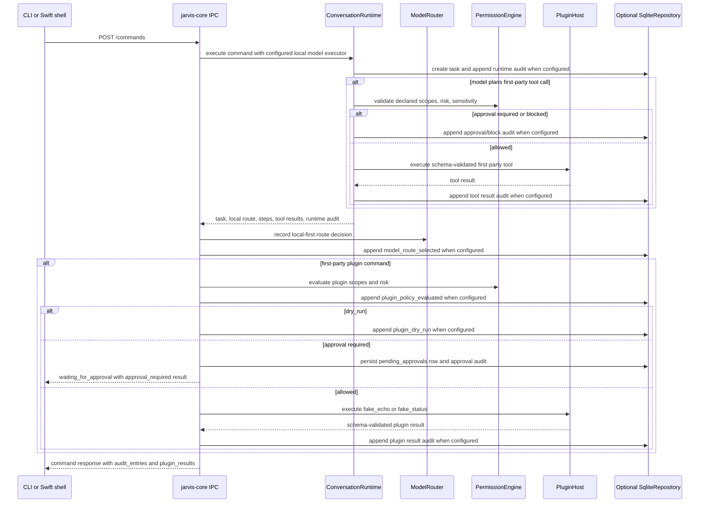
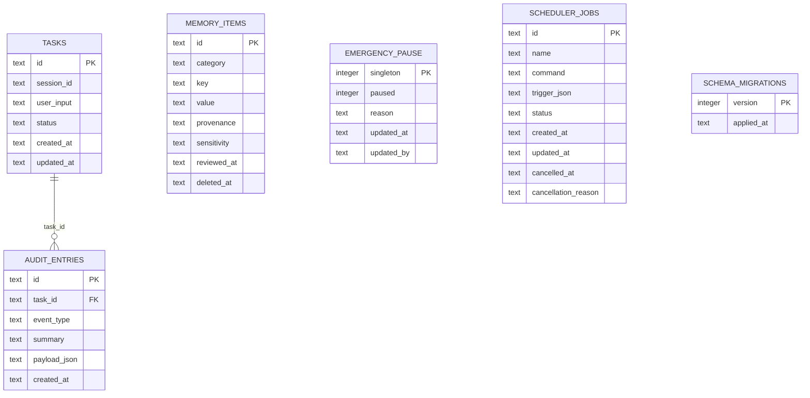

# Architecture Map

Jarvis is a local-first macOS assistant foundation. The current repository
contains a Rust workspace with the core contracts, loopback IPC server,
SQLite-backed repository primitives, policy/model-routing rules, in-process
plugin contracts, scheduler state, CLI client, and a first Swift/SwiftUI Mac
shell scaffold with core supervision under `apps/mac`.

## Current Implementation Diagram

```mermaid
flowchart TB
    User["User or local test operator"]
    User --> CLI["jarvis-cli"]
    User --> MacShell["JarvisMacApp SwiftUI scaffold"]
    DocsAgent["Worker 6 docs sync"] --> Docs["DESIGN, architecture map, release checklist, build/test commands, knowledge-base"]
    DocsAgent --> Sweep["six worktree/branch production sweep"]
    Sweep --> LocalGate["./scripts/release-local.sh"]
    LocalGate --> E2E["local_ipc_e2e ignored release proof"]
    LocalGate --> Smoke["jarvis-cli smoke"]
    LocalGate --> SwiftGate["Swift package build/test"]
    LocalGate --> CargoGate["fmt, clippy, tests, build, package"]
    AppReleaseSmoke["packaged-app-release-smoke.sh"] --> LocalApp["temp Jarvis.app bundle"]
    LocalApp --> AppMetadata["Info.plist plus ad-hoc codesign when available"]
    LocalApp --> BundledCLI["Contents/Resources/bin/jarvis-cli"]
    AppReleaseSmoke --> CleanProfile["temporary HOME and SQLite app state"]
    MacShell --> MacCore["JarvisMacCore IPC client, supervisor, and view models"]
    MacCore --> Supervisor["JarvisCoreSupervisor configured or bundled process"]
    Supervisor --> CLI
    MacCore -->|"HTTP JSON on configured core URL"| IPC["jarvis-core::ipc Axum loopback server"]
    CLI -->|"HTTP JSON on 127.0.0.1:7787 by default"| IPC
    E2E --> IPC
    Smoke --> IPC

    subgraph Core["jarvis-core"]
        IPC --> Health["/health"]
        IPC --> Contract["/contract"]
        IPC --> Diagnostics["/diagnostics/export"]
        IPC --> Commands["/commands"]
        IPC --> Inspection["/tasks, /audit, /model-routes, /memory, /permissions/grants, /plugins/manifests, /plugins/installed"]
        IPC --> InstalledRunner["installed plugin execution boundary"]
        IPC --> PauseApi["/emergency-pause"]
        IPC --> SchedulerApi["/scheduler/jobs"]

        Commands --> Runtime["ConversationRuntime"]
        Runtime --> ModelExec["ModelExecutor trait"]
        ModelExec --> FakeLocal["FakeLocalModel default"]
        ModelExec --> OllamaLocal["Ollama-compatible local HTTP provider"]
        Runtime --> ToolPlan["bounded model-planned tool requests"]
        ToolPlan --> PluginPolicy
        Runtime --> RuntimeControl["RuntimeControl pause/cancel flags"]
        Runtime --> RuntimeStore["RuntimeCommandStore persistence hook"]
        Runtime --> RuntimeAudit["runtime AuditEntry list"]

        Commands --> Router["ModelRouter evidence pass"]
        Router --> LocalRoute["local-first route"]
        Router --> ChatGPTGate["ChatGPT gate and redaction logic"]

        Commands --> PluginDispatch["command-pattern plugin dispatch"]
        PluginDispatch --> PluginPolicy["PermissionEngine policy check"]
        PluginPolicy --> PluginHost["PluginHost"]
        PluginHost --> ManifestValidation["manifest and JSON schema validation"]
        PluginHost --> FirstParty["fake_echo and fake_status plugins"]
        PluginHost --> TimeoutCancel["timeout and cancellation handling"]
        InstalledRunner --> InstalledValidation["stored manifest/action/input/output validation"]
        InstalledRunner --> InstalledGrant["disabled-by-default metadata_only grant"]
        InstalledRunner --> InstalledEnable["/plugins/installed/:id/execution explicit subprocess_stdio grant"]
        InstalledRunner --> SubprocessRunner["local_subprocess direct Command JSON stdin/stdout runner"]
        SubprocessRunner --> SafePath["canonical command under source_path, no shell interpolation"]
        SubprocessRunner --> InstalledAudit["blocked, dry-run, completed, or failed audit evidence"]

        SchedulerApi --> Scheduler["Scheduler"]
        PauseApi --> RuntimeControl
    end

    IPC --> RepoState["optional SqliteRepository backing"]
    RuntimeStore --> RepoState
    Inspection --> RepoState
    PauseApi --> RepoState
    SchedulerApi --> RepoState
    RepoState --> Tasks["tasks"]
    RepoState --> Audit["append-only audit_entries"]
    RepoState --> Memory["memory_items"]
    RepoState --> StoredPause["emergency_pause"]
    RepoState --> StoredScheduler["scheduler_jobs"]
    RepoState --> StoredApprovals["pending_approvals"]

    Types["shared contract types"] --> Runtime
    Types --> IPC
    Types --> PluginHost
    Types --> PluginPolicy
    Types --> RepoState
```



The current IPC `/commands` endpoint invokes `ConversationRuntime` with the
deterministic `FakeLocalModel` by default or an opt-in Ollama-compatible local
HTTP provider selected from typed env config. It returns runtime steps, route
metadata, plugin results, and audit entries, and can persist task/audit state
through `SqliteRepository` when the state is constructed with repository
backing. It also records local-first `ModelRouter` evidence and can execute
deterministic first-party plugin commands through the policy engine. The
runtime also supports bounded model-planned first-party tool calls with schema
validation, policy checks, approval stops, and audit evidence.
Repository-backed IPC state stores approval-required plugin command decisions
in `pending_approvals`, exposes them through CLI/IPC inspection endpoints, and
lets a user grant or deny the pending record without executing the side effect.
The read-only `/permissions/grants` endpoint combines approval history,
high-risk pending counts, and installed-plugin execution-grant state into one
permission-center surface for CLI and Swift inspection.
Installed plugin run requests have an explicit fail-closed boundary that
revalidates stored manifest metadata, checks the requested action, validates
input schema, honors disabled-by-default `metadata_only` semantics, and appends
audit evidence. Contract-only dry runs can return `dry_run` after
manifest/action/input validation with `side_effect_executed=false`.
`local_subprocess` manifests can be explicitly enabled through
`/plugins/installed/:id/execution` with `execution_grant: subprocess_stdio`;
only then can the runner start the declared command directly with JSON stdin and
JSON stdout, with canonical source-path checks, timeout enforcement, output
schema validation, and audit evidence recording whether the subprocess started.
It supports opt-in
ChatGPT/OpenAI-compatible execution only after route policy allows it. It does
not yet support a broader WASM/network/plugin-marketplace sandbox or a signed
packaged Mac approval flow.
Repository-backed IPC state also exposes task, audit, and memory inspection
endpoints, plus first-party plugin manifest listing, so the CLI and Swift shell
can inspect durable local state without reaching into SQLite directly.
The release-proof path remains local: `./scripts/release-local.sh` runs Rust
formatting, linting, tests, ignored release-proof tests, build/package, CLI
smoke, and Swift package build/test. That evidence proves only the current
implemented foundation surfaces. `./scripts/packaged-app-release-smoke.sh`
adds local packaged app evidence by assembling a SwiftPM-built `Jarvis.app`
with `Info.plist`, bundled `jarvis-cli`, ad-hoc signing when `codesign` is
available, temp-profile launch, app-supervised core health, command, audit,
diagnostics, pause, blocked command, resume, and SQLite state checks. It does
not prove Developer ID signing, notarization, installer behavior,
entitlements, Finder/LaunchServices validation, App Store distribution, or real
voice permissions.

The current production sweep is coordinated through isolated worktrees and
topic branches against the public repository
`https://github.com/malak333/Jarvis`. This docs-only slice is
`codex/production-docs-sync` in
`/Users/michaelnobile/Antigravity/jarvis-worktrees/production-docs-sync`.
The six-worker structure is implementation coordination, not release evidence;
each phase still needs matching docs, knowledge-base facts, and E2E or focused
verification evidence for the surface it changes.

## Current Command Flow



## Current Workspace Layout

```text
.
|-- Cargo.toml
|-- DESIGN.md
|-- README.md
|-- apps/
|   `-- mac/
|       |-- Package.swift
|       |-- Sources/
|       |   |-- JarvisMacApp/
|       |   `-- JarvisMacCore/
|       `-- Tests/JarvisMacCoreTests/
|-- crates/
|   |-- jarvis-cli/
|   |   `-- src/main.rs
|   `-- jarvis-core/
|       |-- src/
|       |   |-- ipc.rs
|       |   |-- lib.rs
|       |   |-- model.rs
|       |   |-- plugin.rs
|       |   |-- policy.rs
|       |   |-- router.rs
|       |   |-- runtime.rs
|       |   |-- scheduler.rs
|       |   |-- storage.rs
|       |   `-- types.rs
|       `-- tests/e2e_scaffold.rs
`-- docs/
```

## Implemented Rust Responsibilities

- `jarvis-core::types`: Stable shared records and enums for tasks, audit
  entries, sensitivity, risk, approval, task status, and errors.
- `jarvis-core::ipc`: Axum loopback HTTP API for `/health`, `/commands`,
  `/tasks`, `/audit`, `/memory`, `/plugins/manifests`, `/plugins/installed`,
  `/plugins/installed/:id/run`, `/emergency-pause`, and `/scheduler/jobs`.
  The command endpoint runs the runtime with the configured local model
  executor, records local-first route evidence, can execute
  deterministic first-party plugin commands through policy, returns
  route/step/plugin/audit evidence, and obeys emergency-pause state.
  Installed-plugin run attempts fail closed with manifest/action validation,
  disabled execution semantics, and durable audit evidence.
- `jarvis-core::runtime`: Command runtime scaffolding with max-step enforcement,
  bounded model-planned first-party tool orchestration, runtime hooks, task
  cancellation, emergency-pause blocking/cancellation, model/tool step audit
  entries, a fake local model path, and a persistence hook for SQLite-backed
  task/audit durability.
- `jarvis-core::model`: `ModelExecutor` trait, model request/response/tool
  contracts, route metadata, deterministic `FakeLocalModel`, typed provider
  env config, redacted provider errors, and an Ollama-compatible local HTTP
  provider.
- `jarvis-core::router`: Local-first model route selection, ChatGPT opt-in gate,
  restricted-data blocking, approval delegation to `PermissionEngine`, and
  simple secret-token redaction before ChatGPT routing.
- `jarvis-core::policy`: Capability scopes, approval grants, risk-tier
  decisions, emergency-pause fail-closed behavior, confirmation requirements,
  and audit-required flags.
- `jarvis-core::plugin`: Plugin/action manifests, JSON schema validation,
  permission metadata, approval-required handling, proactive-action checks,
  timeout handling, cooperative cancellation signal, and two deterministic
  first-party test plugins.
- `jarvis-core::scheduler`: Inspectable scheduler jobs with manual, one-time,
  and interval trigger contracts plus cancellation support. Jobs are in-memory
  when the IPC state has no repository and restored/updated through SQLite
  when repository backing is enabled.
- `jarvis-core::storage`: SQLite schema migrations for tasks, append-only
  audit entries, emergency pause, memory items with provenance/sensitivity/
  review/soft-delete fields, and scheduler jobs.
- `jarvis-cli`: Local CLI for serving the IPC API with optional `--db-path`
  SQLite backing, calling health/command/pause/task/audit/memory/plugin
  endpoints, exporting redacted diagnostics, listing/scheduling/cancelling
  scheduler jobs over HTTP, and running `jarvis smoke` against ephemeral local
  servers.
- `apps/mac/JarvisMacCore`: Swift IPC client, core supervisor, command-console
  model, text-only voice state/action scaffold, and management models that decode Rust
  health/contract/command/pause/task/audit/memory/plugin/scheduler/diagnostics
  JSON contracts. Approval management is inspection-only unless `/contract`
  exposes an approval decision endpoint.
- `apps/mac/JarvisMacApp`: SwiftUI shell scaffold with health status,
  degraded-mode banner, transcript, activity/audit panel, memory, plugin,
  approval, run/audit, scheduler, diagnostics, voice-state tabs, send,
  pause/resume, and refresh controls.

## End-Goal Production Architecture

```mermaid
flowchart TB
    MacApp["Packaged Jarvis.app"]
    MacApp --> UX["voice, text console, settings, activity, memory, permissions, diagnostics"]
    UX --> ApprovalUI["approval prompts and permission center"]
    UX --> PauseUI["emergency pause and resume"]
    UX --> IPCClient["versioned IPC client"]
    MacApp --> Supervisor["app-supervised core process"]
    Supervisor --> IPCServer["jarvis-core local IPC server"]
    IPCClient --> IPCServer

    subgraph CoreProd["jarvis-core production runtime"]
        IPCServer --> RuntimeProd["ConversationRuntime with tool-call orchestration"]
        RuntimeProd --> ModelRouterProd["ModelRouter"]
        RuntimeProd --> PolicyProd["PermissionEngine"]
        RuntimeProd --> PluginHostProd["policy-gated PluginHost"]
        RuntimeProd --> SchedulerProd["scheduler and trigger engine"]
        RuntimeProd --> MemoryPolicy["memory classification and review flow"]
        RuntimeProd --> RepoProd["SqliteRepository"]
        RuntimeProd --> DiagnosticsProd["diagnostics and redacted export data"]

        ModelRouterProd --> LocalModels["real local model providers by default"]
        ModelRouterProd --> ChatGPT["ChatGPT only after enablement, approval, redaction, and audit"]

        PluginHostProd --> FirstPartyPlugins["first-party plugins"]
        PluginHostProd --> InstalledPlugins["installed local plugins with manifests"]
        PluginHostProd --> ToolSandbox["declared scopes, schemas, timeouts, cancellation, sandbox boundary"]

        SchedulerProd --> ProactiveJobs["approved proactive routines and triggers"]
    end

    ApprovalUI --> PolicyProd
    PauseUI --> PolicyProd
    PauseUI --> RuntimeProd
    PauseUI --> SchedulerProd

    RepoProd --> TaskStore["task lifecycle"]
    RepoProd --> AuditStore["append-only audit log"]
    RepoProd --> MemoryStore["memory with provenance, sensitivity, review, delete"]
    RepoProd --> PauseStore["emergency pause state"]
    RepoProd --> PluginRegistry["plugin registry and grants"]
    RepoProd --> SchedulerStore["durable scheduler jobs"]

    MacKeychain["macOS Keychain"] --> RuntimeProd
    AppFiles["app-owned files and plugin bundles"] --> RuntimeProd
    DiagnosticsProd --> Diagnostics["local diagnostics export"]
    Diagnostics --> MacApp
    ReleaseOps["release operator"] --> ReleaseGate["signed package, clean-profile Mac smoke, E2E, migration, recovery, diagnostics checks"]
    ReleaseGate --> MacApp
    ReleaseGate --> IPCServer
```



Production readiness for that end-state still requires a packaged `.app`
release, plugin installation/runtime hardening, real voice support,
packaged app smoke tests, and operational release evidence. The current
repository proves only the implemented Rust and Swift scaffold surfaces listed
above; local and ChatGPT/OpenAI-compatible HTTP provider boundaries are
implemented, but full assistant behavior is not.
A public PR may cite local gate output and cross-process E2E results as
evidence for those surfaces, but must not extend that evidence to signed
packaging, real voice, autonomous external action, or broader production
operation.

## Current Vs Target Implementation Phases

| Area | Current implementation | Target production state | Phase |
| --- | --- | --- | --- |
| Mac shell | Buildable Swift/SwiftUI scaffold with health, command transcript, pause/resume, activity/audit rendering, memory/plugin/scheduler/diagnostics tabs, degraded-mode handling, and a `JarvisCoreSupervisor` abstraction for configured or bundled local core binaries. The local packaged app smoke assembles and ad-hoc signs a deterministic `Jarvis.app` for temp-profile launch proof. | Packaged `Jarvis.app` supervises the core, owns voice/text UX, settings, memory and permission surfaces, diagnostics export, and recovery states. | Shell supervision scaffold and local assembled-app smoke implemented; Developer ID signing, notarization, installer/restart proof, and production release QA pending. |
| IPC boundary | Axum loopback HTTP JSON API for health, commands, task/audit/model-route/memory/approval inspection, plugin manifests, emergency pause, and scheduler jobs. | Versioned, compatibility-tested app/core API with packaged app smoke coverage and clear degraded-mode handling. | Core IPC implemented; production app contract hardening pending. |
| Command runtime | `ConversationRuntime` creates tasks, runs a routed `ModelExecutor` (`FakeLocalModel` by default, Ollama-compatible HTTP or ChatGPT/OpenAI-compatible HTTP when explicitly enabled), records structured audit entries, handles pause/cancel, enforces max steps, can persist task/audit state through `RuntimeCommandStore`, and can execute bounded model-planned first-party tool calls after schema and policy checks. | Multi-step assistant runtime with production model responses, installed plugin/tool orchestration, streaming progress, approval UI handoff, and robust recovery. | Bounded fake-model tool orchestration, opt-in local and ChatGPT provider boundaries, and CLI/IPC/Swift approval scaffold implemented; installed plugins and streaming pending. |
| Model routing | Local-first `ModelRouter` exists with sensitivity checks, provider-status route evidence, ChatGPT opt-in gate, approval delegation, and redaction logic. The active `/commands` path can call a configured local provider or opt-in ChatGPT/OpenAI-compatible provider after policy allows the route. Repository-backed command execution persists append-only SQLite model-route records and exposes redacted IPC/CLI inspection without storing route context. | Local provider integration, explicit ChatGPT escalation, minimized cloud context, user approval where required, and durable route evidence in every relevant task. | Local and ChatGPT provider boundaries plus SQLite route recovery evidence implemented with tests; broader production model operations pending. |
| Plugins and tools | Deterministic in-process first-party plugins (`fake_echo`, `fake_status`) execute through command-pattern dispatch and bounded model-planned runtime calls, with manifest validation, policy checks, timeout, cancellation, approval stops, pending approval persistence for approval-gated command scaffolds, and audit evidence. Local plugin installation validates manifest metadata and safe source paths, then stores disabled registry records with `execution_enabled=false` and `execution_grant=metadata_only`; installed metadata is not executable, but contract-only dry runs validate manifest/action/input and audit `side_effect_executed=false`. | First-party production plugins plus installed local plugins behind manifests, sandboxing, user grants, UI approval, proactive gating, and real model-generated tool-call execution. | Contract, deterministic first-party paths, metadata-only local install, and installed-plugin contract dry runs implemented; production plugin runtime pending. |
| Scheduler | Inspectable scheduler jobs with manual, one-time, interval trigger contracts, explicit run-due execution, and an opt-in bounded background trigger loop on `jarvis serve --scheduler-background`. Each tick uses the same visible task/audit records, deterministic due ordering, per-tick limit, and fail-closed emergency-pause behavior as manual run-due. Repository-backed IPC state restores and updates jobs through SQLite. Emergency pause cancels active scheduler jobs, and unsafe due commands fail closed by pausing and cancelling remaining open jobs. | Durable scheduler and trigger engine for approved proactive routines, persisted job state, visible task records, and policy-gated execution. | Durable job state, explicit run-due execution, and opt-in bounded background loop implemented; richer production trigger policy and app notification handoff pending. |
| Storage and memory | SQLite migrations store tasks, append-only audit entries, append-only redacted model-route records, emergency pause, memory items with provenance/sensitivity/review/soft-delete fields, scheduler jobs, pending approval records, and disabled installed-plugin registry metadata. CLI/IPC can inspect model routes, memory items, approval decisions, and plugin metadata when repository backing is enabled. | SQLite also owns permissions, executable plugin grants, migrations with backup/rollback, and memory UX review flows; vector indexes remain rebuildable. | Core local state, route recovery evidence, and plugin metadata registry implemented; broader production schema pending. |
| Safety and approvals | Capability scopes, risk tiers, emergency-pause fail-closed behavior, audit-required flags, and approval-required decisions exist in Rust. Repository-backed IPC persists pending approvals and supports CLI and Swift grant/deny decisions without executing side effects. | Human approval prompts, permission center, grants history, policy review, and no bypass for high-risk side effects. | Policy engine plus CLI/IPC/Swift approval decision surface implemented; richer permission center pending. |
| Voice and diagnostics | Swift has a text-transcript voice state/action scaffold with typed transcript staging, unavailable/degraded/interrupted states, and handoff into the same `CommandConsoleModel.submit` path used by text commands. A protocol-backed macOS Speech/AVFoundation adapter boundary now exists with explicit permission, capture, interruption, and recognition-error states, plus deterministic fake-adapter tests. The SwiftUI surface still stages typed transcripts and live microphone capture is not claimed until app entitlements and manual device validation are complete. Redacted diagnostics export exists over CLI/IPC and omits command bodies, scheduler commands, model route contexts, audit payloads, memory values, and cancellation reason text. | Voice input/output loop, interruption/cancel behavior, microphone degraded modes, and local diagnostics export integrated into the packaged app. | Adapter boundary and text-parity scaffold implemented; live microphone/TTS validation and packaged UX pending. |
| Release proof | Local Rust and Swift build/test/smoke commands plus the ignored cross-process `local_ipc_e2e` release-proof test document the foundation boundary. `packaged-app-release-smoke.sh` adds local assembled-app launch evidence for app-supervised core health, command, audit, diagnostics, pause, blocked command, resume, and temp SQLite state. | Developer ID signed and notarized packaged app release with clean-profile Mac smoke, app-supervised core, command, audit, pause, restart, migration, recovery, diagnostics, and real-provider checks. | Local foundation proof and assembled-app smoke implemented; distribution-grade signing/notarization/restart/manual QA pending. |
| Production workflow | Current production effort uses isolated worktrees, topic branches, reviewable PRs, and parallel ownership slices; this docs slice is branch `codex/production-docs-sync` in `/Users/michaelnobile/Antigravity/jarvis-worktrees/production-docs-sync`. | Public repo release train with PR evidence, reproducible local gates, owner-reviewed release notes, and no hidden readiness claims. | Workflow documented; release governance still manual. |
| Docs, KB, and E2E discipline | Docs and knowledge-base files record implementation boundaries, the current/end-goal diagrams, and local proof commands. Current E2E evidence is Rust/CLI cross-process, Swift package contract/model coverage, packaged-layout supervision proof, and local assembled-app smoke. | Every feature phase updates docs and durable KB facts, adds or names the relevant E2E coverage, and blocks broader readiness claims when coverage is missing. | Phase discipline documented; broader distribution E2E pending. |

## Data Ownership

- SQLite is the implemented structured-state backend for tasks, audit entries,
  emergency pause, memory items, scheduler jobs, and pending approvals.
- Audit entries are protected by SQLite triggers that reject update and delete
  operations.
- Memory items carry provenance, sensitivity, review timestamps, and soft-delete
  state.
- The end-goal architecture still expects macOS Keychain for credentials and
  app-owned files for large artifacts, transcripts, diagnostics exports, plugin
  bundles, local model configs, and attachments.
- Any future vector index should remain rebuildable from canonical records.

## Implemented SQLite Schema



## Readiness Boundary

Current evidence supports a local foundation claim: the workspace has typed
contracts and tested scaffolding for IPC, policy, routing, runtime, storage,
plugins, scheduler, CLI behavior, bounded fake-model first-party tool
orchestration, and a first Swift command/management shell with core supervision
abstractions. It does not support a claim that Jarvis is a finished
voice assistant, packaged Mac app, autonomous external-action agent, plugin
marketplace, or production cloud-integrated system.
The six-agent autonomous sweep model is a workflow convention, not proof by
itself. Only checked-in implementation, documented commands, and captured local
verification output should be used as release evidence. For each new feature
or phase, the architecture map, release checklist, build/test commands, and
knowledge-base notes should either name the relevant E2E coverage or document
the remaining blocker before any stronger production-readiness language is
used.
