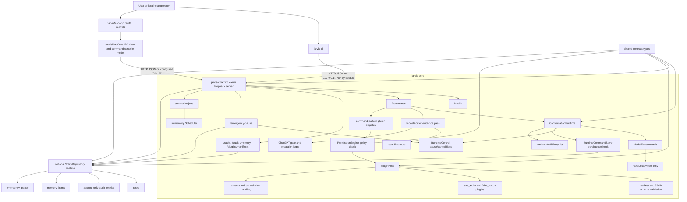
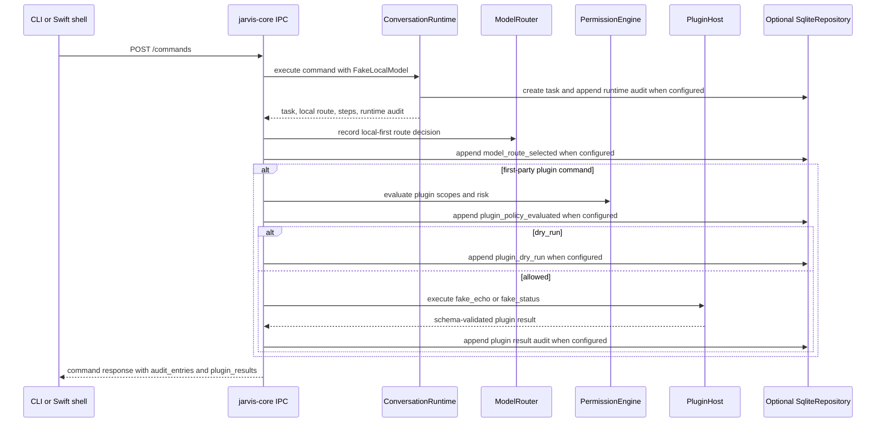
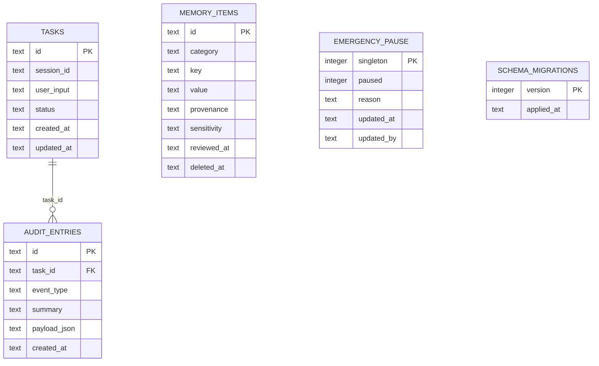

# Architecture Map

Jarvis is a local-first macOS assistant foundation. The current repository
contains a Rust workspace with the core contracts, loopback IPC server,
SQLite-backed repository primitives, policy/model-routing rules, in-process
plugin contracts, scheduler state, CLI client, and a first Swift/SwiftUI Mac
shell scaffold under `apps/mac`.

## Current Implementation Diagram



The current IPC `/commands` endpoint invokes `ConversationRuntime` with the
deterministic `FakeLocalModel`, returns runtime steps, route metadata, plugin
results, and audit entries, and can persist task/audit state through
`SqliteRepository` when the state is constructed with repository backing. It
also records local-first `ModelRouter` evidence and can execute deterministic
first-party plugin commands through the policy engine. It does not yet support
autonomous model-generated tool calls, real model providers, or user approval UI.
Repository-backed IPC state also exposes task, audit, and memory inspection
endpoints, plus first-party plugin manifest listing, so the CLI and Swift shell
can inspect durable local state without reaching into SQLite directly.

## Current Command Flow



## Current Workspace Layout

```text
.
|-- Cargo.toml
|-- DESIGN.md
|-- README.md
|-- apps/
|   `-- mac/
|       |-- Package.swift
|       |-- Sources/
|       |   |-- JarvisMacApp/
|       |   `-- JarvisMacCore/
|       `-- Tests/JarvisMacCoreTests/
|-- crates/
|   |-- jarvis-cli/
|   |   `-- src/main.rs
|   `-- jarvis-core/
|       |-- src/
|       |   |-- ipc.rs
|       |   |-- lib.rs
|       |   |-- model.rs
|       |   |-- plugin.rs
|       |   |-- policy.rs
|       |   |-- router.rs
|       |   |-- runtime.rs
|       |   |-- scheduler.rs
|       |   |-- storage.rs
|       |   `-- types.rs
|       `-- tests/e2e_scaffold.rs
`-- docs/
```

## Implemented Rust Responsibilities

- `jarvis-core::types`: Stable shared records and enums for tasks, audit
  entries, sensitivity, risk, approval, task status, and errors.
- `jarvis-core::ipc`: Axum loopback HTTP API for `/health`, `/commands`,
  `/tasks`, `/audit`, `/memory`, `/plugins/manifests`, `/emergency-pause`, and
  `/scheduler/jobs`. The command endpoint runs the runtime with
  `FakeLocalModel`, records local-first route evidence, can execute
  deterministic first-party plugin commands through policy, returns
  route/step/plugin/audit evidence, and obeys emergency-pause state.
- `jarvis-core::runtime`: Command runtime scaffolding with max-step enforcement,
  runtime hooks, task cancellation, emergency-pause blocking/cancellation, model
  step audit entries, a fake local model path, and a persistence hook for
  SQLite-backed task/audit durability.
- `jarvis-core::model`: `ModelExecutor` trait, model request/response contracts,
  route metadata, and deterministic `FakeLocalModel` test implementation.
- `jarvis-core::router`: Local-first model route selection, ChatGPT opt-in gate,
  restricted-data blocking, approval delegation to `PermissionEngine`, and
  simple secret-token redaction before ChatGPT routing.
- `jarvis-core::policy`: Capability scopes, approval grants, risk-tier
  decisions, emergency-pause fail-closed behavior, confirmation requirements,
  and audit-required flags.
- `jarvis-core::plugin`: Plugin/action manifests, JSON schema validation,
  permission metadata, approval-required handling, proactive-action checks,
  timeout handling, cooperative cancellation signal, and two deterministic
  first-party test plugins.
- `jarvis-core::scheduler`: Inspectable in-memory scheduler jobs with manual,
  one-time, and interval trigger contracts plus cancellation support.
- `jarvis-core::storage`: SQLite schema migration version 1 for tasks,
  append-only audit entries, emergency pause, and memory items with provenance,
  sensitivity, review, and soft-delete fields.
- `jarvis-cli`: Local CLI for serving the IPC API with optional `--db-path`
  SQLite backing, calling health/command/pause/task/audit/memory/plugin
  endpoints, listing/scheduling/cancelling scheduler jobs over HTTP, and
  running `jarvis smoke` against ephemeral local servers.
- `apps/mac/JarvisMacCore`: Swift IPC client and command-console model that
  decode the Rust health/command/pause JSON contracts, including task, route,
  step, audit, and plugin-result evidence from command responses.
- `apps/mac/JarvisMacApp`: SwiftUI command-console scaffold with health status,
  transcript, activity/audit panel, send, pause/resume, and refresh controls.

## End-Goal Production Architecture

```mermaid
flowchart TB
    MacApp["Packaged Jarvis.app"]
    MacApp --> UX["voice, text console, settings, activity, memory, permissions, diagnostics"]
    UX --> ApprovalUI["approval prompts and permission center"]
    UX --> PauseUI["emergency pause and resume"]
    UX --> IPCClient["versioned IPC client"]
    MacApp --> Supervisor["app-supervised core process"]
    Supervisor --> IPCServer["jarvis-core local IPC server"]
    IPCClient --> IPCServer

    subgraph CoreProd["jarvis-core production runtime"]
        IPCServer --> RuntimeProd["ConversationRuntime with tool-call orchestration"]
        RuntimeProd --> ModelRouterProd["ModelRouter"]
        RuntimeProd --> PolicyProd["PermissionEngine"]
        RuntimeProd --> PluginHostProd["policy-gated PluginHost"]
        RuntimeProd --> SchedulerProd["scheduler and trigger engine"]
        RuntimeProd --> MemoryPolicy["memory classification and review flow"]
        RuntimeProd --> RepoProd["SqliteRepository"]
        RuntimeProd --> DiagnosticsProd["diagnostics and redacted export data"]

        ModelRouterProd --> LocalModels["real local model providers by default"]
        ModelRouterProd --> ChatGPT["ChatGPT only after enablement, approval, redaction, and audit"]

        PluginHostProd --> FirstPartyPlugins["first-party plugins"]
        PluginHostProd --> InstalledPlugins["installed local plugins with manifests"]
        PluginHostProd --> ToolSandbox["declared scopes, schemas, timeouts, cancellation, sandbox boundary"]

        SchedulerProd --> ProactiveJobs["approved proactive routines and triggers"]
    end

    ApprovalUI --> PolicyProd
    PauseUI --> PolicyProd
    PauseUI --> RuntimeProd
    PauseUI --> SchedulerProd

    RepoProd --> TaskStore["task lifecycle"]
    RepoProd --> AuditStore["append-only audit log"]
    RepoProd --> MemoryStore["memory with provenance, sensitivity, review, delete"]
    RepoProd --> PauseStore["emergency pause state"]
    RepoProd --> PluginRegistry["plugin registry and grants"]
    RepoProd --> SchedulerStore["durable scheduler jobs"]

    MacKeychain["macOS Keychain"] --> RuntimeProd
    AppFiles["app-owned files and plugin bundles"] --> RuntimeProd
    DiagnosticsProd --> Diagnostics["local diagnostics export"]
    Diagnostics --> MacApp
```



Production readiness for that end-state still requires a packaged `.app`
release, real local model provider integration, approval UI, plugin
installation/runtime hardening, voice support, packaged app smoke tests, and
operational release evidence. The current repository proves only the implemented
Rust and Swift scaffold surfaces listed above.

## Current Vs Target Implementation Phases

| Area | Current implementation | Target production state | Phase |
| --- | --- | --- | --- |
| Mac shell | Buildable Swift/SwiftUI scaffold with health, command transcript, pause/resume, and activity/audit rendering over IPC. It does not start or supervise the Rust process. | Packaged `Jarvis.app` supervises the core, owns voice/text UX, settings, memory and permission surfaces, diagnostics export, and recovery states. | Scaffold implemented; packaging and supervision pending. |
| IPC boundary | Axum loopback HTTP JSON API for health, commands, task/audit/memory inspection, plugin manifests, emergency pause, and scheduler jobs. | Versioned, compatibility-tested app/core API with packaged app smoke coverage and clear degraded-mode handling. | Core IPC implemented; production app contract hardening pending. |
| Command runtime | `ConversationRuntime` creates tasks, runs `FakeLocalModel`, records structured audit entries, handles pause/cancel, enforces max steps, and can persist task/audit state through `RuntimeCommandStore`. | Multi-step assistant runtime with real model responses, autonomous model-generated tool-call orchestration, streaming progress, approval handoff, and robust recovery. | Runtime foundation implemented; autonomous tool orchestration pending. |
| Model routing | Local-first `ModelRouter` exists with sensitivity checks, ChatGPT opt-in gate, approval delegation, and redaction logic. The active `/commands` path still uses `FakeLocalModel`; no real provider call is wired. | Real local model provider integration, explicit ChatGPT escalation, minimized cloud context, user approval where required, and route evidence in every relevant task. | Policy/routing scaffolding implemented; provider integration pending. |
| Plugins and tools | Deterministic in-process first-party plugins (`fake_echo`, `fake_status`) execute only through command-pattern dispatch, manifest validation, policy checks, timeout, cancellation, and audit evidence. | First-party production plugins plus installed local plugins behind manifests, sandboxing, user grants, UI approval, proactive gating, and model-generated tool-call execution. | Contract and deterministic plugin path implemented; production plugin runtime pending. |
| Scheduler | Inspectable in-memory scheduler jobs with manual, one-time, interval trigger contracts and cancellation support. Emergency pause cancels active scheduler jobs. | Durable scheduler and trigger engine for approved proactive routines, persisted job state, visible task records, and policy-gated execution. | In-memory foundation implemented; durable proactive engine pending. |
| Storage and memory | SQLite migration v1 stores tasks, append-only audit entries, emergency pause, and memory items with provenance, sensitivity, review, and soft-delete fields. CLI/IPC can inspect and mutate memory items when repository backing is enabled. | SQLite also owns permissions, plugin registry, model-route records, durable scheduler jobs, migrations with backup/rollback, and memory UX review flows; vector indexes remain rebuildable. | Core local state implemented; broader production schema pending. |
| Safety and approvals | Capability scopes, risk tiers, emergency-pause fail-closed behavior, audit-required flags, and approval-required decisions exist in Rust. There is no user approval UI yet. | Human approval prompts, permission center, grants history, policy review, and no bypass for high-risk side effects. | Policy engine implemented; human approval product surface pending. |
| Voice and diagnostics | Not implemented beyond design docs. | Voice input/output loop, interruption/cancel behavior, microphone degraded modes, and local diagnostics export. | Pending. |
| Release proof | Local Rust and Swift build/test/smoke commands document the current proof boundary. | Signed/packaged app release with clean-profile Mac smoke, app-supervised core, command, audit, pause, restart, migration, and diagnostics checks. | Local foundation proof only. |

## Data Ownership

- SQLite is the implemented structured-state backend for tasks, audit entries,
  emergency pause, and memory items.
- Audit entries are protected by SQLite triggers that reject update and delete
  operations.
- Memory items carry provenance, sensitivity, review timestamps, and soft-delete
  state.
- The end-goal architecture still expects macOS Keychain for credentials and
  app-owned files for large artifacts, transcripts, diagnostics exports, plugin
  bundles, local model configs, and attachments.
- Any future vector index should remain rebuildable from canonical records.

## Implemented SQLite Schema



## Readiness Boundary

Current evidence supports a Rust foundation claim: the workspace has typed
contracts and tested scaffolding for IPC, policy, routing, runtime, storage,
plugins, scheduler, and CLI behavior, plus a first Swift command-console and
activity/audit shell. It does not support a claim that Jarvis is a finished
voice assistant, packaged Mac app, autonomous external-action agent, plugin
marketplace, or production cloud-integrated system.
