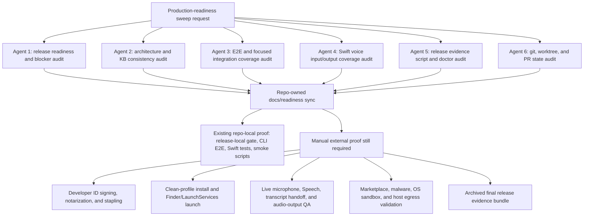

# Production Readiness Sweep - 2026-06-10

This note records the current autonomous production-readiness sweep state for
Jarvis. It is a release-governance artifact, not release evidence by itself.
Use the checked-in code, PRs, and command output as proof.

## Live Readiness Snapshot

Command:

```sh
cargo run -p jarvis-cli -- release readiness --json
```

Observed on 2026-06-11 from `main` at `89076f5` after PR #222:

- `production_ready: false`
- `verified_feature_count: 17`
- `pending_feature_count: 1`
- Remaining pending feature: `live_voice_loop`

Companion command:

```sh
cargo run -p jarvis-cli -- release evidence-status --json
```

Observed evidence inventory:

- `complete: false`
- `satisfied_count: 3`
- `missing_count: 6`
- `invalid_count: 0`
- Missing external/manual evidence remains the signed zip, signed installer,
  signed-distribution provenance report, live-device QA report,
  plugin-trust QA report, and final release evidence bundle.

The pending `live_voice_loop` feature is intentionally manual. Swift fake-adapter
coverage proves the text-path and adapter state behavior, but it does not prove
live microphone capture, Speech permission prompts, spoken transcript handoff,
live audio output, or clean-profile signed-app behavior.

## Six-Agent Sweep Ownership



## Current Architecture Phase

Jarvis is currently a production-shaped local assistant foundation:

- Rust core and CLI cover IPC, runtime, policy, routing, storage, scheduler,
  approvals, plugin governance, diagnostics, release readiness, and release
  evidence inventory.
- Swift shell covers command, activity, memory, approvals, permissions,
  scheduler, diagnostics, release inspection, voice adapter controls, speech
  output controls, Keychain launch credential injection, and core supervision.
- Local release proof includes the canonical `./scripts/release-local.sh` gate,
  repository-backed operator smoke, unsigned distribution launch proof, release
  evidence script self-tests, Rust/CLI E2E, and Swift package tests.
- PRs #215 through #221 tightened plugin trust evidence, package provenance,
  Mac scheduler actions, public GitHub release-local runtime compatibility,
  release-evidence archive URI validation, `/contract` release-evidence
  wording, and `/release/evidence-status` proof-boundary wording.
- The current conservative readiness boundary is unchanged: 16 verified
  repo-owned features, one pending manual live voice validation feature, and
  six missing external/manual evidence artifacts.

## End-Goal Production Phase

The target production state is not just "all local tests pass." It requires the
same architecture plus validated external release evidence:

- Developer ID signed, notarized, and stapled app and installer artifacts.
- Clean-profile install into `/Applications` and Finder/LaunchServices launch
  validation.
- Owner-recorded live microphone, Speech permission, spoken transcript handoff,
  and audio-output validation against the signed installed app.
- Plugin trust evidence for marketplace review, malware analysis, OS sandbox
  validation, and host-level egress controls before marketplace claims.
- Final release evidence bundle generated, checked by the evidence doctor, and
  archived at a durable reports archive URI.
- Evidence-aware readiness rerun with
  `JARVIS_RELEASE_READINESS_EVIDENCE_MODE=external` only after all required
  reports exist and pass semantic checks.

## E2E Coverage For This Sweep

No executable behavior changed in this docs-sync phase. The relevant existing
coverage is:

- `cargo test -p jarvis-cli --test local_ipc_e2e release_readiness_cli_falls_back_without_running_server -- --nocapture`
- `cargo test -p jarvis-cli --test local_ipc_e2e release_readiness_cli_uses_explicit_live_voice_evidence -- --nocapture`
- `cargo test -p jarvis-cli --test local_ipc_e2e release_readiness_cli_computes_production_ready_only_from_external_complete_evidence_status -- --nocapture`
- `cargo test -p jarvis-cli --test local_ipc_e2e release_readiness_rejects_semantically_invalid_live_voice_evidence -- --nocapture`
- `cargo test -p jarvis-cli --test local_ipc_e2e release_evidence_status_rejects_plugin_report_non_owner_review_source -- --nocapture`
- `cargo test -p jarvis-cli --test local_ipc_e2e release_help_surfaces_current_evidence_boundaries -- --nocapture`
- `cargo test -p jarvis-cli --test local_ipc_e2e serve_exposes_local_ipc_contract_and_persists_state -- --nocapture`
- `swift test --disable-sandbox --package-path apps/mac --filter JarvisMacCoreTests`
- `./scripts/release-local.sh` before merging executable or release-boundary
  changes.

For this phase, the release boundary is the feature: Jarvis must keep reporting
`production_ready: false` until owner-recorded external evidence is complete,
and production plugin-trust evidence must stay owner-asserted rather than
imported or self-test sourced.
The release CLI help is also part of that operator contract: it must describe
operator-readable default output, `--json` for exact evidence payloads, and the
current owner-source, host-egress, child-report, and local-signature-validation
checks without implying Jarvis performs the external manual gates.
`/contract` feature metadata is in the same boundary: release evidence status
proof text must name repository-backed live command evidence, plugin-trust
host-egress fields, and child-report revalidation so clients cannot infer a
weaker release-evidence floor from feature presence alone.
The release evidence bundle and doctor paths also enforce structural release
evidence binding: the app zip must contain exactly one top-level `Jarvis.app`
payload with the app executable, bundled core, and `Info.plist`; the
live-device QA bundled-core SHA-256 must match the signed-provenance bundled
core SHA-256; and the owner final-bundle completion time must be no earlier than
the signed-provenance, live-device QA, and plugin-trust child report generation
times and no later than the final bundle generation time.
Final release evidence also requires a durable reports archive URI. Blank
values, missing schemes, placeholder/example/fixture values, and self-test
archive locations are invalid for production evidence in
`release-evidence-bundle.sh`, `release-evidence-doctor.sh`, and
`/release/evidence-status`.
