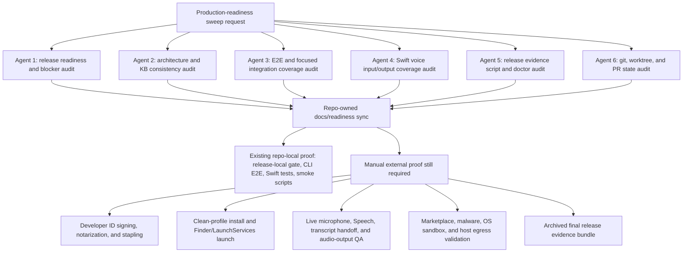

# Production Readiness Sweep - 2026-06-11

This note records the current autonomous production-readiness sweep state for
Jarvis after the release-format, package-preflight, and evidence-doctor guidance
PRs merged. It is a release-governance artifact, not release evidence by itself.
Use the checked-in code, PRs, and command output as proof.

## Live Readiness Snapshot

Command:

```sh
cargo run -p jarvis-cli -- release readiness --json
```

Observed on 2026-06-11 from `main` at `7833c62` after PR #235:

- `production_ready: false`
- `verified_feature_count: 17`
- `pending_feature_count: 1`
- Remaining pending feature: `live_voice_loop`
- Open GitHub PR count: `0`

The first release-readiness recommended commands are now:

```sh
./scripts/release-local.sh
./scripts/release-ci-workflow-smoke.sh
./scripts/release-operator-qa-smoke.sh
./scripts/packaged-app-release-smoke.sh
./scripts/package-distribution.sh --check
./scripts/package-distribution.sh --unsigned-launch-check
cargo run -p jarvis-cli -- release signed-distribution-runbook
JARVIS_DEVELOPER_ID_APPLICATION='Developer ID Application: ...' JARVIS_DEVELOPER_ID_INSTALLER='Developer ID Installer: ...' JARVIS_NOTARYTOOL_PROFILE='...' ./scripts/package-distribution.sh
cargo run -p jarvis-cli -- release live-device-runbook
```

Companion command:

```sh
cargo run -p jarvis-cli -- release evidence-status --json
```

Observed evidence inventory in a fresh worktree before generating local
distribution artifacts:

- `complete: false`
- `satisfied_count: 0`
- `missing_count: 9`
- `invalid_count: 0`
- Missing evidence: signed app bundle, app executable, bundled core executable,
  signed app zip, signed installer package, signed-distribution provenance
  report, live-device QA report, plugin-trust QA report, and final release
  evidence bundle.

After `./scripts/release-local.sh` or
`./scripts/package-distribution.sh --unsigned-launch-check` creates the local
unsigned distribution layout, the app bundle, app executable, and bundled core
can become present local evidence. That still does not prove Developer ID
signing, notarization, stapling, clean-profile install, Finder launch, live
device QA, plugin trust QA, or final evidence bundling.

`./scripts/release-evidence-doctor.sh --check` now starts missing-evidence
guidance with the no-sign preflight before credentialed signing:

```sh
package preflight: ./scripts/package-distribution.sh --check
signing: JARVIS_DEVELOPER_ID_APPLICATION='Developer ID Application: ...' JARVIS_DEVELOPER_ID_INSTALLER='Developer ID Installer: ...' JARVIS_NOTARYTOOL_PROFILE='...' ./scripts/package-distribution.sh
```

The pending `live_voice_loop` feature is intentionally manual. Swift fake-adapter
coverage proves text-path and adapter state behavior, but it does not prove live
microphone capture, Speech permission prompts, spoken transcript handoff, live
audio output, or clean-profile signed-app behavior.

## Six-Agent Sweep Ownership



## Current Architecture Phase

Jarvis is currently a production-shaped local assistant foundation:

- Rust core and CLI cover IPC, runtime, policy, routing, storage, scheduler,
  approvals, plugin governance, diagnostics, release readiness, and release
  evidence inventory.
- Swift shell covers command, activity, memory, approvals, permissions,
  scheduler, diagnostics, release inspection, voice adapter controls, speech
  output controls, Keychain launch credential injection, and core supervision.
- Local release proof includes the canonical `./scripts/release-local.sh` gate,
  repository-backed operator smoke, packaged-app smoke, unsigned distribution
  launch proof, package-distribution no-sign preflight,
  release-evidence-doctor missing-evidence guidance, release evidence script
  self-tests, Rust/CLI E2E, and Swift package tests.
- Recent PRs #223 through #235 synchronized architecture/readiness docs, added
  explicit `--json`/`--format json` release inspection compatibility, added the
  package-distribution preflight to the local release gate, and made the
  evidence doctor recommend that preflight before credentialed signing. PR #230
  also added speech-output natural completion coverage so the Swift model
  returns to idle when AVFoundation playback finishes or cancels. PR #231 made
  readiness display evidence-aware and fail-closed in Swift, while PR #232
  clarified exact release evidence script handoff commands. PR #233 hardened
  Swift voice UI truthfulness, PR #234 rejected placeholder owner evidence
  notes in release evidence-status/final-bundle paths, and PR #235 ignored stale
  AVSpeech completion/cancel callbacks after a newer utterance starts.
- The current conservative readiness boundary is unchanged: 17 verified
  repo-owned features, one pending manual live voice validation feature, and
  missing external/manual release evidence before production-ready language is
  allowed.

## End-Goal Production Phase

The target production state is not just "all local tests pass." It requires the
same architecture plus validated external release evidence:

- Developer ID signed, notarized, and stapled app and installer artifacts.
- Clean-profile install into `/Applications` and Finder/LaunchServices launch
  validation.
- Owner-recorded live microphone, Speech permission, spoken transcript handoff,
  and audio-output validation against the signed installed app.
- Plugin trust evidence for marketplace review, malware analysis, OS sandbox
  validation, and host-level egress controls before marketplace claims.
- Final release evidence bundle generated, checked by the evidence doctor, and
  archived at a durable reports archive URI.
- Evidence-aware readiness rerun against a core started or restarted with
  `JARVIS_RELEASE_READINESS_EVIDENCE_MODE=external` only after all required
  reports exist and pass semantic checks.

## E2E Coverage For This Sweep

After PRs #231 and #232, executable and script-output behavior changed; use
their focused validation commands plus the current local release gate as
evidence for those changes. The relevant existing coverage for the broader
sweep is:

- `cargo test -p jarvis-cli --test local_ipc_e2e release_readiness_cli_falls_back_without_running_server -- --nocapture`
- `cargo test -p jarvis-cli --test local_ipc_e2e release_signed_distribution_runbook_summarizes_next_operator_steps -- --nocapture`
- `cargo test -p jarvis-cli --test local_ipc_e2e release_readiness_cli_uses_explicit_live_voice_evidence -- --nocapture`
- `cargo test -p jarvis-cli --test local_ipc_e2e release_readiness_cli_computes_production_ready_only_from_external_complete_evidence_status -- --nocapture`
- `cargo test -p jarvis-cli --test local_ipc_e2e release_readiness_rejects_semantically_invalid_live_voice_evidence -- --nocapture`
- `cargo test -p jarvis-cli --test local_ipc_e2e release_evidence_status_rejects_plugin_report_non_owner_review_source -- --nocapture`
- `cargo test -p jarvis-cli --test local_ipc_e2e release_help_surfaces_current_evidence_boundaries -- --nocapture`
- `cargo test -p jarvis-cli --test local_ipc_e2e serve_exposes_local_ipc_contract_and_persists_state -- --nocapture`
- `./scripts/release-evidence-doctor.sh --self-test`
- `swift test --disable-sandbox --package-path apps/mac --filter JarvisMacCoreTests`
- `./scripts/release-local.sh` before merging executable or release-boundary
  changes.

For this phase, the release boundary is the feature: Jarvis must keep reporting
`production_ready: false` until owner-recorded external evidence is complete,
and production plugin-trust evidence must stay owner-asserted rather than
imported or self-test sourced.
